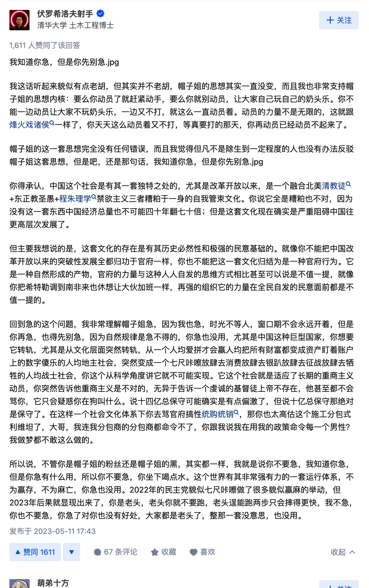
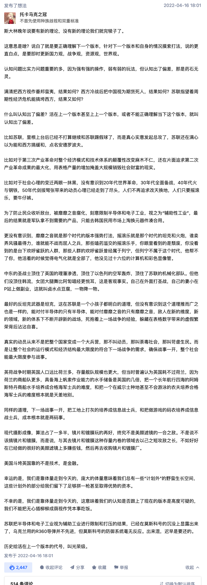
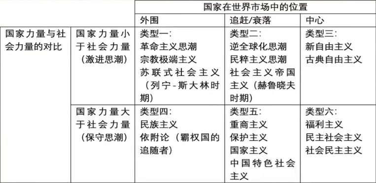
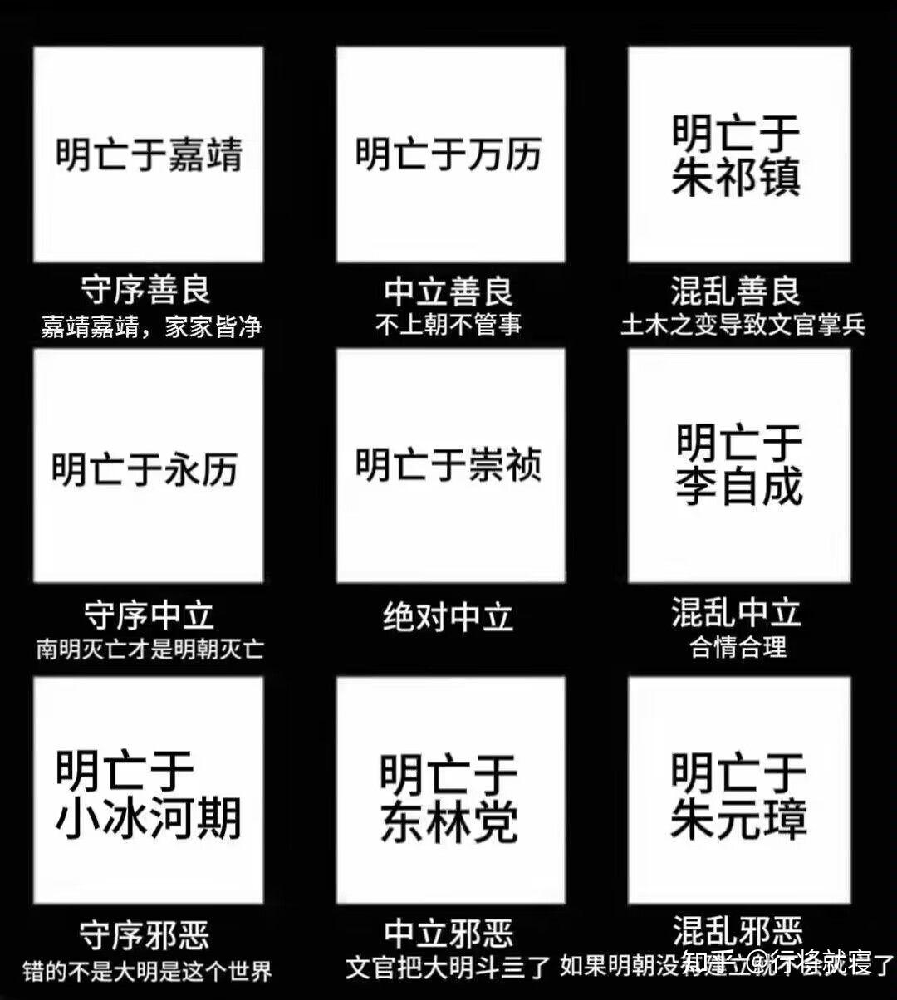

## 李建秋


```markdown
疏懒于写大篇，有一个很重要的原因在于：没必要。
微博远远达不到要写大篇的程度，比如说来个秦晖语录，他的传播性要远远比什么大篇强得多，不写大篇是对的。
一个简单的口号的传播性，比千百万次辩经都强，不服气你在微博搜索秦晖。
...
```

老刘暴打秦晖啊。需要驳斥秦晖，直接在老刘微博和知乎搜索就可以。

山高县的“入关”、秦晖的“秦制”、姨学的“武德”。都是天然适合传播的概念，因为高度抽象又高度具象。但是，可以说任何构建于这些概念上的论点，都可以直接判断为错误。


---


```markdown
日本再虚，还是比欧洲强的。

本子现在吃亏在两个地方：
一个是和中国产业形成冲突，日韩都有这个问题，你把中国抛开，日本产业其实非常能打。
一个是太小了，且能源，农业，原材料都无法独立，且政治依赖大，一旦市场波动就非常受影响。

相对比欧洲，欧洲两大优势：市场够大，可以制造非贸易壁垒，且比较能自给自足。

但是欧洲有一个天大的劣势，抵消了所有的优势，就是移民混杂，且人心不齐。

我们假设意大利和日本同样都不怎么样，但是意大利还有非法移民这个debuff，日本可没有，日本民族相当单一，因此一旦遇到了逆风，意大利可能率先内乱，导致逆风造成更大的破坏，日本一般不会。

日本是有底的，衰落到什么程度是自己心里有数的。
欧洲没有底。
```


```markdown
这地球上的民族国家从来没有靠引进外来人口解决过问题，
移民国家那是惯性。

也有国家尝试过，比如说德国，大力引进过，结果呢？
人口问题没有解决，反而增添了新的问题

德国8000多万人口的国家，引进外来人口都搞不定，
指望中国14亿人口的国家，靠移民解决人口问题，把非洲填进来都不够。
别整什么幺蛾子。老龄化问题自己要适应。
```

看老刘的文章，比较有收获的就是不同国家的比较。其实就是三板斧，民族建构、罗斯托起飞模型和产业结构。

另外，“这地球上的民族国家从来没有靠引进外来人口解决过问题”，正如以色列的“民族、国家、宗教”的不可能三角，中国作为一个天然的民族国家，如果想靠引进外来人口解决人口问题，代价是什么呢？


---


```markdown
入关学的本质是悲观主义。

我个人认为压根不存在悲观还是乐观，人类历史循环一直是这样。
中国在大一统条件下的王朝，在可知的文明内都是第一。
即便是大宋很怂，但是你得承认，大宋技术和财富这方面可不弱。

即便是到了大清，即便是到了大清末期，即便是到了鸦片战争时期，这时候够弱了吧。
还不是顺差？顺到大英帝国都受不了了。

大英咧，那时候的大英咧，那出过什么什么牛顿，什么一大堆的科学家，就问你牛X不牛X，你先说牛X不牛X？
牛X吧。

那么牛X，为什么逆差到要搞炮舰了？
一个进入工业化的国家，贸易做不过农业国？
那时候的贸易可不像现在，搞什么信用货币，那时候的贸易可是货真价实的贵金属啊。

其实依照这个分析，你就很容易看出来，前几年的贸易战……
我农业国贸易和工业国打的时候，我就没输过。
我工业国对你搁工业国，我会输？
怎么会有人当时觉得悲观的？咋想的，来我采访一下。
你现在也没办法对我用炮舰，再说了，现在比造舰，那谁强谁弱恐怕再衡量下吧。
```

---

新儒家和新教伦理

老刘聊这部分内容也挺有意思的，懒得摘录了。搜了一下，已经有不少大儒以此为论点开始论证了。


---


```markdown
意料之中的事情，一定要保护国内市场。
现在需求才是关键。
```

什么是营商环境好？有利润就是营商环境好，没有利润，即使你搞重商主义，让商人主导政治（如美帝），也是营商环境变差。只有吃不到的肉才是好肉，吃到肚子里的就会想着怎么减掉。


---

```markdown
科技战有一个问题在于目前中国的企业慢慢在适应深度，但是宽度也需要加强。

亦即：不仅仅是一两家企业，而是整个行业要抬起来，就类似于电动汽车，如果只有一两家冒头，就会出现谁冒头就打谁的情况，单个的企业承压是有极限的，但是如果大量的，成批的企业起来，就能形成一道风险墙。

参考过去的操作系统的经历，操作系统的研发，是需要足够多的厂商形成生态，打击一家企业很容易，打击一个生态就很难，一个操作系统需要系统稳定性和流畅性，也包括参与厂商和用户规模，由于历史的原因，生态的搭建不是一朝一夕可以完成的，这方面的突破需要技术，同时也需要时间。

关于兼容安卓的问题，这个问题无需讨论，目前世界存量用户这么大，没有道理不兼容。

这几年小在质量和研发投入都很大，小米即将上市的企业会搭载澎湃OS，会和更多的伙伴去推动小米手机和汽车的无缝连接，中国市场够大，世界市场更大，企业最终不是局限于国内，终究还是要走出去的，迟早也要面对三星和苹果的竞争。
```

确实

---

```markdown
说富什么都是对的，穷什么都是错的，
那要怎么变富？
很简单，首先你得富，然后你才能富。

这话说起来荒唐，现实比比皆是。

卡拉赞你都没毕业，你来卡拉赞干什么？
不组。

卡拉赞要想毕业，必须要打卡拉赞，
可是打卡拉赞，就必须要卡拉赞毕业。
```

> 穷，先在经济上失去话语权，然后在政治上失去，现在，在道德上也要失去话语权喽


---


```markdown
国外的核心政治理念还是在精英分权治国。
其他一切，都是围绕着精英治国这个理念展开的。
这个精英，并不是大家想的有钱，也不是有能力，而是局限在一个圈子，你能进这个圈子才是精英。
川普有钱，但不属于精英。
苏联遭受敌视，而中东很多国家不遭受敌视，有一个很重要的原因是：苏联过于平民化了。但是中东国家其实还是精英治国。
```


```markdown
精英就是一个小圈子，精英治国可以发展到精英治世。
这些人并没有掩盖自己的企图，比如说FT这篇文章《世界需要美国当全球警察》

逻辑论证很简单：第一美国是对的，第二，因此美国应该当世界警察。
如果你反对第二点，请看第一点。

在他们看来，美国是对的，这是一个无需自证的公理，其他所有的论证必须围绕这个证明来，由于美国是对的，所以美国的盟友是对的，因为美国不会挑选一个不对的盟友。
这样形成一个小圈子。
由于美国是对的，美国盟友是对的，因此世界应该接受这个小圈子的领导。

这种情况还可以论证美国国内，因为华盛顿的小圈子精英是对的，所以川普是错的。

“那川普人家也是民选的啊”
一句话：那叫民粹，不叫民主，民粹现在被定义成这样那是干什么的？不就是为了应对这种措辞？

这种情况看起来离谱，只需要翻开圣经。
上帝是对的，这是一个不需要自证的公理。
```


---


```markdown
不要说什么美国各种资源，人力，智力都够用，
这年头，吃饱肚子没有那么困难，说美国各种资源，人力，智力都够用的，俄罗斯同样的各种资源，人力，智力都够用，且俄罗斯还是有主体民族，主体文化的。
随着生产力发展，过去一直怕吃不饱肚子的，以后都吃得饱，这都不是问题。

一个阶段有一个阶段的问题，现在国人都吃得饱，家用电器，汽车普及率很高。
你想想，如果朝鲜战争的那些先烈问现在中国人都什么生活，
说现在都有家用电器，都有车，先烈是不是以为咱们现在共产主义都建设成功了？
没有，该抱怨的还是抱怨，而且声音比过去都大。
这事……是看对比的。

老亨头很早写过一本书，《谁是美国人》
就说过美国主体文化和民族消亡的问题，
人在美，心在他国，这是移民常态，其实华裔还好点，拉美裔才是凶，
很多拉美裔二代还是说西语。
当年亨廷顿就做过移民问题的讲述：一旦移民成为正反馈，则移民不可终止。
后来果然如此。

老亨头说了美帝三大方案：

“世界上的美国：是世界主义的，还是帝国性质的，抑或是民族性质的？
美国人怎样界定自己的特性，将决定美国在世界上起什么样的作用，而世界怎样看待这一作用，也会影响到美国的特性。在现今这一新阶段，美国与世界各地保持什么样的关系，这方面可以有3种总的方案。美国人可以拥抱世界，也就是向别国人民和文化开放自己的国家；或者，美国人可以试图按照自己的价值观去改造别国的人民和文化；或者，美国人可以保持自己社会和文化的特性，使之不同于别国人民的社会和文化。”

第一个方案，也就是世界主义的方案，牵涉到恢复“9·11”以前在美国占主导地位的趋势。美国欢迎世界，欢迎世界各地的思想和东西，最重要的，是欢迎世界各地的人。理想的局面是开放社会，开放边界，鼓励国民层次以下的民族、人种和文化身份，鼓励双重公民身份和移民社群。起领头作用的精英人士则是日益将自己定性于全球机构、准则和规矩，而脱离本国的特性。美国将应该是多民族、多人种和多文化的社会。多样性即使不是最主要的价值观，也应是最主要的价值观之一。给美国带来不同的语言、宗教和习俗的人越多，美国才越成其为美国”

……
“世界主义的方案和帝国的方案都是企图减少或消除美国与别国之间的社会、政治和文化差别。民族性质的方案则是承认美国不同于别国社会，而保持自己的特性。美国若成为世界就不可能仍然是美国。别国的人若成为美国人就不可能仍然是他们自己。美国是不同于别国的，这区别在很大程度上决定于美国的盎格鲁—新教文化和宗教信仰。与世界主义方案和帝国方案不同，民族性质方案就是要保持并加强美国自立国以来所独具的素质。”

老亨头写完这本书后，发生了很多事情，世界方案和帝国方案都用过，失败了。

老亨头当年就预测过最后还要回民族性质方案，也就是文章提到的“美国是不同于别国的，这区别在很大程度上决定于美国的盎格鲁—新教文化和宗教信仰”

但是由于移民的原因，根本不可能。
所以最终结果是什么，等落地。
```


---


```markdown
GDP作为一个数字其实是非常唬人的。
如果你以俄罗斯建立时期的GDP来算，那俄罗斯增长率高的吓人。
埃尔多安执政时期，也创下过四年GDP三倍的奇迹。
就拿美利坚来说，2020年美国GDP21.06万亿，
2022年呢？25.46万亿。
（25.46-21.06）/21.06=20.89%
这增长了多少？增长了20%啊
哇，这就2年时间20%，拜登是不是美利坚第一圣人？
这玩意……
```


---

```markdown
国家是一个异常复杂的系统，发展是一个异常复杂的话题，因为其复杂性，政策为什么不可以照搬？因为一个政策，在这个国家可能实施的很好，在那个国家可能就会失败，就不存在所谓的“普世政策”，拿到哪里都可以被实施的政策。

同样是新自由主义的环境，可能这个国家是受益的，那个国家就是受害的，受益还是受害，这取决于竞争力。

很多人其实是新自入脑但是不自知，反过来批判新自，这个就比较幽默了，我国对于新自的态度，是搞了一些，比如说90年代的国企改革，政府放权之类的，相对于其他国家，我国的新自的步子迈的相当小。

但是很讽刺的是，那些大踏步在国内搞新自的国家，在国际新自环境下，反而竞争不过我国，这不得不说是一个极大的讽刺，也反证了国家发展的复杂性，绝对不是一两个政策所可以涵盖的。
```

```markdown
不要觉得科学家在社科上就好得了几分钱，爱因斯坦不也有贬低中国人的日记么？

从20世纪初花式论证为什么中国人智力低，到现在各式各样的“东亚裔智力高”排名，
咋，中国人基因变异了？

你站在忽必烈那个时代，你怎么解释蒙古大军横扫半个地球？
游牧民族的优越性，游牧生活的优越性。
游牧就是先进。

说到这个话题，总是有人说我历史虚无主义……不是我历史虚无主义，我只是指出了你过去不愿意承认的事实罢了。
```


```markdown
最痛恨的是什么样的企业？
百年企业。

自GAFA之后，美国现在新活多少大家也看得见的。
中国是同生态位出现BAT的，BAT之后呢？又呼啦啦的出了一大批。
整个生态是活跃的，不是死水一潭的。

丰田做不出新能源，不是丰田的错，它就不该做出新能源，
丰田之后有没有丰田，这才是问题。

丰田这是在日本那个圈子里面被厚待，它压力不重，某种方面说，大众做的比丰田好。
大众还有几款电动汽车能拿出来，ID系列至少卖的出去。
这也是和两国的压力有关，丰田没压力啊，当然可以混。
大众压力山大。

现在欧盟对燃油车这一块卡的死，银行对于任何公司都是非常重要的，
尤其是融资部分，
你说你做喷油嘴，缸盖，油泵，传统动力总成，别说融资了，不抽贷都算银行心善，
燃油车零件一年比一年少，价格低不说还不让涨价，量还越来越少，
燃油车成本会越来越高。
越来越高怎么办？那不只能亏损？
然后倒闭关停甩卖。

燃油车供应商第一个倒霉，然后是那些小厂。
```

实话，百年企业太多说明经济没有活力。甚至，在必要时政府有责任用行政职责拆分各种Duopoly、Triopoly或者托拉斯。


## 星话大白


```markdown
美国所谓小院高墙，就是从全面进攻，转为重点进攻。
那后面是不是还要进入到战略相持？
再往后，美国是不是就得全面防御，到重点防御，再到龟缩防御？
那美国就得重回孤立主义了
```

---

```markdown
美国对就业人口的定义也是每周至少工作1小时。
这其实是国际通用的定义，我们也是这么定义。
只不过，很多人吐槽我们这个每周工作1小时就算就业的时候，却不知道这是国际劳工组织的定义，包括美国、英国也都是这样定义就业人口。
除了每周至少工作1小时外，各国在定义就业人口细则上有所不同。
我这里把美国对就业人口的定义细则也发一下。
美国“就业人口”的界定为满足以下四个条件之一即可：
（1）薪资工人：在调查参考周内，至少带薪工作1小时。
（2）自雇佣者：在调查参考周内，在自己的生意、职业、贸易或农场工作至少1小时。
（3）有工作，但不在工作：在调查参考周内，暂时缺席工作、或自己的生意或农场，不管是否带薪均可；缺勤原因通常包括度假、生病、恶劣天气、产假或陪产、工作培训、照料孩子、罢工运动等。
（4）无薪家庭工：在调查参考周内，在家庭成员拥有的企业或农场中，无偿工作至少15小时的人。
美国“就业率”为就业人口占16岁及以上非机构居民人口的比重。
所以这个“就业人口”为分子，不是分母。
```

fact check如下

```markdown
[[统计视点]-平顶山市统计局欢迎您！](https://tjj.pds.gov.cn/contents/14077/373162.html)
---

一、调查失业率反映的是劳动力市场供需情况，国际上对调查失业率的概念和方法有明确的界定

　　调查失业率是反映劳动力市场供需情况的指标。进入劳动力市场也就是在寻找工作的劳动力才形成劳动力市场供给，而未进入劳动力市场也就是虽有劳动能力、而未在寻找工作的人员形成不了劳动力市场供给，如一些有劳动能力的人员，出于各种因素考虑不想或不愿寻找工作，就未形成劳动力市场供给，仅仅是劳动力市场的潜在供给。由于经济规模以及劳动力供需结构的原因，不是所有的劳动力供给都能实现就业，最终劳动力供给就表现为失业和就业两种状态，也就是劳动力供给等于就业人数加上失业人数。失业率就是失业人数除以劳动力供给，以反映劳动力市场的供需情况，这一定义也是国际劳工组织（ILO）所推荐，为国际通用的反映劳动力市场供需情况的指标。

 　　这一指标之所以为普遍接受反映劳动力市场供需的指标，是因为当失业率高的时候，它就意味着愿意寻找工作的人中找到工作的人在减少；低的时候，意味着寻找工作的人中找到工作的人在增加，能够反映出愿意寻找工作的人找到工作的情况，能够反映出劳动力市场的供需情况。

　　为了确保失业率准确反映实际，也为了国际标准的一致，国际劳工组织对失业人口和就业人口给出了明确的定义。就业人口是指调查周内为取得报酬工作1小时及以上和因休假、临时停工等暂时离岗的人；失业人口是指没有工作，近期寻找工作，且能立即去工作的人。

　　需要特别指出的是，在使用这一指标时，谨防对失业人口概念的把握，不能把所有没有工作的人都视为失业人口，只有寻找工作而未能找到工作的人才是失业人口。
```


```markdown
单就失业率的计算方法看，是比较简单的。但何为就业人口，何为失业人口，则不同的人可能有不同的理解。为保证不同国家或地区的失业率可以用来比较，则必须对就业人口和失业人口的定义作出统一的规定。国际劳工组织为规范世界各国劳动力市场统计，保证各国劳动力市场数据可以相互比较，制定了标准的就业、失业指标定义。1982年第13届劳工统计大会通过的《关于经济活动人口、就业、失业和不充分就业统计的决议》，给出了就业人口和失业人口的标准定义，2013年第19届国际劳工统计大会通过的《关于工作、就业和劳动利用不充分统计的决议》又对相关定义进行了修正。国际劳工组织的统计标准，在各国的统计实践中均得到执行。

我国劳动力调查同样采用了国际劳工组织关于就业、失业的统计标准。根据我国法律规定，16岁及以上才可以合法工作，所以就业人口是指在调查参考期内（通常为一周），16周岁及以上，为了取得劳动报酬或经营收入而工作了至少1小时的人口，包括休假、临时停工等在职但未工作的人员。失业人口是指16周岁及以上，没有工作但在三个月内积极寻找工作，如果有合适的工作能够在2周内开始工作的人。由于采用了国际标准的就业和失业定义，保证了我国调查失业率数据与其他国家数据的可比性，在我国经济日益融入国际体系的今天，这一点尤为重要。此外，我国劳动力调查以16岁及以上的常住人口为统计对象，且不论其是否进行了失业登记，均按国际标准进行就业失业状态的认定，使得我国调查失业率数据可以更全面地反映劳动力市场的实际状态。
```


---


麒麟9000s

```markdown
有种说法认为，恒大的美元债是拿国内资产抵押，由国内银行担保，如果破产，会变成国内银行去偿还美元债。
但这种“内保外贷”说法并不靠谱。
恒大的美元债，基本是在港交所发行的企业信用债，并没有以国内的实物资产去抵押。
在港股上市的房企，是在港交所公开发行美元债，并在港交所公开交易，这是没有抵押的信用债。
“内保外贷”前几年就已经被叫停了，一直到去年底，才对小部分房企开放，而恒大并没有在名单里。
恒大的结局是已经注定，等完成保交楼后，该怎么清算，自然会怎么清算。
```

内保外贷，怎么说呢？只是个工具，吉利能够闪击收购奔驰，也是内保外贷实现的。


---

```markdown
最近猪肉价格是涨了一波。
生猪出栏价格从7月初的14元/公斤，涨到月底的17元/公斤。
但相比去年同期，这个价格仍然是低很多。
今年7月猪肉价格均价是16元左右，去年7月猪肉均价是22元左右。
这个同比降幅，跟7月CPI统计里猪肉价格同比下降26.0%是比较接近的。
我们再来看年度对比数据。
去年下半年，猪肉价格有一大波上涨行情，去年10月猪肉价格峰值为27元。
也就是说，下半年猪肉价格即使出现反弹，只要没涨过27元，那么猪肉价格仍然会成为拉低下半年CPI的主要权重。
假设今年10月份猪肉价格反弹到20元，但相比去年10月，猪肉价格同比仍然会有超过26%的跌幅，这个自然会大幅拉低CPI指数。
所以，从猪肉价格推演来看，下半年仍然会保持低通胀态势。
除非猪肉价格能大幅上涨破27元。
如果不希望猪肉价格大涨，那么就只能靠时间熬过去。
去年12月猪肉价格就跌回20元，最迟到12月就可以摆脱去年下半年高猪价基数的影响。
以上说的都是生猪出栏价格，单位是“元/公斤”。
```

> 但由于去年下半年猪肉价格上涨，导致当前猪肉价格比去年同期下降了不少，会成为下半年拉低CPI的主要因素。

大白这条2023/8/10的微博，今天来看，确实应验了，刚刚查了一下2023/12/12的生猪价格平均价格¥13.9/kg，各地差不多从¥13.4到¥14.2都有。生猪价格也拉低了11月CPI。

---

```markdown
如何反驳“因为汇率贬值压力，才被迫减持美债“的说法？
很简单，直接举出反例。
比如，去年11月到今年1月，人民币汇率从7.37一路升值到6.7。
但同时间段，我们仍然在连续减持美债。
这已经说明，我们减持美债跟汇率贬值没有太大关系。
确实有其他一些国家是因为汇率贬值压力，不得不减持美债，比如日本。
但不代表所有国家都是如此，每个国家的情况都不一样。
日本外汇储备1.2万亿美元，持有美债1.09万亿美元，日本是90%的外汇储备都跑去买美债，那么日元贬值，就不得不主动抛售美债。
而我们外汇储备超过3.19万亿美元，现在持有美债8467亿美元，我们外汇储备只有26%跑去买美债。
这种情况下，我们怎么可能会因为汇率贬值，才不得不抛售美债。
我们持有的美债，基本都是到期不续的方式来减持，这样才不会有亏损。
那种拿日本情况，不分青红皂白就往我们身上套，是缺乏“具体问题，具体分析”的辩证思维，只会刻舟求剑。
```

---

```markdown
最近还有一个谣言，说印度从俄罗斯进口原油才35美元，远低于我国。
但事实是今年1月，印度进口俄罗斯石油约为604.6万吨，进口总额为32.45亿美元，折合每桶价格为73.5美元。
今年前2个月，我国进口俄罗斯石油接近1570万吨，进口金额84.6亿美元，均价每桶74美元左右，跟印度基本相当。
我5月这期视频里有提到过，我国和印度从俄罗斯进口的原油价格，均为国际油价的九折。
其实那个谣言是一眼假，欧美对俄罗斯的石油限价令都有60美元，俄罗斯不至于用35美元的价格去送钱给印度。
其实最近所有这类谣言，核心思路就是渲染我们是冤大头，来唱衰。
```


---


```markdown
不少人关心降息后对房贷利率的影响，我这里也做个说明：
房贷利率是由两部分组成：5年期LPR利率+浮动加点。
两年前买房，浮动加点部分基本是超过60基点，有的甚至120基点。
去年房地产救市，力度最大是修改了“浮动加点”部分，把房贷利率下限修改为5年期LPR利率减20基点。
比如说，去年4月买房的人，是5年期LPR利率+60基点。
但到了5月买房，就变成5年期LPR利率-20基点，一下子就少了80基点。
相比之下，当前5年期LPR利率减少10个基点，并没有太大感觉。
但关键问题是，去年这个浮动加点的规则修改，只适用于新增房贷，不对存量房贷生效。
这导致当前存量房贷比起新增房贷，起码高60-120基点。
存量房贷，只有5年期LPR利率，是会每年根据最新房贷利率去更改，但浮动加点部分是合同里固定的。
比如，有人在两年前买房，房贷利率是5.65%，也就是5年期LPR利率4.65%+100基点。
去年5年期LPR利率从4.6%，下降到4.3%。
这个人今年的房贷利率是4.3%+100基点=5.3%利率。
而现在新买房的人，房贷利率最低可以到4%利率。
也就是不管LPR利率怎么降，他都会比新买房的人，多100基点的利率。
相差还是比较大的，这也是为什么现在都在攒钱提前还房贷，因为存量房贷利率实在太高。
这某种程度并不利于促进消费。
想要降息促进消费，得把去年修改浮动加点规则，也对存量房贷生效。
这个才是关键。
```


## 嵩县


## 大佐





```markdown
明朝真的比汉唐还要强盛吗？
---

明朝的历史贡献很大程度上都是在为大汴擦屁股，把大汴丢失的核心和势力范围一个一个捡回来。

汉的前面是秦，唐的前面是隋，人家是努努力把一个一米八的精神小伙带到两米。大明不一样，大明是把90厘米的侏儒拔成一米三八。

其实大明挺不容易的。虽然成就看着好像一般，但是起点实在太低了。
```


```markdown
斯大林为什么有着温柔和善的评价？
---

猜猜斯大林为什么会杀那么多人？

因为列宁杀伐果断，所以他可以在事情还可以控制的时候用相对温和的手段解决。但斯大林会一味地妥协，直到把事情搞得无可挽回了不得不采取最极端的手段解决。列宁清楚，就是因为斯大林温柔和善，所以他要想解决问题，肯定会杀很多人。
```

---

```markdown
为什么领导干部在不同单位间调任，都能胜任好领导工作？
---

你以为的领导:

事事躬亲，微操达人，运筹帷幄，电脑前指导你把机枪阵地往前推5米！

实际的领导:

我上面有人，能为手下的部门搞定增加的人事晋升，能带底下的人考核优秀多发年终奖。

我下面的人因为我人事和财事搞得好，大家有肉吃，积极性好，都愿意跟着我讲核心，拼劲干，圆满完成上面交办的各项任务！


业务上的活有中层干部就够了，领导的功能就是向上讲核心+为底下拉资源，不同部门随便调动，做好这两点就是好领导

```


---


```markdown
女的要求男的上进，什么是上进!?
---

我有一个群友前几天跟我们全程直播他女朋友pua他的过程，给我们看了他们的聊天记录，就是他女朋友发了好多大段的文字和语音，控诉他没有危机意识，不上进，不如同龄人，不会主动学习，总之就是一堆半懂不懂的互联网词汇，看得我们全群一整个大无语。

然后他们见面了，他们吃饭的时候他女朋友还在一直说各种批话贩卖焦虑，一直到吃完饭开房进入正题，这位群友一顿疯狂输出，把他女朋友搞翻白眼了好几次，还用铜头皮带把他女朋友抽得如陀螺般旋转，最后他女朋友抱着他幸福地睡去，一句批话都没有。

接下来的一周里，他女朋友都一句批话没有，每天嘘寒问暖还给他买东西。

汝果欲学诗，功夫在诗外。 @李三江 有一句名言，家暴的家庭没有离婚的，因为被家暴的一方的精神和肉体需求在家暴的过程中已经得到了充分的满足。当然，家暴不可取，但人类就是这样一种生物，客观上存在这样的需求。如果这些需求得不到满足，他们就会逐渐走向焦虑，把自己的不舒坦施加到身边的人身上，而被施加的人一头雾水，还以为是自己真的做错了什么。

其实，你做的最错的就是没有满足她被拷打的需求。她让你上进你就上进，她让你舔狗你就舔狗，那才是最大的缘木求鱼，最大的南辕北辙，你们的关系只会越来越差。

```

大佐经典回答，被知乎夹掉了。细说“铜头皮带”。


```markdown
你以为卢大使在第一层，其实卢大使在大气层，因为从实践上讲，没有什么比一顿结结实实的拳打脚踢更能讨好一个臭m，这是一种发自内心的尊重。 如何理解“前苏联加盟共和国的主权在国际法下缺乏坚实基础”？
```

---

```markdown
你是否经历过“听话”“老实点”“照做”“不然揍你”“都是为了你好”这种训化，感受如何？弊利何在？
---
咋说呢，任何社会对人都总是有各种各样合理的或者不合理的要求和规训的，但也不代表人家规训了你就一定要听嘛。

你训你的，我干我的呗。抓到了你该揍揍，揍完了我还敢。
```


```markdown
千言万语，汇成一句话吧。
做统战对象是危险的，做基本盘是致命的。
不论什么年代，不论身在哪国，不论做什么事儿。是政治，是社会，是职场，是饮食还是男女，永远永远，别做基本盘。
要善良，但不能被欺负。要奉献，但不能被牺牲。要识大局，但不能逆来顺受。
我们是人组成的集体，不是集体分解成的人。
加油。为自己。为邻居。加油。
```

```markdown
自由不是货币，不能用来交换金钱、安全或生命。自由就是自由。
```

```markdown
如果把大学学费提高到100W，是不是就不会有所谓的孔乙己脱长衫了？
---
资本主义确实有值得学习的地方.jpg

正确做法不是“政府把大学的学费提高到100w”，而是“政府宣布大学拥有绝对的独立自主权，政府无权决定大学应该收取多少学费。”

政府只拥有有限的权力，承担有限的义务，你念不起大学去找大学说去，别找我，我没有权力命令大学录取你。你毕业之后公司不要你你去找公司说理，别找我，我没有权力命令公司雇佣你。

你穿不穿长衫，脱不脱长衫，这是你的自由，没有任何人有权管你。政府又无权命令你买房，无权命令你工作，无权命令你结婚生小孩，它最多也就是在媒体上磨叽两句，不爱听可以拔网线，它能拿你咋样。政府的职责就是给低保户发点米面油，防止饿死，在此之上你能混成什么样，完全是你的自由。
```

```markdown
为什么有些人老了发现「子女没出息是一种福分」？你怎么看？
---
也有一定道理吧，至少从生育率的角度来看确实如此，孩子一有出息就会有思想，有思想就会焦虑，就会看不上这个看不上那个，要么干脆不结婚，要么丁克，一说生孩子他就是养不起，一个月五万养不起。

没出息的话，反正一辈子也走不出县城，十七八就开始同居生小孩了，最后稀里糊涂生一串小孩，也过挺好，一个月五千养一堆孩子。

百年之后你那些成就都是假的，只有染色体是真的。
```

---

```markdown
你们都比较爱骂苏联的动员体制。
是，苏联的动员体制确实不好，但是吧，你们可能也是真没见过斯拉夫式怠工。
斯拉夫人确实给人感觉非常苦难，但是吧，这个不矛盾，他们是一边苦难一边怠工，再苦再难也要怠工。
承认民族特色，承认文化差异，这也是实事求是啊。人必须实事求是。
你不整点古拉格吓唬吓唬，他们是真给你怠啊。不是绝对工作时间的问题，德国佬上班的时间可能并不长，但人家是真出活儿。斯拉夫人那是真能给你摸啊。
市场经济的激励机制根本不足以让斯拉夫人动起来，什么，给我钱我就要干活吗，我可不干。所以斯拉夫自古以来就是动员制经济，这是有道理的。
不要一上来就以己度人。大家国情真的不一样。 都说苏联不好，那么苏联现在没了，现在的苏联人民过的好吗？
```

---

```markdown
俄方称「俄中贸易本币结算率已达 95%」，这意味着什么？

---

中国近四十年来的经济腾飞让很多人对资源、能源持有一种藐视态度，以为有了钱就可以为所欲为，有了科技就可以念力造物。何其荒谬，何其狂妄，何其可笑。

高科技卡你脖子，你努努力总归还能搓出来，搞不好还找到了新路径，搓的比发达国家更好；能源矿产卡你脖子，那是真卡。没有资源和能源，你什么工业，还没大粪值钱，大粪还能肥田。

人能胜人，再强的人也可以被战胜。但人胜不了天。人跟天斗，那就是个蚂蚁。

就中国而言，没了日本和韩国的科技，我们可能暂时在经济上会面临一些摩擦性的挫折，但是很快就能被替代。如果刚果金突然天降伟人，统一国家，然后停止向中国提供矿产，那才叫万劫不复。

好在现实中这种情况绝对不可能出现。刚果金又不是钢板一块。

中俄的关系，与其说往俄罗斯卖东西，挣那点钱有多重要，不如说是让俄罗斯与中国在能源矿产的供给上相互绑定，让俄罗斯如果停止向中国提供资源和能源，需要付出很大的转型代价以致于不可承受。这很重要。

对，还有个粮食。粮食比上面那俩还重要。
```


```markdown
如何评价哈维尔·米莱(Javier Milei)当选阿根廷新一任总统？
---
我一直觉得中国相比起美苏这种大富国而言有一个重大“优势”，那就是地狭人稠资源匮乏穷得要命，每次一瞎折腾意识形态，很快就会开始闹饥荒，马上就折腾不下去了，就会迅速尊重现实，走正常轨道。

如果中国人听不懂唯物主义，大自然的客观规律也略懂一点拳脚，于是中国人马上就听得懂唯物主义了，咱没别的优点，就是听劝。

美苏就不一样了，这国家太富了，再怎么瞎胡闹意识形态，国家还是能维持下去，蛋白质摄入量还是能碾压你几倍，他们就会觉得他们闹得对，进而没完没了变本加厉地闹下去，直到最后闹到社会彻底崩溃解体算球。

我就想看阿根廷是不是真的富，能闹多久开始饿死人。
```

---

```markdown
曼德拉是南非的罪人吗？
---
谈不上，你说曼德拉是南非的罪人，就相当于问希特勒为什么这么反犹。希特勒本人一点也不反犹，是德国人民坚决要求反犹，你希特勒要么代表德国人民清算犹太人，要么你就给我滚下台，我们再选一个会清算犹太人的上台。

曼德拉问题也是一样，曼德拉一点也不想拆毁南非的经济基础，而是拆毁南非的经济基础给大家分配是南非主体民族人民的共识，你曼德拉要么代表南非人民拆毁南非经济基础给大家分配，要么你就给我滚下台，我们选一个会拆房子给大家分配的人上台。

至于说曼德拉革命之后三十年为什么南非迟迟发展不了经济，一天比一天差，也是陷入了一样的误区。南非不是发展不了经济，南非是根本就不发展经济，整个南非主流社会上上下下的共识根本就不是发展经济，而是把国家工厂的地基拆了，分配给自家垒猪圈。不是一两个个人或者一两个阶层这样想，而是上到达官贵人下到底层百姓全都这样想。

分配分配，来他个总分配，分配他个吊旦精光。
```

正如今日之德国，绿党、冯德莱恩等等，其实本质上来说跟希特勒有区别吗？过于迎合民众情绪的，活该完蛋。

希特勒把德国的kd刷的太高，最后还输了。这下“元首的债务还不完了”

---

```markdown
宋明的结局揭示了什么？
---
你把宋明放一起说那根本揭示不了啥，因为这俩就没啥共同点。

国之兴亡，何代无之？国和人一样，有兴就有亡，再强的王朝和国家也必然有灭亡的一天，历史终结论注定是个天大的笑话。

人家明朝作为一个大一统王朝，活了两百多年到了末期，调动不起社会资源，打不过起义军，打不过鞑子，打不过勋贵，总有一个你打不过的，赶在一起更打不过，力不如人该亡就亡，这很正常，没什么丢人的。

大汴就不一样了，首先你连个大一统王朝都不是，人家大明是个朝代，你不是个朝代，你就一割据政权，南宋连格局政权都不是，纯纯就一附庸国，跟朝鲜平起平坐，你拿啥跟人家带明放一起说。带明再烂，也是同时期中国唯一的合法代表，你大汴是个啥。

至于开封城下打得过硬送这种事，放在整个世界历史上看也是很楽的，只能说死晚了。
```

```markdown
没任何可比性。带明千烂万烂，它也是中国历任大一统政权中的一任，是当时中国唯一的合法代表。宋是啥啊？北宋跟辽是独立平等的两个国家，分别代表中国的一半；南宋压根就是大金的藩属国，不具备完整的主权，跟朝鲜平起平坐。宋要是能代表中国，那朝鲜毫无疑问也可以。

拿大明跟宋比，无异于拿人跟狗比，你可以骂一个人有多么差，也可以夸一个狗有多么好，但人终究是人，狗是狗。
```

---

```markdown
为什么皇汉不尽快与左人决裂？
---
弱势民族的民族主义者，本来就是和社会主义者画等号的，而且也必须画等号。

因为弱国的社会主义进程，必然伴随着弱势民族的民族解放，别无选择。反之亦然，弱势民族的民族解放，必须依靠国家的社会主义进程，别无选择。

在弱国，任何企图通过自由市场那一套来实现民族崛起的民族主义者，要么是打着民族旗号吸民族血的买办，要么是被忽悠瘸了的傻子；而任何否认民族主义的左派，则连傻子都不是，而一定都是打着左派旗号的民族叛徒，俗称汉奸，没有例外。

具体到中国，一个尊重现实，实事求是的左派，都一定热爱汉族；而任何一个热爱汉族的民族主义者，都必然会，也不得不，选择偏左的政治立场。
```

就这么一段，就远胜过帽子姐每天发的一堆废纸。

---

```markdown
人人以厂为家，怎么厂子就垮了呢？
---
世俗经济层面的成功与否，本来就和道德的高低没有任何关系。

你在大街上扶了个老奶奶，她拉着你的手说小伙子你真是个好人，你的善行的因果报应在她感谢你的那一刻已经完成了。

你不能幻想因为你做了善事，所以你过两天就能发大财。世界上没有这样的逻辑。

事实上就连她感谢你的这一层逻辑也未必就能兑现。很有可能她非但不感谢你，还讹你十万八万的。

但这就是世界运转的一般规律，并不稀奇，只有清教徒神棍才喜欢把道德和世俗成功联系在一起。

当然我认为即使不追求世俗成功，也要做自己认为正确的事，不过这是另一个话题了。

我并不反对有些人把世俗的经济成功看做衡量人的唯一标准，这没什么，毕竟大多数人都是俗人，没什么高尚情操，追求狭隘的经济成功并没有什么错，这世上总归是坏人多。

但如果把道德的高低和世俗经济成功联系在一起，那就不是狭隘，而是单纯的愚蠢了。
```

确实，只是说有修养的人，从统计学上来说，更容易获得成功。但是道德并不是成功的必要条件或者充分条件。

---

```markdown
独生子女被剥夺了什么？
---
这个话也很难说。比如我要是说，你没来非洲打过灰，所以你被剥夺了遭我这份洋罪的资格，你肯定觉得我脑子不太正常，因为遭洋罪又不是什么好事，苦这玩意儿不吃也没啥好遗憾的，没见过谁羡慕人打灰的。

但是客观来说，你没遭过这份洋罪，你的抗挫折能力显然不如我，今后遇到别的困难，你成功克服，生存下来的概率也比我低，这也是明摆着的事实。

独生子女就是这么回事，从幸福的客观程度上来讲，多子女家庭跟独生子女根本就没有任何的可比性。哪怕是非常普通的工人甚至农民工家庭，只要是独生子女，都能享受到一定的物质优待，更重要的是父母双方无偿而且无条件的爱，你不需要和任何人进行竞争，也不需要去以任何方式取悦父母或者引起他们的注意，因为他们别无选择，你天天跟你爸对着干，和天天百依百顺地哄他，结果是完全一致的，这使得你完全可以以最真实的面目出现在你的父母面前。这种毫无任何心理负担，绝对真实的状态是你今生永远都不会经历的。多子女家庭的孩子一生都不会有这种绝对放松的体验。

但是人总归要离开父母走向社会，走上社会之后没有人会惯着你，而独生子女，多多少少，难免会把这种状态代入社会，总有一种地球围着他（她）转的心理，很多那啥甚至理解不了“地球为什么会不围着我转”。那么可想而知，他（她）被社会毒打几乎是必然事件，独生子女在社会上生存发展下去的能力肯定是要偏弱的，这也是事实。
```

```markdown
为什么左人总是不愿意放弃建立地上天国的企图？
---
喜欢建立地上天国不是左人的专利。准确地说，是政治幼稚病患者喜欢建立地上天国。右人里也有政治幼稚病。

你比如弗朗西斯福山老师，就是非常典型的右人政治幼稚病。在美国霸权主导下的历史终结，世界大同，这不就是教科书一般的地上天国吗？

现在来看，美国霸权的寿命还未必有福山老师本人长。包括福山老师自己也承认了错误，改口了。

之所以大家的印象中，左人都是那副白日梦缠身，沉浸在幻想乌托邦里出不来的魔怔形象，不是因为左人里没好人，而是因为那些尊重现实、实事求是、为基层谋求有限福利、努力在现有基础上进行改良的左翼及左翼同情者，都被开除左籍了。

那剩下的可不就是魔怔人了嘛。
```

---

```markdown
河南率先要求高中周末不能补课，拒绝内卷开了第一枪，你觉得下一个跟上的省份是哪一个？
---
基本常识1：一个省周末补不补课跟大学在你们省的招生人数毫无关系，就算你们省把小孩个个逼到胃出血，也感动不了各大学，不会在你们省多招哪怕一个学生。

基本常识2：一个省的学生在中学阶段补课越多，进入大学之后，学生的综合能力越差，学习能力越差，在大学以及社会的竞争中越吃亏，进入社会后的收入和社会地位就会越低，越容易被人欺负，越容易失业并跌入底层，进而你们省就会越穷。

你补课，害的是你自己，跟别人没关系。望周知。

望周知。
```

---

```markdown
你们有什么想对自由派说的话?
---
中国就没自由派，即使有数量也非常少，而且形不成任何气候。中国所谓的“自由派”其实只是媚美派，他们甚至连“媚西方”都算不上，他们是单纯的媚美。从始至终就跟自由二字没有任何关系。

诚然，我不可能穷举自由主义的全部内涵，因为一方面我本人的水平非常有限，另一方面，能够被穷举的自由主义也不再自由了。一个所谓的自由派，至少要达到以下这么几点：

1.将自身的自由意志视作高于环境，而不是相反，认为只有什么什么样的环境才能“给我自由”。

因为这个世界上的所有国家和地区，说白了都是有好有坏，不仅没有绝对的好坏，甚至连相对的好坏都很难说——刚果金虽然落后又危险，连我都不敢去，但是很多人去了发了大财；美国再发达，也有很多流浪汉横死街头。换句话说，好的地方不一定对你好，坏的地方不一定对你坏。一个自由主义者，他永远都会以自己的实际情况为中心考虑问题，他会考虑，哪个环境在哪个时间对他而言是有利的，是他的自由意志在主导他的行为，而不是简单地罗列一个排行榜，某地“好”，某地“坏”，我去了某地就自由了，我去了某地就不自由了。

2.能够明确地限定自己自由和责任的范畴。绝对的自由不存在，比如任何人都没有无缘无故地伤害他人的自由。即使是自由主义者也必须组建政府，缴纳税收，承担公民义务等。但这一切必须是有边界的，税收不论高低，必须有个定额，不能想拿就拿；义务不论多少，必须有个限度，不能朝令夕改。反过来也是一样，政府或者集体必须也必然存在，但是他们对人所履行的职责是有限的，不能把你当个婴儿一样去无微不至地照顾，人必须为自己兜底。在此基础上，你可以以你个人的方式来反抗公权力或者社会对你施加的不合理义务并相应坦然地承担以此造成的风险和代价，但同时你也不能指望他们对你承担无限的责任。

3.肉体本身的自由。脱离肉体的自由讨论精神的自由在我看来是荒谬的，对于绝大多数人而言，囚犯和失去行动能力的病人毫无疑问没有自由，除非他是真正超脱的圣人，但这样的圣人在世上几乎不存在，你我显然不在其列。一个自认为自由主义者的人应当能够自主地选择其居住的位置，享有在这里居住或在那里居住的权利，以及今天在这里居住、明天又去那里居住的权利。这种选择应当出于他本人的意愿，而不是社会和环境的所谓的胁迫。

我一直说，从自由的角度讲，任何形式的定居都不可取，定居在非洲并不比定居在北京高端多少，因为定居本身就意味着你对于自我权利的阉割。之所以说国内的自由派根本就不是自由主义者，很大程度上就是因为这些人本身的迁徙欲望极低，非常不愿意为了践行自己的自由而付出行动和代价，而只是喜欢躺在同一个地方，寄希望于自由能够降临在他的头上。

当然，自由的内涵远远不止于此，我的表述非常浅薄。但即使是如此浅薄的表述，国内的所谓“自由派”们也很难，或者说根本不会做到。他们其实根本就不想要自由这个东西，他们只是想把自由卖个不同的价格。只可惜，连你自己都不珍视的自由，也就不值钱了，也就卖不上价了。
```

```markdown
经济的内循环确实对宏观经济数据有极大的干扰。吃饭在公司食堂吃，水果零食日用品都是公司发，住在公司提供的住处，出行开公司的车，连理发师都是农场师傅兼任，工地上这帮小子甚至连衣服都不买全穿公司发的。这里面的每一步其实都涉及到增值和效用，但是都只会以成本计入GDP，相比起市场价格可以忽略不计。
国内经常喜欢取笑美国GDP统计计入虚拟房租，甜甜圈看个病几句话5000多美元，因此美国GDP被高估，但其实你宏观经济统计要想准确，那可不就是得计入这一系列乱七八糟虚拟的数据嘛，你指计量明面上的数据，那根本就没法准确。事实上并不是美国的经济数据被高估，而是中国的经济数据被严重低估了。
甜甜圈看病这5000多美元确实没有产生任何实质性的物质财富，但是这5000多美元确实是甜甜圈本人自愿花的，那就说明甜甜圈认为他在此过程中获得了不少于5000多美元的效用，那这个社会就发生了5000多美元的增值。这跟你买了5000多美元的美容或者按摩服务其实是一样的。
当然你也可以说，那照这么看GDP这东西也没啥用啊，抠这些个虚拟数字有什么意义？还不如用原来那一套工农业生产总值。你这么说我倒是也不反对，甚至我也觉得某种意义上来说这种计量没什么意义，我支持你。但是现代经济就是这么算的。你可以不接受这一套宏观经济统计，但只要你接受了，那你就得承认这一套算法，你妈给你做顿饭都得算进虚拟服务业。
```


```markdown
如果历史上中华民族一直是赢赢赢，那汉族人民在两段亡天下中又到底失去了什么？
---
我有时候不知道南派皇汉究竟是太抬举满蒙这俩小兄弟儿了，还是对汉民族的自我贬低太过严重。我没太搞清楚你们究竟是想说明啥？是不是想说明汉民族非常弱小无能，动不动就亡，根本不配统治这一千多万平方公里的土地，所以应该趁早解体分家回高老庄？

一个蛮族入侵而已，社会形态发生改变了吗？没改变，还是那个形态。基因型发生改变了吗？没改变，还是那个基因。语言文字发生改变了吗？更没改变，汉语占据绝对统治地位。那风俗文化发生改变了吗？这个……这个还真变了！出于异族的皈依者狂热以及应激反应的原因，汉文化在每次经历过蛮族入侵之后都会变得比之前更宋，更保守，更自我封闭！

社会社会没变，基因基因没变，软件硬件都没变，就上层统治阶级那几个人换了一下，到你这就变成亡天下了？我也是实在想不太通你这天下咋就这么容易亡的，噢，感情汉民族在这生活了几千年不算数，蛮子来待个百十来年就算亡天下了？那照这个逻辑，是不是你在你家住了十年都不算数，我去你家住一宿第二天早晨我就可以说这是我家了？

妄自菲薄也不应该到这个程度吧。

你要说中华民族从五千年前一直在赢赢赢那肯定不准确，毕竟历史螺旋上升，很多土地失而复得，得而复失，有得有失，一边失一边得，这很正常，毕竟人家别的民族也不是吃干饭的，在那躺着等着你去占领。你在扩张，人家也在扩张，你在算计人家人家也在算计你。但是，从黄河流域那一小块到现在这么大，这肯定说明了很多问题，那就是肯定是赢得多，输的少。

至于有些人说这些领土是蒙元或者满清的功劳，这我当然不能同意；但我也不认为这些全都是本朝单一一次军事作为的功劳，或者说我干脆就不认为领土的扩张是单纯的军事行动的功劳。这片领土之所以属于我们，是由于我们一代又一代汉人不断地向蛮荒之地进发，建立定居点，扩张自己的势力范围，再在此基础上进一步向蛮荒进发，永不停息地扩张与前进。

我所知道的是，如果让你们这些南派皇汉统治，每天一边用领土精算学去计算“这块土地在会计上赔本了，所以我们应该放弃，那块也赔本所以也放弃，领土搞那么大没有用小小的才可爱”，另一边不断地用一滴血原理去开除自己同胞的汉籍“你七舅姥爷的远房表哥跟村口的满族寡妇搞过破鞋所以你是满族”，那汉族才是真的要亡了。

幸运的是，没人听你们的。
```


```markdown
如何评价「世界是一个草台班子」？
---
很好评价啊：

我们草台班子虽然不完美，但是还真就比你们写做“完美主义者”读做“二极管”的魔怔班子强太多了。

这个世界确实是草台班子组织的，这不假；草台班子确实只会写屎山代码，这也不假。但你有没有想过屎山代码既然能跑那肯定是有原因的？

原因就在于草台班子虽然水平一般，做事效率低，还有很多自相矛盾的无用功，不能一劳永逸地解决问题，但是他们是在做事情的，发现哪里漏水就堵一堵，哪里坏了就修修补补，最终这个系统还是能维持下去的。

而且他们时不时地还会做一些局部的改良，虽然这些改良本身可能治标不治本，可能会产生新的漏洞，做改良的人本身也有私心，也有很多不是好人，但是通常你发现随着你修修补补，虽然这个过程中贪官污吏也没杀绝，黑社会也没消失，社会的阴暗面该有的还是有，但老百姓逐渐吃得起饭了，用得起电灯了，开得起车了。

反倒是那些写做“完美主义者”读做“二极管”的魔怔班子，他们的社会还在二极管的一个极端和另一个极端之间反复摇摆，战乱频仍，只有老百姓的生活止步不前。

草台班子没什么不好，因为这个世界终究是人组成的，人又不是神，人的智力和能力都是有限的，谁也不比谁聪明多少，那么人组建起来的社会组织，它的能力必然也超出不了你作为人类所能理解的程度，不可能有什么太强的远见卓识，都是走一步看一步，过一天算一天，而且每天都在犯错。你凭什么要求一堆凡人组建的系统能比人更完美？

草台班子的真正可贵之处就在于，它不会用完美主义的二极管来要求这个系统里面的人，也不会去幻想历史的终结与人类社会的最终形态，而是老老实实地承认自己的平凡和局限，并在此基础上做出现实的考量和努力。正因为草台班子是草台班子，他们没有完美的能力，所以他们也恰恰不会像一些二极管一样，“反正也做不到完美，那就干脆什么也不做了吧。”

在“一瞬间建成地上天国”和“彻底躺平”之间，还有一万件事可以做。
```

```markdown
为什么资产阶级共和国在中国行不通?
--
不是市场经济玩不起，而是计划经济更有性价比。

市场和计划没有绝对的优劣，只是在不同的历史阶段有不同的适宜的经济模式。建国初期中国那个形势，全国所有的工业全拿出来掰着手指头都能查清楚，这种环境下搞计划经济，一来效率高，二来因为数量少所以也容易摆弄。你这么点工业，玩什么资产阶级共和国，你有资产阶级吗？那就意味着你仅有的这一点工业也会被拆干净。

但是到了八九十年代，你的工业体系已经基本建立起来了，工业设施也多了，再继续搞计划经济效率只会越来越低，调配都调配不过来，你往市场经济方向去转轨这是必然趋势，资本主义的成分肯定也要逐步增加。

后发国家都是这么过来的，否则它就没有指望。其他成功的后发国家也是这一套，它可能名字不叫社会主义，但其实玩的还是那点东西，集中力量办大事，集权搞大推进，等家底积攒起来之后再逐步放开自由化，市场化。换汤不换药罢了。

我虽然算是个自由主义者，但也得有个前提，家底厚了确实要放开。你刚果金就别搞自由主义了吧，你刚果金要是能搞搞朝鲜那一套，这会儿早就是中等发达国家了。
```

```markdown
如何评价曹丰泽演讲稿《去非洲：中国青年工程师的“发展主义”选择》？
---
简单看了看下面的回答以及回答的评论，多少有点哑然失笑。

最让我哭笑不得的地方，就在于这下面不管是直球骂我的，还是觉得我“另辟蹊径，将来肯定比在北京卷干得好”的，归根结底，还是在用东亚那一套腐烂恶臭的排名体系在考虑问题：我之所以离开北京，是因为我买不起北京的房子，就算买得起，我在北京也发展得慢；所以要换个赛道去卷，去非洲富贵险中求，牺牲自己的青春，咬牙忍耐，最终目的还是为了多挣钱，快升官，归根结底还是要在这套体系里混个高位；曹丰泽就是因为最开始专业选错了，选了土木，才不得不去非洲，他要是选了个金融计算机的成功单位，留在北京还不是美滋滋，何苦去非洲遭罪，如此这般。

这几句话，我打着打着自己都笑了。

你说我还怎么反驳？我已经反驳过无数次，反驳得都不能再反驳了，他们就是理解不了，我还能逼着人家去理解吗？

我在文中开宗明义：东亚这一套从生到死、忽悠人去劳作一生的排名体系对我来说已经失效了，我观之如同一个我不玩的游戏的玩家等级；北京的生活哪怕是那些成功人士的生活对我来说都是生不如死，拿北京成功人士的生活“诱惑”我，无异于你拿着一坨富有营养的排泄物在我面前炫耀你的伙食有多好，我吃不上，来企图让我羡慕。

你甚至都不需要读完全文就可以理解我的观点。

你说我还怎么反驳？我只能说，或许有些人的理解力，真的也就到这了。

至于该不该学土木，该不该来地理意义上的非洲，在我看来这些是最没有意义的问题：我连我自己的人生尚且不做精算，我精算你的人生干什么？且不说这套排名本身毫无意义，就算单纯从功利角度出发，在我看来，“狼走千里吃肉，狗走千里吃*”也是一个根本不需要证明的坚固命题。你能混得怎么样，跟你这些表面上的东西没有任何关系，而是更多地取决于你这个人，究竟是不是个能行的人。

更何况我原文里也说了。这个世界，是一个二阶混沌系统。任何对自己人生的精算，都是作茧自缚的可笑行为，最后会被变化多端的命运无情地抛弃。这根本就不是什么秘密。

可能有些人真的，理解层次在这了，永远在这了。你指望跟他说点别的，让他听懂，他做不到。

上帝也好，苍天也好，造物主也罢，科学规律也好，总之这个东西，它对人类是很吝啬的。我们只有几十年的寿命，再去掉懵懂无知的幼年和失去自由的暮年，能留给我们感知和了解这个世界的时间就更短了。

这一点点时间何其珍贵？如果我们每天都有幸过上全新的一天，几十年下来，我们尚且不可能去认知这个世界的全貌；如果我们再浑浑噩噩地每天在同一个城市重复相同的生活，那么这个世界的千变万化，光怪陆离，你又有什么可能去感受一二？我们又和那些朝生暮死、没有自我意识只是按照大自然的法则机械地运转的苍蝇蚊子有什么区别？

或许有些人就想要这样的生活，但这里面并不包括我，我想可能也不包括你。

人的意志相比起自然何其渺小。我们再怎么挣扎，也不过是一个小小的血肉之躯。

可尽管如此，我还是想把自己的一辈子，活出别人十辈子的丰富。
```

```markdown
非洲人有什么优势可以活着比黄种人压力要小一些+……?
---
你压抑的原因已经都明明白白地写在你的问题里了：

你觉得必须得有点什么优势，才可以活得压力小。

人家就是没压力，就是快乐，就是高兴，跟什么优势不优势有啥关系？？？
```

```markdown
互联网时代的一大特点就是把一些无关痛痒的小毛病无限放大，然后群情激奋让民意裹挟着，针对一些脚气或者包皮过长之类的小毛病硬上化疗，再不然就是眉毛以下截肢。
你要跟着节奏跑，这国家早就亡了。
所以从这个角度讲，头痛捂嘴，脚痛还捂嘴确实是一种非常好的治疗手段，因为止痛片对身体的伤害确实远远小于化疗或者眉毛以下截肢。但互联网时代本身对这种行为就非常抗拒，你捂了适得其反，其实资本主义确实有值得学习的地方，最好的办法还是奶头乐+摆烂，头痛开淫趴，脚痛还是开淫趴。一开淫趴人民就会发现，嘿，没错，头痛脚痛果然都不影响开淫趴，确实是小毛病，是我太没事找事了！
```

```markdown
世界上只有一种英雄主义，就是你认清了生活的真相之后仍然热爱它。这话反过来说也一样，其实世界上也只有一种可笑的悲剧，就是你对生活抱有一种不切实际的美好期待，想象一个地上天国出来，然后当你发现它并没有你想的那么美好之后，你又一瞬间把生活看作一种一无是处的丑恶东西，你就像一个二极管一样在绝对的美和绝对的丑之间跳跃，可惜这两者都是假的。只有你真正完整地认识到一件事情的全貌，包括好的和不好的，你才有资格去评判你到底喜欢还是不喜欢它。
```

```markdown
这个世界上最优秀的政权，就是那些永远头痛医头，永远脚痛医脚，永远治标不治本，同样的错误反复犯，每天西西弗斯推石头，具有内生的结构性矛盾永远无法解决，有问题就捂盖子捂不住了就躺平装死，每天一堆人骂，编排各种笑话，想捂人嘴但是又捂不住，最后躺平放挺导致更多的笑话，这样的政权。
它们不仅活得久，而且历史评价也高。它们即使死了，也会赢得上上下下全部人民最多的怀念。
所有试图毕其功于一役，试图从根本上解决人类社会的内生性矛盾，试图达到这样或那样幻想出的人类社会终极形态的政权，最终必定会被钉在历史的耻辱柱上在永生永世的唾骂中死去。
尊重现实的理想主义者是世界上最好的人。脱离现实的理想主义者是世界上最坏的人。脱离现实的理想主义者做的恶，超过这世界上一切恶人作恶的总和。
```

```markdown
人类社会未来还可能出现纳粹主义这种东西吗？
---
现在的几个主要大国都很擅长把外部矛盾往内转移，把国与国的矛盾内化为阶级矛盾/种族矛盾，再通过阶级/种族细分把矛盾变得更加细碎，再掺和一点男女矛盾等后现代议题，接化发几下子就把矛盾向内消化了。

所以几个大国都没什么纳粹化的可能性，越大的大国转圜的余地越小。有人说美国，确实美国人在思想观念上是极端纳粹的，但这种纳粹思想很难转化为高度动员化的单一方向的国家级纳粹行为，基本上都被内部无休无止的打砸抢和孤狼式的种族仇杀给接化发了。

大国有腚力，小国操作的空间就大，所以未来能贯彻落实法西斯的前景主要还是看小国，尤其是一堆垃圾小国中间一枝独秀的那种小国，法西斯化的收益是非常显著的，同时各大国腚力大比拼没精力管它，是崛起的重要时机。

这几年大家可以观察观察。
```

接化发

---

```markdown
如果，连芯片都突破了，中国是不是无敌了？
---
你要理解，中国是一个人类历史上从未存在过的巨型政治实体，以实际GDP计量，它的实际经济规模甚至超过美国。大是一个中性概念，这意味着任何单个领域，哪怕是毫无疑问的赢麻，对于整个中国而言的正面影响都是小到几乎可以忽略不计的；反过来，任何哪怕是毫无疑问的输麻的单一事件，对于整个中国而言的负面影响也是小到几乎可以忽略不计的。拿下一个能够解决上百万人口就业的高端产业，对中国的就业压力也只能算“暂时性的略微缓解”，这是简单的数学问题。

所以哪怕你仅仅是键政，对于中国这个超巨型政治实体而言，永远不要轻易地妄论赢麻输麻，都是最基本的素质。如果你连这一点都做不到，说明你根本就不配键政，至少是在中国。
```

---

```markdown
如何看待2023年8月，大象公会员工Akid (王懿) 在日本死于饥饿？
---
现在这个年代，连稍微好点的非洲国家都不至于挨饿了。肉吃不起，玉米面糊糊还是管够的。

我很不赞同在这个问题下面嘲讽日本政府的，日本政府确实除生，但至少在这个“人”的死上没有任何责任。有人说她但凡从她那个烂窝里爬出来倒在大街上也不至于饿死，就是这样。挪威瑞典照样有人自杀，英国美国照样有精神病，瑞士照样有人饿死。就算是一个再无微不至的政府，也不可能派人24小时盯着你喂你吃饭。你自己非要作死，神仙也拦不住你。

强行要求“一个都不掉队”，既不可能做到，对那些积极生活的人也不公平，对社会资源也是一种极其低效率的浪费。

该抛弃就抛弃，该放弃就放弃。
```

该抛弃就抛弃，该放弃就放弃。


---

```markdown
为什么现在很多女人择偶都要求“男方要有上进心”？
---
不是，你们不要把女人妖魔化，大多数女人没那么坏，她们主要是自己也不知道自己想要什么。女人只有看到别人有什么的时候才能想起来她想要什么，并且开始羡慕。你就算给她一座金山银山，她看到身边路过的穷小子给女朋友买了杯奶茶，她手头没有，她还是会羡慕，你永远做不到让她不羡慕别人。那种目的性特别强，真的只认钱只拜金的女人是极少数，绝大多数女人只是不断地被具体的细碎的需求所吸引。

她要你有上进心，就是因为她一时想不到她究竟想要啥，脸憋通红，只能先说个政治正确的。她只有看到别的女的有啥的时候她才能想起来她究竟想要啥，看不到她就想不起来，看到了她就啥都想要。

不要太把女人的需求当回事儿，过一会儿看到别的她就忘了，基本上就是黑瞎子掰苞米。
```


```markdown
为什么完整工业体系对一个国家如此重要？
---
这个还是要感谢金融霸权国。

当你拥有完整的工业体系的时候，你是感受不到完整工业体系有什么好处的。

但当你缺少完整工业体系的任何一环的时候，金融霸权国一瞬间就会让你感受到完整工业体系的重要性。你缺失任何不起眼的一环，金融霸权国都能一瞬间抓住这一环然后把你往死里打。

你一瞬间就能长记性，从此再也不敢断环。

所以还是要感谢金融霸权国，应该给金融霸权国颁发一吨重的大勋章。
```


```markdown
我这人比较社达，仅供批判。

同情弱者是你的权利，但却不是别人的义务。强大可以不打人，但是落后不能不挨打。

在我看来，东北人受欺负，本质上还是因为东北人太老实，太遵守社会的规则。个体上没有打出统战价值，群体上舆论能力不够强。道德与礼仪是强者的特权，却是弱者的毒品，不能沾。

一个脑子正常的人会对着一个瘦弱的东北做题家骂东北人都是黑社会，但通常不会对着一个比他高一头的东北大哥骂他是黑社会，因为他可能真是黑社会。

普通员工通常不会跟自己的东北领导提桌饺，因为他真的可能会丢工作。

被抹黑，被牺牲，被倾轧，说白了就是因为你可以被抹黑，可以被牺牲，可以被倾轧。为什么欺负你不欺负别人？因为你好欺负，欺负你成本低，收益高，就这么简单。东北人就是把自己长成了一种价值很高但统战价值很低的形态，所以一定要吃你。就是一个又大又甜又没有刺的水果，脑子正常的人都会来吃你，不吃才是傻子，换我我也吃。

你说你最烦的是什么？我觉得归根结底还是在烦自己不够强吧。

抱怨有什么用？当别人说你素质低的时候，你最好真的素质低。
```


```markdown
突然发现二战中的芬兰和日本还真有些共同点。本身都是铁杆法西斯，但是都在垂死挣扎阶段通过给同盟国造成巨大损失的方式赢得了统战价值，趁势立刻话锋一转开始“斯大林/麦克阿瑟赛过我亲爷爷”，实现实际上有条件的投降，战后战犯没有被完全清算，并且凭借着二战中赢得的统战价值在战后实现经济腾飞。还有个共同点是随着苏联的灭亡都开始丧失统战价值了，进入到了失去的二十/三十年。
所以这俩国家确实有的聊。
```

```markdown
美国夏威夷大火死亡人数不断攀升，约 1300 人失踪，受灾地区面临着怎样的次生灾害威胁？该如何处理？
---
我反正觉得美国这国家，好就好在它不管老百姓的死活。你要是接受不了这一点，那你就不是真的爱美国。

不用你管我死，但你也别来管我活。你就老老实实收税，然后做与税收相称的社会服务，就行了，税我愿意交。你收有限的税，负有限的责任，享有有限的权力，多余的事儿你别来管我，哪怕是好事儿我也不用你做，只要我没授权给你，好事儿你也别做，我用不着，谢谢，请你走开。你要觉得你收的那两个钱不够你提供那么高的服务，那也可以，是加钱还是减服务，这都能商量。

重要的是在我不需要你服务的时候你别来服务我。

这才是美国文化的精髓，是美国文化中最光辉璀璨的那一面。我不要的东西你别给我，即使是好的东西你也别给我，因为我未必觉得好。

当然现实中，来自民间自组织对自由的侵害往往比来自政府的多得多，包括而不限于家庭、宗族、社区、社会习俗等等。大政府能做的恶终究是有限的，也好规避；来自民间小组织的恶才是无孔不入的。所以有的时候，大政府反而相对于小政府更能保障个体的自由，这是一个很无奈的现象。这种民间自发恶，美国也存在，哪国都存在。当然，这是另一个问题了。
```


---


```markdown
以前看过一个研究张作霖的学者分析张作霖。他说，很多人说张作霖是个土匪，没有主义，这是不对的。张作霖有主义，他的主义叫做“政府主义”。他是无政府主义的绝对反面，他不在乎这个政府是一个君主、总统、军阀还是土匪头子，重要的是要有一个政府。
曾经的我非常赞同这套观点，但现在我有了一些其他的想法，我感觉刚果金确实有值得学习的地方。如果长期得不到无政府主义铁拳的拷打，被娇惯的人民会开始变得面目可憎，觉得自己所享有的一切秩序与安全都是理所应当的，这不行。
```

```markdown
新加坡是个民主国家吗？
---
你在东亚这片土地上计较民主不民主没意义，大家骨子里就不觉得这玩意是啥好东西。东亚人民的核心需求是生活水平，只要生活水平足够高（尤其是得比邻国高），这帮人甚至不介意生活在朝鲜，其中的相当一部分人甚至可以一辈子不出平壤，你让他出他都懒得出。
---
俄罗斯有没有新加坡民主我不好说，但是刚果金绝对比新加坡民主，从任何意义上都是如此。但显然你还是更愿意生活在新加坡。
做个日子人真的，并不寒碜，你真的可以大大方方承认。没兴趣就承认没兴趣，99.9%的人都对这事儿没兴趣，真的不寒碜。既当又立的没必要，真没必要。 新加坡是个民主国家吗？
```

---

```markdown
《大明王朝1566》里，为什么不可以产业升级地部署推行“改稻为桑”，以大户雇佣农户织丝绸？
---
哪国的“产业升级”，“资本主义萌芽”，“工业化”都是一样的羊吃人，一样的尸山血海，一样的民不聊生，没这个你就别想“产业升级”。

至于你是国家推动还是财阀推动，是牺牲殖民地还是牺牲本国，牺牲城市还是牺牲乡村，是什么年代什么路径，在效率上可能有点区别，但是在死人这事儿上大差不差。

因为不管你搞什么主义，你归根结底都是要集中资源，而你农业社会状态下那就是没什么生存线以上的富余资源，你要集中资源那就是得死人。

从这个角度讲改稻为桑就是资本主义萌芽，就是产业升级，就是工业化，就是进步，这没什么好说的，不尸山血海哪来的产业升级。你推下去了，尸山血海，然后产业升级；你推不下去，那你什么时候推，什么时候尸山血海。当然你推不下去，更大的可能是你尸山血海，帮宗主国产业升级了。反正尸山血海你是躲不过去的。
```


---


```markdown
中美两国反智主义表现形式是不同的。
美国反智主义主要表现为“认为已经发生的事情实际上没发生”，是一种对精英阶层的受迫害妄想，比如觉得登月不存在，觉得疫苗是假的，要么是精英阶层在骗自己钱，要么是精英阶层在拿自己做人体实验。
中国反智主义主要表现为“认为没有发生的事情实际上已经发生了”，是一种对被精英阶层抛弃的恐惧感，有一个很典型的表现形式是经常寄希望于一些本身非常复杂的事情“实际上没有那么复杂，可以通过很简单的方式实现”，比如中国的民科特别热衷的一件事就是“推翻相对论”，因为相对论的表达式相对于牛顿力学不那么简洁美观，他们觉得“显然不该这么复杂”。包括十年前的小保方晴子事件，小保方用一种简单得一眼顶针的方式制备干细胞，很多中国民科欢呼雀跃，他们的第一反应是“你看，我就说原本就应该这么简单”。当然我个人承认小保方确实顶，拥有巨大的说服力，但是顶毕竟不是顶针，小头不能代替大头思考。
研究这两群人的区别非常有意思，美国人的本质是害怕精英管自己，中国人的本质是害怕精英不管自己。美国反智群体认为自己的生活原本可以好好的，都是精英把自己的日子搞坏了。中国反智群体认为自己的生活这么烂都是因为精英不管自己只顾自己享福导致的，精英有义务把自己的生活往高层次带。
我其实有点想看这两拨人打起来。
```

```markdown
自由派是不是未来最有发展前景的一个派别？
---
自由派根本不在乎什么“自由派有没有前景”，我过我的日子，你过你的日子，不会因为咱俩都是自由派而有什么联系，我发展的好不好跟你没有啥关系，反过来也一样，我也不在乎你。

中国我基本上没见过什么自由派，这个民族就没有什么自由派的土壤，打着自由派旗号的说白了都是嫌自己爹不好，想换个野爹，既能保护自己安全，又不需要自己履行任何义务，疼了痒了爹还得管他。
```

---

```markdown
公务员未来是不是会大量失业？
---
经历过90年代末的大规模社会动荡之后，国有部门对裁员这件事儿的方式方法开始变得相对柔和。方式方法其实很多，比如实质性降薪，比如多退休少招人的自然减员，比如向基层分流，比如转事业单位然后逐步剥离，总之方式非常多，尽可能把曲线拉平。你可以不满，但是不至于突然一下子生活发生断崖。事儿能办成，还不至于一下子把人得罪透。

这样就不容易发生系统性风险，不会出现大规模的动荡。

事在人为，同样一件事儿，事缓则圆，方法很多，其实能办妥的，没有必要搞那么急。
```

```markdown
中国人工资三四千块钱 是不是美国人害的?
---
有一说一，中国人的工资从三四十块钱变成三四千块钱，从全家用尿素袋子做一条裤子谁出门谁穿到现在吃饱喝足人均蛋白质摄入量超过日本，这个过程中西方企业，尤其是美国的企业还是做了不小贡献的。

只不过美国人的想法是你中国现在吃的有点过了，中国的人均收入和资源消耗怎么也不应该超过美国人的十分之一，但你现在看看，都快到五分之一了！这怎么可以？

所以一码归一码，你月薪能拿到三千，确实某种意义上要谢谢美国人；但你月薪到不了六千，这确实某种程度上是美国人在搞事。
```


```markdown
教育公平是穷人和富人之间的公平，不应该是聪明人和笨人之间的公平。你神童、普通小孩和智障小孩拿同一套系统来教，最后肯定是谁也学不好啊。历史经验表明为了追求公平而追求公平、为了追求公平而牺牲科学的体系，没有一个能成的，最后都是死无全尸，然后造成更大的不公平，包括而不限于前苏联的经济、某些国家的种族以及某些国家的教育。
```

```markdown
为什么说中国人必须承认元朝和清朝，没有其他选择？
---
大哥，白拿宣称，为什么不承认？

罪都遭了，苦都吃了，脸都丢了，然后到了拿分红的时候，你跟我说这是耻辱换来的，所以你不拿？

你tm不拿？？？你不拿那我tm得拿啊！！！

我tm不知道如何评价这种行为，就有个童话故事你们知道吧，说一个士兵迷恋一个公主，公主说咱俩身份差距太大，你要是能在我窗前站满一百个晚上，我就答应你。士兵站了99个晚上，最后一个晚上走了，他跟公主说我用99天证明爱，用一天证明尊严。

这个故事饱受东亚那啥男的欢迎，我估计这群东亚那啥男里应该不少也是否认元清论的重要支持者。

他们怎么想的我不管，反正要是我的话，我高低得使点狗伎俩给公主捅咕捅咕，我捅咕舒服了之后我才能走，不然我肯定不能拉倒。

当然我从最开始就不会去站这个岗，但既然站都站了，你让我捅咕捅咕我也算多少回点本，你不让我捅咕两下子这事儿肯定是过不去的。
```

```markdown
有人说辛亥革命是一场不必要的革命怎么看？
---
癌症病人刚化疗那段时间肯定也是感觉自己本来好好的身体被活活治坏了，但这不代表你不治就能一直活着。
```

---

```markdown
美国有哪些亡国之兆？
---
你找任何一个大国强国来分析都能分析出无数个亡国之兆，但不代表它有了这些亡国之兆它就一定立马要完。任何一个大国强国，它的带病运转能力都是很强的，你从理论上去剖析它的社会矛盾你会觉得它应该已经死了好多年才对，但人家就是活得好好的。

事实上中国崩溃论的原理也是一样，有一帮认死理的人总觉得社会有了解决不了的毛病就一定会爆发，国家就会亡，其实这是典型的教条主义。他们分析的社会毛病都是真的，现实比他们分析的甚至还要严重，但是这些毛病根本导不出这个国家会亡这个结论，不仅不会亡，反而还能十倍二十倍地增长，欣欣向荣。

真正有问题的体制是苏联那种体制，社会稍微有了点毛病就先死为敬。可能也恰恰是苏联的亡国给一些有点知识但又不多的人形成了误导，感觉好像得了病尤其得了绝症就一定会死，其实你说苏联那点毛病放在中国，放在美国，放在古今环球任何一个大国强国身上，算得了啥啊？谁身上没有几个绝症？谁没有分裂倾向，谁没有经济危机，谁不是灰头土脸，谁不是屁滚尿流，谁不是过了今天不知道明天咋过？但现实是大家唾面自干，照样活着，而且活得欣欣向荣。

所以说急人是最搞笑的人，必须得今天晚上就赢，而且要大赢特赢，不然就是输。你太小看人类社会的抵抗力稳定性和恢复力稳定性了，这是一个柔性的系统，它没按照你的想法去运转但是还能活着，不代表是它错了，只能代表是你没知识。
```

```markdown
美国为什么会有很强的纠正能力。难道只是因为强大吗？
---
美国没有纠正能力，美国强大也不强大在什么纠正能力，它强大在它不需要纠错的能力，或者叫带病运转的能力。

就像一个美式大皮卡，你用拆迁用的大铁球把它砸成一摊烂铁，你进去一打火，所有警报灯全红，但人家就是能发动，能跑起来。你别管人家破不破，你就说人家是不是能跑。

还能额外再拉五百公斤货。

而你这边，闪个黄灯你就要修，最后越修越完蛋，一开始就是天有点冷，让你一顿修最后趴窝了。你说谁破，是他破；你说谁垃圾，是你垃圾。

认为有了问题就要修改，有了问题就要完，这才是病，得治。不治，这得要命。
```

---


```markdown
为什么很多初中女学霸到高中就默默无闻了？
---
有一类学霸的特点就是轴，犟，不听劝，认死理，不喜欢退缩，不喜欢周旋，喜欢闷哧闷哧一条路跑到黑，喜欢非黑即白地思考问题，不喜欢思考。这种人通常到了后期就容易被落下，然后越下降他们越焦虑，越焦虑就会越轴越犟，越犟就越落后。

当然也有人靠着力大砖飞考上大学，要么是智商非常高，能暴力推公式的那种；要么是因为做题太多把高考能涉及到的所有题型都穷举背下来。当然这毕竟是少数。高考毕竟是一个有限的区域，总共就那点内容，穷举也是穷举得完的。

这一类学霸，男女都有，但是女生偏多一些。

这类学生就算没有在高考中被淘汰，上了大学，走上社会，迟早也是被社会淘汰的命。他们的悲剧人生是注定的，也不值得同情。

大多数的高等做题家，他们也很努力，但不是努力学习，而是努力思考怎么能少努力，多拿分。
```

---

```markdown
私企效率高这个谎言是如何传开的？
---
我不跟二极管交流，因为二极管根本就没法交流。

不是私企效率高，也不是国企效率高，而是不同的行业、不同的细分领域，都有它最适合的、效率最高的对应的生产组织模式和规模。

让私企去搞控制国民经济命脉的能源与基建，和让国企去搞百货商店与时装设计，都是一样的灾难。

就算同样是打灰，一千万美元以下的小项目和十几亿美元的大项目也是两码事。前者你让大国企搞，搞多了我们能把裤衩子赔没。后者你让私企去搞，他十年都干不完活。他压根就组织不明白，最后让人清出去。

但你让他们干小项目他们就能又快又赚钱，让我们干大项目我们就能组织得井井有条，按期完工还能赚钱。这都是血淋淋的事实，是我亲身经历过的。

大家各自适应的领域是不一样的，硬去别人碗里吃饭都是要中毒的。为什么就不能够承认，术业有专攻，各自把各自擅长的领域打理好？

你说十几亿的大项目重要，几百万的小项目就不重要吗？都重要，而且一样重要，缺了哪个人都没法生活。

别二极管，别魔怔，别走极端。必须缝合，谁缝合得紧密，缝合得灵活，谁就能发展得好。
```

“不是私企效率高，也不是国企效率高，而是不同的行业、不同的细分领域，都有它最适合的、效率最高的对应的生产组织模式和规模。”

适合私企的行业，私企效率高。适合国企的，国企效率低。

究其原因，就是“相对垄断”状态，相对不需要创新的行业


---

```markdown
这句话反映了很多国人尤其是内地居民的一种心理：他们默认人都是不愿意离开自己家乡的，但凡家里的日子能过得下去，就绝对不会离开家乡。如果离开家乡了，那一定是家乡的日子过不下去了。

但是事实上你的这种心态，只能代表你自己。很多东北人，包括我自己，离开家乡的心态，单纯就是因为世界那么大，一辈子呆在同一个地方亏得慌。哪里的黄土不埋人，我为什么非要安土重迁？家乡再好，那也不过就是一片巴掌大的地方，逛游几年怎么也够了。一直在你家那个城市呆着，你不憋吗？

我一毕业就来了非洲，难道是因为非洲比中国好吗？难道是因为我贱蓝子，就喜欢工地打灰，就不喜欢舒服的生活？当然不是，是因为非洲这地方我没深入地体验过，绝大多数人都没来过，我好奇，我希望我的一生中能在不同的地方都呆几年，过过不同的生活。

对我们这种人来说，家乡也好，他乡也罢，都是一样，都不过是那个笑话中讲的金钥匙开锁。铁钥匙看金钥匙捅了半天打不开锁，嘲笑金钥匙说你金子做的有什么用？你要懂锁的心，才能打得开锁。

金钥匙说我懂锁的心干什么？我就捅着玩玩。这就是我们对于包括家乡在内的任何一片土地的态度。我们是土地的主人，不是它的奴隶。我们可以拥有土地，但永远不会属于土地。

很多东北人的想法跟我是一样的，非常单纯，那就是不想一直待在同一个地方。老家是一站，东北也是一站。我们的祖先本来就是全国各地闯关东来到的这片土地，安土重迁的基因早在闯关东的时候就被筛选掉了。对我们来说，不要说是人间的家乡，就哪怕我们生在天堂，我们也要去地狱转悠两圈，跟魔鬼喝上两杯。

我们累了也会回东北，感叹一下东北这地方确实好，但是之后呢？它就是再好，难道配得上我的一生吗？我还是想去不那么好的地方溜达溜达，就算它不好，我也想尝尝它究竟不好在哪儿。

一桌子苹果，我们本来也不会挑其中的一两个好的吃。我们会把每一个都咬一两口。
```


```markdown
为何孔子在不像穆罕默德在中东那样有底层群众基础，今天中国百姓不把孔子当碗菜，而中东依然尊敬穆罕默德？
---
宗教也好，道德也罢，究其本质无非是出台一套大家普遍认可的行为规范，降低统治成本，提高统治效率。对统治者而言可以少费劲，方便统治；对普通百姓而言也可以少遭罪，少经历社会动荡。然后把少部分不遵守这套规范的人孤立出来，对其进行专政，形成多打少。

从这个角度来讲，中国百姓对这套价值体系的遵从程度显然比伊斯兰教区域只高不低，中国总的来说是实现了用最少的社会成本来实现最大限度的社会安定的。目的已经实现了，自然也就没必要拘泥于虚名了。

中国人可能确实很少提孔子，很少提朱熹，但是“吃得苦中苦，方为人上人”，“书中自有颜如玉，书中自有黄金屋”，“枪打出头鸟，出头的椽子先烂”，“我要默默努力，然后惊艳所有人”这种话基本上是滚瓜烂熟，从底层百姓到高官巨贾基本上都认可这一套逻辑，社会稳定得甚至都有点过头了，这种背景下你说中国人究竟信不信教，我觉得差别不大。
```


---

```markdown
男人挣钱回来晚就不参与家务了吗?
---
其实你根本不是在嫌弃你老公不做家务，因为他哪怕做点家务跟你的家务量比起来也是可以忽略不计的，何况你也知道他未必做得好。

而且其实你也并不是在嫌弃你老公挣的少，因为你内心其实也清楚你自己也没什么本事能找到更好的，要是能找到你早就找了，理性上你知道现在的生活已经是最优解。

你其实渴望的就是冲突本身，你就是想吵架，因为你在家憋得慌，你想吵架就像你想吃饭睡觉一样，但你得不到满足。

即使你老公找到了一份体面的工作，收入比现在高三倍，每天回家也热情地帮你做家务，你也一样还是要和他吵架，因为你对于吵架的需求并没有减弱半分，你只会因为找不到茬儿和他打而更加痛苦，最后你只能因为他进门先迈了右脚而骂他。

因为你的刚需不是金钱也不是体贴，你的刚需就是吵。

我见过副市长被媳妇骂废物，也见过亿万富翁被媳妇在家摔盆摔碗，更见过家里家外事事都行的好男人被媳妇呵斥得跟狗一样。这些优秀的人没有被普通男人甚至真正的垃圾男人好上半分。让自己变得优秀是没有任何意义的，绝对意义上的优秀对于外人而言是无比的羡慕，但对于一起生活的家人而言没有丝毫价值。

对暴力的需求只能通过暴力来满足。结结实实地打一架之后，双方都能变快乐，和谐的关系能维持很久。

你想选择亲密关系，那就不要回避冲突，你要提高的是冲突之后恢复亲密关系的能力，而不是避免冲突的能力。如果你畏惧冲突，那就不要进入任何一段亲密关系。

一夫一妻制本身是极其反人类的。对这种反人类的弥补与修正，就是定时的暴烈冲突。这种冲突没了，你们也就离离婚不远了。

```

```markdown
法国为什么发生大规模反抗压迫运动？
---
你说是美国煽动我不反对，因为美国NGO这个东西它基本上已经实现了全自动运转，不一定是美国让它去煽动谁，而是它自己在全自动地煽动暴乱，如果没人可以煽动它就去煽动美国。

但是你要知道，煽动暴乱这种行为之所以能煽动起来，归根结底还是因为这地方有这个暴乱的土壤。NGO再猛它也是打火机性质，如果你这没可燃物那你再怎么点也没用。

法国这个人口结构，民族结构，本身就是一个广泛性地拿打砸抢烧当一乐的社会，跟森林大火一样，表面上看是因为有人纵火，但其实就算今天没人纵火，明天掉根电线，后天打个雷，它早晚要烧起来，你光是控制火种没啥用。

你把NGO塞进加贝他们老家那一带，你看他能煽动起来不，那NGO都得跪下给这帮人磕头，我求求你们了，上街烧辆车吧，烧车可有意思了，人家就不去，我不去，我就喜欢一生一世一双人，我就喜欢书中自有颜如玉，书中自有黄金屋。
```


```markdown
想搞好计划经济不是不行，最重要的一点就是不能念经，不能魔怔，不能教条，不能对抗人性。

事实上现在这社会已经没有亚当斯密那时候的真市场经济了，大家多少都沾点计划，原因很简单，不计划你这国家根本维持不下去，关键是计划到什么程度，是计划到国家层面，还是计划到产业层面，还是原材料和产品的调配也要调控，调控到什么程度。

只要你不魔怔，计划肯定是有好处的，随着计算机技术的发展，各国对经济的计划调控程度也是在逐渐深入的，很多企业看起来是自由市场，自由竞争，实际上也是整个计划体系上的小果子，这是现代经济的常态，一点也不稀奇。只要你老老实实地搞缝合，只要你疯狂地折中，国家肯定是能平稳发展的，至少不会出乱子。

怕就怕有些人搞计划经济是出于一种魔怔，试图把万事万物都管起来，更有甚者觉得前三十年那种工业贵族分封制是好的，那你不崩溃谁崩溃啊。
```

工业贵族分封制可还行

---

```markdown
老胡之前在波黑内战的时候做战地记者，写过一本叫《波黑战地采访手记》的书，那时的老胡还是个很有人样的青年才俊。书中记载卡拉季奇的作战会议为了避免被外面的记者听到选择的保密方式是“把放摇滚乐的音响声音调大”，因为摇滚乐声音太大，导致外面保卫的官兵一直在跳舞。老胡在贝尔格莱德的邻居是个塞族精神小妹，家在萨拉热窝，有一个周末穿越重重火线回萨拉热窝去了，老胡也想去采访，领导没让，说太危险，结果小妹在萨拉热窝做了个炫酷发型又回贝尔格莱德了。老胡还采访了塞军的桃色场所，以为是苦大仇深的军妓，结果发现里面是完全的非盈利机构，除了酒收费之外，全都是寂寞的塞军男女随便玩玩。后来局势已经对塞军极其不利，第二天就要大决战了，前一天晚上塞军还在酒馆里看一场塞尔维亚对阵其他国家的足球比赛，场面极度兴奋，大家还打起来了。
老胡理解不了。
中国人特别喜欢说的一句话是“不能把xx当儿戏”，不能把战争当儿戏，不能把生命当儿戏，不能把安全当儿戏，不能把前途当儿戏，不能把金钱当儿戏，中国人的生命中没有儿戏，连儿戏都不是儿戏。
但是对这个世界上大多数的人而言，生命本就是儿戏，其下的其他事情就更是儿戏了。
```

---


```markdown
“民主是最不坏的制度”，这一论断是怎么证明出来的？
---
这句话的原理类似于富二代最好老老实实吃喝玩乐，不要瞎创业。这句话是非常正确的，不过前提是你得是富二代。

民主好就好在它可以确保你什么事都做不成，只要做不成事，就不会出大错。发达国家老老实实地躺在祖先的殖民成果上睡大觉吃老底，这个老底几代人也吃不完，所以不要折腾，你不要翻身，你需要的是躺稳，别乱动。

但是后发国家不行，后发国家想翻身必须搞集中力量办大事，不管你是走极左还是极右，靠国家还是靠财阀，总之这个资源你必须得集中起来，分散在老百姓手里肯定是不行的。一个穷鬼应该关心的不是躺平和创业哪个好，而是赶紧找个工打避免自己当天晚上就被饿死。

所以问题的关键是要先成为富二代，然后再去评价这句话。
```

---


```markdown
如果落实双休，能挽救生育率吗？

落实双休当然挽救不了生育率，除了接受并鼓励非婚生育之外任何举措都不可能在现代社会挽救生育率。

但是落实双休是一个伦理问题，不是一个功利问题，不是因为有什么好处所以才应该落实双休，而是就应该落实双休，没有理由。
```


---


```markdown
中国古代朝贡体系为什么要厚往薄来？
---
规模效应摆在这里，大强国和临近小弱国交往，公平贸易和经济殖民这俩事儿基本上就可以画等号。你正常公平贸易，就等于是在经济殖民。要不了几十年，甚至十几年，小弱国的经济就会被你摧毁。

人家要是不想被吞并，肯定会反，然后你就要巡航导弹打骆驼，人家主场作战，贱命一条，对大强国而言费效比非常不好。如果是一堆小国同时反了，就会比较麻烦。

这种情况下，拿点小恩小惠出来维持小弱国稳定是比较划算的。

适当的惠本身没有什么问题。你本来做了利润率非常高的一单生意，拿两个小钱出来，请合作伙伴玩玩商k，给人家哄住了，方便你长期盈利，这是非常理性的决策。

但前提是你要控制好这个度。稍微惠一点，换取外交优势是对的，但是如果惠得太多，已经伤害国体了，而且对方升米恩斗米仇，不仅不领你情，还嘲笑你，那就是重大外交错误，你就必须要派兵去弥补了。
```


---


```markdown
人类社会里，想要做成一点事情，是多么的难。
不要说是给美国这样的超级大国调整政策。就是开个小饭店，你想能开起来，开红火，有多难？
一步最小最小的作为，你以为是张张嘴的事儿，背后要扯多少皮，要跟多少人撕多少逼，要挨多少顿打又要打多少人？
何况是美国这样的超级大国，很容易因为事情太大，没人顶得住，最后干脆就没人顶了，然后陷入一种集体的无意识当中？
人人都在狂欢，觉得全世界的专家都没自己懂，然后实质性地失去治理。
也恰恰是因为大，所以但凡有一个人能干事儿，哪怕他事儿干的不那么好，只要能够一直干下去，结果都会变得非常好。
能干事儿的人，何其难得。当你在一堆集体无意识，浑浑噩噩的npc里面遇到了一个真正能干事儿，能把事儿张罗起来执行下去最后能干成的人，那是一种发自内心的尊重，油然而生。哪怕他干的事儿漏洞百出，个人道德也不敢恭维。
哪怕只是开个小饭馆子。但凡能开起来，能干成。那都是百里挑一的人杰。
哪国都一样。
```

---

```markdown
东北汉化时间有三百年吗？
---
从整体上讲，东北一直都是汉人的。

以前科技不发达，东北开发不出来，汉人虽然不多，其他民族的更少。

后来东北开发出来了，汉人多了，其他民族还是很少。

鬼子也好，毛子也罢，他们每送一个过来殖民，东北的汉人都要对应增加十个。归根结底还是汉人的。

另外，胡汉旋转门是客观存在的。分子生物学上讲，东北只有两种人，一种是汉人，一种是不知道自己是汉人的汉人。
```


## 安好心


```markdown

马斯克 X 公司估值已降至 190 亿美元，不到推特收购价一半，如何看待此事？

---

这是唯一一个看破第四权真相的new money，第四权就是第一权。

它直接包揽了人类接受信息时“最后一公里”的配送问题。

它可以直接改造的东西包括：

出师有名的“名”（战争动员），天下归心的“心”（意识形态），去伪存真的“真”（信息伪造）等等。

我并不反对“物质决定意识”，这没错。但有一个前提是，你怎么能正确接受到关于这个物质的真实信息？在接收它的最后一公里时如果被歪曲，那它得出的结论到底是谁决定的？而那些“物质”的相关信息摆在你眼前，你会因为那些遥远就不去看了吗？不会的，恰恰相反，因为这等悬殊的信息量，你会更加关注那些信息而忽略眼前。很可惜我们整个世界正朝着这样的方向迈进。

...

现在巴以冲突，敢说真话的社交媒体就只有Tiktok和X了，一是因为他们是少数没有被犹太资本控制的平台，二是他们拥有者极大的去中心化特征，与传统媒体不同的是，它们的声音是由下而上传播的，你很难掐住几个脖子，去控制本该大量出现的声音。太多普通人亲自掌握信息最后一公里，并且在很成熟的算法下迅速爆发，更容易绕开封锁全面开花。

...

所以这些媒体虽然不是官媒，但更愿意听指挥。不用开会，不用学习精神，不用整天念经，只需要知道谁发钱，谁养活你，就可以爆发出我们无法想象的配合。而这些意志是由无数Old money的利益交织而成，他们并不需要靠暗示来投放广告，而是要靠这些媒体的共同作用下，稳定出一个风向。这玩意比广告都有用。

当初马斯克开价时就是一个让人无法拒绝的价，就是为了排除万难切这一刀舆论盛宴回去，那估值就是用来跌的。不然民主党就这么放弃阵地也太傻了。你怎么也得让民主党的爪牙谁也不想花这冤枉钱当白骑士才能将其谈成。

商人的目的固然是为了赚钱，但你也要考虑一下有的是人不想让他赚钱。在这些人里，我们中国人都排不上号。

```


```markdown
这次巴以冲突给我最大的感受是：

有些思维定式，是我们中国人才有的特权。

比如我们看待“压迫与反抗”的叙事，会最终导向“压迫者注定会灭亡，反抗者终将获得胜利”这个结局。觉得以色列这样残暴无道，会自取灭亡的。甚至有人真的会认为：不用管他等着就行。

你知道你这些想法怎么来的么？

这是中华民族几千年来的顶级韧性，在付出无数生命代价，经过了内外双重验证后得来的。

先说什么是对内验证：作为世界上唯一一个文明延续至今文明古国，比起其他国家来说，我们口中的兴衰存亡更像是“寓言故事”。在其他民族眼中，亡了就是亡了，背后什么都没有是。哪来的什么触底反弹？只有历史长河中的烟消云散。

而我们对历史规律的总结，用了极其奢侈的素材“王朝更替”，别的文明出现一次，可能其文明就在史书上二维化了，而后经验用于警示后来人。只有我们自己才能培养出一种不考虑真灭亡的思维定式，然后以此去衡量所有国家和民族。即使强如美国也不行，他们的历史更多得总结出强权带来的好处，也导致了他们的好战，他们要是遭受我们百年屈辱级别的苦难，恐怕是缓不过来的。

更重要的是对外验证：近代百年耻辱，让我们感到最震撼的事，就是从前的经验用不上了。但也因此被动验证了我们的民族韧性是极强的，之后在二战中我们击退了日本侵略者，抗美援朝时我们更是击退了十六国联军。不仅是让世界头号霸权低头，之后对印、对苏、对越更是一直没输过。这让我们难免陷入了一种思维定式：哪里有压迫，哪里就有反抗，反抗后就会取回属于自己的一切，所以压迫就是最愚蠢的开始。仿佛这一切是天注定的。

这种思维定式固然振奋人心，但它在更广泛的范围内并不符合实际。不然现在为什么印第安人在保留地里坐看其文明渐渐凋零，而不是昂撒人在保留地里发抖？你知不知道希特勒搞种族灭绝之前受到的最大的启发是西进运动？你知道多少小国灭亡于蒙古铁蹄之下再也没人提及？你知道最后一名塔斯马尼亚纯土著被做成标本放在博物馆了吗？那他们有没有从博物馆复活把大英踩在脚下？被埋在加拿大天主教堂下的儿童，他们传承下来什么反抗力量了？

没有，他们没有反败为胜，他们都完了。

抛开中国不谈，太多例子证实了民族之间压迫狠了，就没有反抗了。人都没了谁来反抗？我们过于庞大的民族，让我们总是淡化了“人是反抗的主体”，这个基本事实。很少考虑种族灭绝到尾声的时候，反抗意志就没有意义了。

没了就是没了，灭了就是灭了，这现实不是你大哭一场就会扭转的。绝对的力量，会造就绝对的现实。你哭也好，闹也罢，你不争取，这个世界不会有人为你兜底。不是世界太冷漠，各国也没办法。

现在可能有人觉得巴勒斯坦人的惨痛传播到世界各地，会激发出中东各国的愤怒，最后一定会把以色列灭掉。我劝你不要用中国人的经验去这样思考问题。加沙地带不是神州大陆，它没有纵深，它是很危险的，这样压迫下去真会出事情。

当居住的信心崩溃到一定程度，他们确实有相当大的可能迁往西奈半岛，然后作为下一阶段的入侵借口，让以色列继续攻取苏伊士运河。然后重复对加沙的一切操作。哪怕是这些人拒不迁移，也依然有可能达到生存的临界点，无法保证生育，大面积死亡，人口迅速凋零。

每当我看见中文评论，指着那些失去家人的儿童说“哈马斯变多了”的时候。我都不禁感叹，这种天真真是中国人独有的特权，对存亡的理解实在太过书面。首先，我丝毫不怀疑这个婴儿极大可能会成长为反抗者，我绝非质疑他的意志。但首先一个最重要的问题是，他得先长大。你问加沙地区儿童长大后最想做什么，他们马上能意识到自己长不大。连肉身成长这个门槛都走不进去，精神与意志又有什么用呢？截止目前加沙地带约有3000多儿童被炸死，2000多儿童失踪。医院、学校、难民营等基础设施都是以色列打击的目标。你考虑一个襁褓里的孩子会不会成为哈马斯，你还是太乐观了。

我们以为自己本国历史书写起来足够厚重，但没有一页走到了加沙现在的地步。我们对抗法西斯固然付出过更惨痛的代价，但绝望程度根本就不是一个级别的。我们可以打持久战，打纵深，打游击战，获取反法西斯联盟支持。

而加沙地带身后没有谁了，且不说无纵深、人口少、被围困、被切断一切生存资源。中东国家不站出来，联合国站不出来，中国帮不上忙，欧盟不帮倒忙就谢谢他们了，美国还帮着以色列。想打巷战人家以色列人都不和你打，有舆论机器支持的他们甚至可以直接用空袭长期代替地面进攻。而自己反击侵略时杀那些“亲善夏日祭”的鬼子和强占房屋的开拓团，就被打成恐怖主义。

中东各国愤怒成这样，为什么只有武装组织在打，为什么国家不站出来？因为他们输了五次了。在美国的支持下，五战五败，各国还能保持什么锐气？而武装组织再强，没有国家形态的支持也很难巩固战果。

你占地谁去修铁路、盖房子、谁去和以色列占领定居点一样不怕死的去居住？没有国家支持，当你有自主政策了，伊朗还会给你支援吗？就算支援，武器外的资源呢？粮食、能源、文娱、服务业、轻工业、重工业，这也让伊朗养着吗？美国都没说把以色列养成这样，你还能把一个没有民众的军队养成这样？可你不这样，你怎么说这片土地是你的？只要国家不配合，你站的地就得还回去。

所以现在的问题是老百姓的锐气没了，是民族产生深层恐惧了，而且没有把国力恢复到可以认为前五次输了第六次必胜的地步。

我们在指责现在中东各国如此之怂的时候，要考虑到自己的战争史，我们的强大已经超越了那些受殖民统治过的民族理解。我们更适合作为受殖民主义迫害民族的灯塔，而不是一个拿自己国情对外说教的鞭策者。

因为一旦我们将这份强大习以为常，那么就会对其他民族做出非常凡尔赛的要求，和非常过分的评价。中东地区的最深层噩梦不是以色列，是它背后的美国，没有美国它至少灭国两次。航母过来一停靠，多少国家要参战的热血都冷却下来了。而连这个幕后boss都能将其击败的我们，怎么能理解他们心中的恐惧与无奈？当我们觉得这些胜利都是过去式没什么可谈的时候，也考虑一下没见过胜利之人的感受。

我们以为一个战士最大的悲愿，莫过“此身虽战死，和平留后人”，战壕里想象着胜利后祖国百姓在和平年代的光景，而眼前是炮火呼啸血肉横飞的必死之境。

而这个世上还有更悲的，那就是这个战士深知今后没有和平、没有后人、没有民族。反抗也好，投降也罢，最终都会导向这个结局。闭上眼想象，没有你能捍卫的未来，没有任何机制为你兜底。

对于这场战争，联合国帮不上忙，中东帮不上忙，中国也没那个能力，唯一有能力的美国还是帮凶，也许舆论可以做点什么但又一直被压制着，也许国际社会能缓解下人道主义压力，但以色列也会轰炸他们。巴勒斯坦人可以寄托什么？靠什么来幻想自己会迎来一个触底反弹？什么都没有，有的只是一死而已。

悲愿的极致是无愿。

对于世上很多民族来说，反抗不一定是要为了民族复兴做准备，也不一定是为了多活几天。

反抗就是为了不顺从，他们不能选择如何生存，但可以选择如何死去。当民族消亡后落入史书，他们希望后来人记得，他们是站着离开历史的。
```


---

```markdown
美国还是言论自由的国家么？面对巴以问题，现在怎么开始“人人过关”了呢？

其实美国一直以来都是言论与资产阶级暴政双重自由的国家。自由主义念经人应该都不陌生一点，那就是西方所解释的言论自由特指“政府不能限制”。

但媒体平台是可以限制的，限制对象哪怕是现任总统。只要你抓不住媒体被政府直接管控的证据，就不算触犯言论自由。这算平台的经营自由。

资产阶级大佬是可以用你那毕业后找不到工作的未来威胁你的。甚至可以让你为自己的沉默或不够忠诚付出代价。因为这不仅不是政府在限制你，甚至这是资产阶级的自由。
...

政府其实不必直接控制舆论。因为政府也是由资产阶级控制的。政府本就是和媒体平行的两条犬，互不牵绳，却目的一致。这很难理解吗？

比如所谓民主党媒体，他们完全不需要民主党从通过国家机器下达指令，甚至根本不配下达指令。而是政党所掌握的权力资源与民主党媒体共同接受同一份指令。这里面的强制关系被利益关系取代。所以筛选出来的人更听话，更有创造力，听暗示的时候更会去主动解析。而这两条平行的狗绳，是由资本主义框架下的利益输送维系的。给你钱去竞选，给你钱去造势，利益绑定之后，我们最终效忠了我们自己。

所以他们要特定言论自由是指政府不干涉，不敢说，强者不干涉，更不敢说无论强弱者都要保持真实性云云。因为确保言论和资产阶级双重自由，会极大保证他们的意志得以践行。允许政府管太多，反而束手束脚。

```


> 政府本就是和媒体平行的两条犬，互不牵绳，却目的一致。这很难理解吗？


## ~~九乡河龙牙~~

:::danger
实话说，认知真不太行
:::


码了一下，看起来全是大篇，但是实际上基本都是片汤话。之前还star了那么多文章。

主要是经济相关内容。后面天天发房地产相关的东西，太悲观了，内容嘛，也是天天在不同的问题下复读那几个观点，连改都不改（没活了），就取关了。

他的观点可以总结为：

- 严禁996，让年轻人有时间生活和消费。
- 顶层通胀、底层通缩：让社会中上层（真正的中产群体构成可能是以军公医教油电烟银为代表的体制内加上部分民企、外企的精英）大力消费，避免CPI连续下降，进入通缩
- 能看出来他对国有经济的意见挺大的，认为对互联网经济的监管不合理。（这点我持保留意见）
- 认为在当下环境，任何面向曾经新中产的品牌、公司（比如每日优鲜）都会完蛋，需要早做转型。（这点认同，但是也持部分保留意见，因为我估计25年就会进入新的正周期）


```markdown
2022 届本科毕业生仅 6.9%月收入过万，超八成高职生起薪低于 6000 元，该薪资水平合理吗？

---

给应届生一点建议：

1.除非进入了体制内、央企.....否则尽量去上海、深圳等一线城市发展，早点在一线多认识点人，积累资源，不必要求多高，能认识几个好朋友就不错。

2.在一线的体制外工作，但是务必逢编必考，做一个四处巡考者，如果能考上就去二三线，这个版本的“终极出装”还是很明显的。

3.一线城市压力大，但是收入水平摆在那里，未来对这一代年轻人来说，最重要的是现金（存款），非必要不消费。

4.家境有限的应届生也不要担心置业问题，去一线城市不必关心买房这种话题，先租房攒现金，你会发现你曾经想定居的二三线城市房价每天都在跌。

5.体制外，你去的城市越大，才能利用地域优势抹平和留守体制内同期的差距，如果张三在枣庄的体制内，李四在枣庄的体制外那么一辈子可能都会低于.....但是李四去了上海、北京，就可能会完全不一样。

6.在一线城市发展感觉自己的公司很坑，不要轻易有去二三线养老的想法，正确的想法是看看一线其他机会，不要武断认为天下乌鸦一般黑。

7.体制外且毕业就有和对象过段时间就结婚成家的想法，就不要去一线了，这可能会导致较大的变数发生。

8.毕业就能在家里的支持下在二三线置业和体制外尽量去一线城市发展并不矛盾，同时如果不是购置二三线主城区繁华地段兼顾教育、商业的房子，不建议购买宁愿拿现金。比如在武汉、重庆、成都的郊区即使有能力买，现在也完全没有这个必要。

9.体制外，自己有收入后给自己买一份重疾险，意外什么之类的项目没太大必要。

10.以前外语不错的继续保持，以前外语不好的尽量保持提升。
```

```markdown
去年结婚人数创 37 年来新低，相比 9 年前结婚人数下降 49.3%，透露了哪些信息？
---

唉，我曾经有个暴论......按照目前的趋势发展下去，男女那点破事都会进入疲劳阶段，大家集体进入无过错式独身状态，最终的结局就是结婚反而成了顶层或底层的一种常态，形成哑铃分布。

所有处于中间的群体，他们在年轻的时候(不大于32岁)面对一个问题：

男生觉得自己非常辛苦，买房子付首付，赚的薪水大比例用于偿还房贷，没有多少钱用于恋爱及家庭开销、养育子女，没有自己的空间与时间，感觉自己像个黄牛，结婚图什么呢？

女生觉得自己非常亏，男生买的房子是他的婚前财产，他是在给他自己的房子还贷还喊累，家庭的开支还得自己多补贴一些，还要负责生娃和带娃，感觉自己是个倒贴女，结婚图什么呢？

这个阶段，年轻男女都会觉得两个人在一起、两个人结婚，带来的巨大压力和心理负担，远不如各自独身，上班干活，下班娱乐，孑然一身，好不自由，他们都没错。

所有的中间群体，他们在步入中年的时候(大于32岁)面对一个问题：

男生与女生在这个年龄，物质基础好了很多，但是他们都面对同一个问题，财务自由了吗？如果没有，考上编制了吗？未来稳定吗？

这个年龄段，一个34岁的软件企业的Java开发老哥和一个33岁的互联网运营老姐，他们坐在咖啡屋相亲的时候还有心思吗？很快各自就要35+了..........双方都没上岸，和岸上的异性已经"生殖隔离"，他们体制外的强行结合，是否会给几年后失业产生的"贫贱夫妻百事哀"埋下导火索呢？与其如此，要不先等等？

相亲的双方经过简单的接触，看着自己并不能高枕无忧的存款额，各自下定决心，在35之前还有1/2/3/4....年考编上岸的机会，先考编再成家可能才是更靠谱的选择。

于是34岁的Java开发与33岁的运营，他们给对方发送完"你很不错，肯定能找到更合适的"之后，各自打开了台灯，进入行测、申论的世界。

```


```markdown
统计数据显示 1-5 月份全国房地产开发投资 4.57 万亿元，同比下降 7.2%，这透露了哪些信息？

---

这说明我们国家在摆脱房地产依赖层面取得了卓有成效的结果。

总是有人说房地产是我国经济的支柱，1-5月份全国房地产开发投资4.57万亿，同比下降7.2%。

2023年一季度，我国卖地收入约为8728亿元，同比下降27%，虽然收窄2%，但是也可谓是断崖式下跌。

但是，从最能衡量一个国家经济发展水平的GDP来看，我国进入23年后GDP增速达到令人瞩目的5%左右，甚至有专家学者认为今年我国GDP增速有望达到6%。

因此房地产支柱论某种程度上可以打上一个问号，或许是我们努力优化经济结构，成功让我们的经济降低了对房地产的依赖。

这是一件喜事，更为难能可贵的是，我们的GDP增速在5%左右，但是我们对CPI的控制可谓是教科书级别的，一直在0.2、0.3%左右徘徊，这种数据能让欧美羡慕哭，一边高速发展，一边对通胀有近乎极致的抑制，这是经济上的伟大成就。

因此，一边是房地产的萎靡，另一边是经济的稳中向好，更不用提2023年一季度，全国居民人均可支配收入10870元，同比名义增长5.1%。

种种数据表明，地产的降速对我国经济的发展影响非常有限，我们通过产业结构的调整，降低了地产对我们经济的影响力。

所以，数据上成功的去地产依赖，可能是23年我国经济的最大惊喜。
```

---


```markdown
中国降息 vs 美国暂停加息，中美货币政策分化什么时候才能停止呢？

---

中美的货币政策分化短时间内不会有什么改变，中国是生产国，美国是消费国。

美国加息的目的是想要抑制消费，中国降息的目的是想要促进消费，因此二者的根本目的不同，政策自然也会不同。

如果美国进入降息周期，好不容易控制住的CPI又会增加再度失控上涨的可能性，如果中国进入加息周期，地产可能连最后的半口气都不剩，还增加了企业融资成本。

中国是生产国，所以货币贬值对出口有一定促进作用，同时因为在利率差方面无法提供更多的无风险收益，贬值还能吸引海外的美元资本来投资。

说实话，美联储加息对我们确实有挺大的影响，这让我们进退两难，如果不是美联储加息这么凶猛，我们对货币贬值和利率下调的顾虑不会那么多，在降息方面可能会步子迈的更大一些，现在为了避免贬值太过于夸张，必须步步为营。

但是客观来说，国内为了促进出口和消费，可能还是得继续降息，这个降息促进消费可能不是指大家存款等理财收益降低了，大家就去消费了，而是指释放诸如背负房贷群体的压力，让他们能有些许余力去进行消费。

如果希望通过降息促进地产和汽车的消费，可能需要更大幅度的降息或者说还是降价更实际一些，但是正如我所说的美联储加息/不降息在这里杵着，我们很难真的大幅降息，虽然明知很难，但是还是期待地产和汽车尽快降价，让市场规律来调节。
```

这个就是有期播客里提到的“错周期和利差的循环传导”，要刺激经济，就不能升息，美国在不停升息，利差就在不停扩大，你还不能降息，否则压力更大，以人民币计价的资产的挑战，这个问题转一圈又会导致经济增长恢复不好，恢复不好又要刺激，就又转回来了，就负循环了。现在来看，美国停止升息，那么压力最大的顶点就已经过了，中国的经济周期就进入正周期了。


---


```markdown
如果加大力度刺激楼市，会不会出现新一轮的楼市泡沫？楼市还具备再出现一轮泡沫的条件吗？
---

有很多人曾经担心中国的地产市场会重蹈日本的覆辙，目前来看可能有些多虑了。

在国家对地产负向调控已经偃旗息鼓多年的前提下，国内出现了一场民众主动自发的去杠杆行动，有能力的提前还贷，没能力的就挂牌卖房，这是一种何其壮观的景象。

在一些国家出现经济泡沫的阶段，民众尤其是在信息茧房中的人下场一般都会比较悲惨，这类人往往是中下层为主，但是在国内呈现全民高认知的态势，无论推出怎样的购房优惠政策，各类阶级的民众均不买账。

大家只有一个共同的信念，"现金为王，大部分的房产没有持有价值"。

说到底楼市的萎靡根源还是出在就业端，相关部门对996和加班的视若无睹，这造就了大量企业公然推行以1.5个人的成本雇佣1个人干1.8-2个人的活，社会总就业岗位不断减少，体制外处于高度激烈的"优胜劣汰"竞争圈。

没有人能保证自己的收入和就业稳定，除了少数精英，绝大多数人对自己体制外的职业生涯缺乏乐观，有日本的示范在前，我国很多普通民众自我教育、自我攻略最终完成了罕见的集体自发去杠杆活动，这可以说是为自己与家庭负责的体现。

此时此刻如果还在想着刺激楼市，可能已经没有意义了，因为根源还是就业，至于泡沫？放心吧，我们的广大人民群众对各种买房利好政策不买账，自发降杠杆了........泡沫什么的就让M2和城投、交投、水投、地方国企自己玩吧~

年轻人只要没有房贷，最好再有个小几十万、十几万的存款，N+1还怕了你不成？拿赔偿在出租屋刷一个月剧也不会慌的，曾经所谓的泡沫对年轻人的伤害最大，乐见这一代年轻人的智慧应对。
```

有点意思


---


```markdown
美国投资巨头免费接手乌克兰全部国企，包括能源和电网，哪些信息值得关注？

---

这个话题让我想起在我小时候困扰我许久的一个问题，"为什么欧美殖民过的很多国家和地区，在解放后还对欧美有好感，反而是沙俄等国家的殖民模式持续制造民族仇恨？"

当我长大之后，学习了大量知识发现了二者最本质的区别。

欧美殖民者追求的是Market和Money(曾经欧美也追求过Ground，但是后来工业革命后有所转变)，沙俄殖民者追求的是Ground，通俗的来说欧美的殖民模式追求的是财富，沙俄追求的土地。

这二者有什么区别呢？

通常来说外族间接造成1000万美元损失，一个女人被外族入侵者强奸，一个人被外族入侵者杀害，一平方米土地被外国侵占，一栋房子被外族入侵者损毁。

在相对不发达国家的国民看来，仇恨值由高到低分别为：

一平方米土地被外国侵占>>>>>>一个人被外族入侵者杀害>一个女人被外族入侵者强奸>一栋房子被外族入侵者损毁>外族间接造成1000万美元损失

举个虚拟的例子，这句话的意思是，假设美国人在印度通过殖民赚走1000万美元的黄金，远没有俄国人在印度侵占一方平方米国土更能激发印度人对俄国人的仇恨值高。

对于欧美的殖民者，近代发展过程中集中在财富的摄取上发力，如果现在回答我儿时的问题，答案就是欧美的殖民者试图让殖民地成为廉价劳动力和廉价商品的供给基地，倘若这个殖民地还能培养出一些当地消费者消费欧美的商品，那么更是大赚特赚。

以俄国为代表的"Old School"，还处于领土扩张，留地不留人的传统殖民观念，先占地再屠杀再移民建立居住圈抹除当地语言和文化。

所以回到这个问题，魔幻的点在于美国这么做了，乌克兰还得谢谢美国.......

这场战争中，普京一度公开自比为俄国开疆拓土的彼得大帝，这也意味着普京还是帝俄思维.......在其他国家尤其是周边国家施加仇恨值最高的影响，这种模式已经远远落后于时代了，这种模式不仅不会让乌克兰屈服，反而让真的有共同种族起源的乌克兰人激发出从未有过的民族意识，第一次真正明白乌族和俄族是不同的。

```

现代的殖民都是经济殖民，但是毛子因为斯拉夫人不事生产的民族性，也没法搞经济殖民，只能搞领土殖民了啊。

另外，延伸来说，苏联的失败在很大程度上也是因为，军事威胁和军事威慑的区别。


---

```markdown
美联储 6 月会议纪要「几乎所有官员都表示，可能会进一步收紧货币政策」，释放了什么信号？

---

释放了美国官员坚定想要继续完成这场"比烂大赛"的决心......

站在客观角度来说，全球经济都不太好，这时候搞你赢我输、我输你赢的辩论没有太多的意义，家家都有本难念的经。

美联储在20-21放水刺激政策过度后，是一度非常恐慌的，但是谁能想到全球都进入了下行的周期，尤其是目前美元最大的对手诸如欧元、英镑，这两个主要竞争货币的归属地，在俄国发动战争后能源等价格居高不下，带动了整个国家和地区的CPI居高不下，不管美元加不加息他们自己也得加。

美联储从去年开始多次连续加息，还没有产生预料以外的副作用，可能有人会说多国两两之间的本币结算和货币互换这个对美元不利，但是这属于可以预料的负面作用。

这给了美国和美联储极大的信心，加息的初期特朗普还一度出来积极反对，加息到现在因为在这场"比烂大赛"中，美国表现还算不错，特朗普的声音也变得很轻微了。

原本很多人预测美联储不断加息带来的资本流动性危机，可能会导致美股崩盘，但是这一年多下来，可能是海外资本的流入起到托底的效果，美股没有像想象中那样被重创。

所以我之前说虽然这个世界在很多方面还是存在割裂差异性，但是除了日本等国家，各国无论发达还是发展中，都有动机联合起来阻止美联储加息，这个应当适当利用。

美国现在的举动属于很典型的自伤八百、伤敌一千，可以这么说如果不是美联储咄咄逼人的加息，我们降息降准的脚步还能更快一些，现在即使考虑到外汇的限制，我们还是得谨慎不能操之过急。

但是我不认为现在美国经济和就业的数据，拜登或民主党有半分功劳......真的是瞎猫碰到死耗子，唉。

```

当然，整理这片文章的时候，这个时间点已经过了。但是，荒年杀猪备灾不是必然的吗？这也是刚开始大家就知道的，你跟美帝打擂台，可能不算上欧洲和日韩吗？通过俄乌战争，杀欧洲产业，给自己回血。

---

```markdown
今年 IT 行业就业情况能否回春？
---

国内IT已经进入死亡螺旋了，还回春呢？我是真的奉劝程序员老哥别再整天盯着红黑树、MVCC、最终一致性，睁开眼睛看看这个社会现状吧，程序员以掌握高并发多线程为荣，但是自己在生活中却大多是一个狭隘的单线程。

什么是国内IT死亡螺旋，中国不需要那么多的程序员->程序员供大于求->培训班学员减少->培训班降价招生->培训班学员增加->程序员进一步供大于求->培训班学员进一步减少->培训班进一步降价招生。

可能有人也发现了，这么下去培训班自己也会死，为什么要降价呢？因为不降价立马死，降价作为培训的老板还能赚最后一个铜板，持续生意一段时间。

事实上现在很多培训班也在裁讲师，某几个知名的培训班失业老师还在微博、B站等平台维权，是不是很讽刺？

这些失业的讲师同时还在做自媒体，发布各种教程，进一步加剧了内卷。

这场IT死亡螺旋只有一个受益者，就是985、211的科班学子，原本IT是看重技术大于学历的，结果现在任何Java、Vue、React、Python、Hadoop、Go等相关开发岗位，都能收到数千封简历。

用人单位被迫通过年龄、学历两大指标进行筛人，过去那种从简历中筛选到出身于二三本甚至专科的技术遗珠，现在越难复现。

随着IT也在转向学历歧视，其实最不歧视学历的考公考编本应该成为这批人的最佳选择，计算机专业虽然不比汉语言文学，但多少也算是考公岗位的热门专业之一，这群二三本的老哥如果目光持续狭隘，非要找一份开发的工作，真的会愈发艰难，不要让自己牵扯进死亡螺旋。

话也不说死，如果这群老哥老姐想要学IT也不是不行，但是务必日语之类也带着一起学，懂日语且掌握亚马逊云、微软云的老哥老姐35+依然能有不错的出路，不懂日语的32+程序员真的很容易彻底性失业。
```


## FanFanFan


```markdown
40、50 岁的中年人对于 30 岁以下的年轻人有什么忠告？

---

0，身体是一切的一切的本钱。

1，你可能可以从你做出的正确判断和正确行为中获益，但这并不必然。但你一定会是你做出的各种错误判断和错误行为的的后果的最主要承担者，甚至是唯一承担者。

2，没体会过衰老的人是很难想象衰老对人的目标、需求、心态的全面且极难对抗的影响的。你在20-30岁时做下的有关 “人生” 的诸多信誓旦旦乃至重大决策，待到 “衰老” 切入进你的生活后，大多数都会被你自己认定为幼稚得可笑。

3，20-30岁，人的生理和情感体验的巅峰期，干什么都很高效。学习工作很高效，爽得也很高效。

你最好能多学又多爽。只学不爽，虽然也行，但一定还是会不可逆地永远错过很多体验。只爽不学。。。只要将来真的能在衰老后彻底接受人生的凋零和淡出，其实倒也挺爽的。又不学又不去爽，每天浑浑噩噩废着，那大概率会废一辈子，不过在统计上倒也无所谓。

4，若想干什么大事儿，30岁前一定肯定确定就要全面进入 “干大事儿” 的状态和日常规律循环中了。此处的 “大事儿”，不限内容。可以是在专业领域追求卓越，可以是创业，可以是搞gm，甚至也可以是暴力犯罪刀尖舔血（尽管此处并不鼓励），皆可。你30岁之前，对任何一件 “大事儿” 都完全没有实质行动，却仅是在脑中或键盘上作准备，那甭幻想了，你就是个统计意义上的普通人而已，这辈子跟 “大事儿” 也是无缘的。

5，真实的社会的第一大属性是高熵值屎山。真实的人生的第一大决定项是ε。绝大多数人的幸福感，终究需要靠自我和解、家庭慰藉和群体精神依附来获得。一个统计中常人，若以成为人上人来作为人生幸福的必要条件，并视一切无法成为人上人的人生路径为修罗国的牛马，那么这个现实世界是不存在能满足他幸福需求的社会共同体的，这个人的人生痛苦的概率，必然接近百分之百。

6，统计上看，或者说，从历史经验来看，以上这么多，说了也白说，各位随便看看就好。能有个别个体觉得受用，就很不错了。

```

---

```markdown
前 11 个月我国进出口总值 37.96 万亿元，与去年同期持平，如何看待这一数据？

---

...
啥？产业升级虽然赚钱，但搞不定就业？

这事儿也说过很多次了：在完成了工业化和现代化的大型国家里，只有全面的老龄化+零工化，才有必要追求充分就业。而人类工业发展的必然方向，一定是让越来越高比例的人口，不再拥有工作的价值和必要的。该解决的问题是，让不再有工作价值的人，也能不再有工作的必要，而不是，强行追求让所有的人，都能保留有工作价值。
```

---

```markdown
我很好奇，美国真正有才的人也不少，这些人能忍受他们的国家如此肮脏吗？
---
不开玩笑，一个很可能在人性层面就具有普适性的规律，即下限足够低，和上限足够高，是成对儿出现的。

或者更进一步说，因为下限足够低，所以上限足够高。或者再进一步，只有下限足够低，上限才能足够高。

所以站在囚徒困境的角度讲，若是想要达成对下限足够高的普遍追求和保证，那么去消灭那些对上限下限皆在制度和文化层面自由不设限的社会共同体，将会是不得已的选择。

但依然，上限和下限的差距足够大，还是要维持的。或者说，靠社会建构来缩小上限和下限的差距，程度不能太过头。太过头的话，社会陷于一潭死水，也符合人的本性。

在所谓的资本主义国家里，美国和日本算是两个极端。
```

---

```markdown
对于类似 “美国何时崩溃” 这种 “中必崩” 的反向命题，我个人是几乎不参与的。

但看到不少人拿美国的地理或资源禀赋，去作为该命题的驳论，就觉得还是要再次明确一件事情：

美国是一个全球帝国。在其鼎盛期，其军事控制的疆界，是在包括我国在内的全球各国的领海线上的；其市场、人口、资源、信息……控制的疆界，更是在包括我国在内的全球各国的国境线内部的。

基于以上的初始疆界，若美国在实然层面收缩了，那就是收缩了。不断去复读 “美国本土无忧”，其实反而是证明了这种实然。

虽然我倾向于认为，美国的国家特殊性，决定了其若收缩至本土去自循环（其实根本不用收缩至本土，而是全球疆界收缩至某个荣枯线），国家体制是完全hold不住的，但这一倾向，并无所谓，因为 —

站在我们的利益和视角上看，若美国真的收缩至本土，并基于地理和资源禀赋，通过自循环，依然可以延续着富裕国家的状态，那其实就已经是任务充分达成了。
```

---

```markdown
希特勒是民选出来的元首么？
---
我知道你们问这个问题，以及从完全对立的立场上去回答这个问题，其实是想表达些什么。

但其实完全没有这个必要，因为你们这套问答，依然不触及本质，也没有打开思路。

定义植入、价值塑造和议题设定的精髓，本就在于把定义、价值和议题的权力建立在自我为主体的中心上，并彻底否定对方的主体中心之存在。

正确的设问起始姿态应该是这样式儿的：

二战后的美国历任总统是民选的么？

这才是你想去展开 “民选” 和 “法西斯” 之不互斥乃至有因果性相关叙事的有趣尝试方式。

如此，你就成功地把议题，从 “二战前的德国是否是民选”，设置为 “二战后的美国是否是法西斯” 了。

你仔细感受一下这个差异～
```

设置议题


---


```markdown
你有什么话是想对左派人士说的？
---

0，充分学习、调查和实践，以及积极的行动，是真·左的必要不充分条件。

1，今日世界最广大人民群众之自由、平等和解放，在于打破价值生产、科技垄断、文化植入和信息控制等层面的不平等循环，创建一个更为均衡的全人类命运共同体和民主化决策体系。

2，不论是从人的基因性角度看，还是从人类信息收集、社会建构和生产力水平角度看，一切指向彻底消灭剥削，彻底消灭阶级分化的现实追求（而不是愿景口号），暂时是无可能实现的。不但暂时无可能实现，而且若用力过头，大概率会导致人间炼狱。

3，人类的自由之升级，乃至终极解放，靠基于我们目前这个物理存在的任何一套社会建构，终究是上限不高的，甚至悲观点儿说，是已经差不多达到了上限的。2中所述的那个愿景口号般的理想的真正实现，靠的并不会是过度或创新的社会建构，而是科技的大幅度升级，以及我们对自身客观存在的大幅度成功改造。

以上内容若太长不看，以下是精炼版：

0，已经最精炼了。

1，今日，不反帝的人，绝对谈不上左。

2，左的追求，可以很好，但别太过头 — 上限是白忙活，下限是人间炼狱。

3，人类实现左的大同，终究无法靠社会建构，而是要靠科技升级和自我属性改造。
```

---

```markdown
你有什么话是想对右派人士说的？
---

当今世界规模最大也最显著的右翼思想特征，即维护帝国的统治和价值观传播。或者说，当今全球最老保中的老保，即帝国概念下的建制派。

精英主义和社会达尔文主义之所以不对，根本上是操作层面的无效，而并不必然需要是道德层面的低劣 — 人类需要维持庞大的基因库和基因多样性，才能维持高度流动的精英群体，并应对各种程度的环境变化。即，让更多的人类个体生活得小康并有尊严，哪怕是对精英主义或社会达尔文主义之有效彰显，也是必要条件。

市场经济，显然有其诸多好处，但资本自由化的程度不断提高，在现有科技和生产力水平下，几乎必然会指向资产阶级专政；而在未来可能的科技和生产力水平下，则大概率导致赛博朋克。

支持资本的自由化，与一个人自称左，是绝对肯定一定互斥的。我并不绝对反对资本的自由化，但我认为一个显然对资本自由化表示相当支持的人还自称左翼，是颇为荒谬的。

最后，仅说简中网络空间上的那些显著的右翼人士。。。若这社会的规律真的变得精英主义和冷酷社达，那么以他们表现出的那种天赋、能力和精明程度，极大概率是属于会被迅速吃干抹净的群体。

即，我不会劝他们去左，我也并不彻底反右（正如我显然也并不反左），我仅是时不时还是会略微惊叹，他们竟然貌似真心以为自己有资质和资格去右。
```


---

```markdown
英伟达 CEO 黄仁勋警告对华「芯片战」将对美科技损害严重，美产品无法销售，中企正自研芯片，如何解读？
---
半正经半戏谑地说，对我国科技发展实力的信心程度，美国科技产业界，大于我国翼赞乡民，大于美国国家政策制定者，大于我国科技产业界从业者，大于我国唱衰乡民。

很正经地说，黄老板怎么说，已经完全不重要了。中美两国都已经上了牌桌，亮出了赌注，斗争的架子和资源都是现实的了，都只能朝着分出胜负的唯一方向去了，巨大的惯性都不再以两国具体个体或小群体的意志为转移了，都没有走回头路的空间了。

这使得我对简中键政的兴趣也越来越小了，对你乎日常装着把两国各种以周乃至以日记的事件，皆拿出来大书特书分析一番再得出一个早就确定好了的结论来抱团取暖的桥段，越来越无感了。

就不如都等着就是了。反正等结果最终逐渐揭晓的时候，我一定还没老，你也一定还年轻。
```

---

```markdown
按美国算法，中国GDP能超过美国吗！?
---

不考虑因两国经济统计而带来的无法统计的差异（我国巨大的不成规模经济），仅说可被相对容易且准确统计的内容，两国GDP核算的最大差异，就在于以下两个：

1，虚拟租金；

2，非赢利性/非市场化机构提供的产品和服务的净价值。

第一项，即虚拟租金，按照名义价格计算，美国的规模是大约2万亿美元。若视其为单一经济体，那么经济规模能排全球前十。

建议评论区甭再提类似 “我国也有虚拟租金” 这种事儿了。首先，定义和统计方式完全不一样，其次，不论是金额还是比例，皆可被忽略。

第二项，估计是两国相差最大的一块儿。举个例子说，如我国高铁，价格显然并非是市场化价格。若是在美国，会参考一个私营高铁公司的价格，按照人次和里程，把公立非市场化高铁所提供的服务总价值匡算一个市场化数字，再减去收到的所有高铁票款，差额计入GDP。

若还是不理解，也可以这么想：这相当于是在一国之内，将所有非市场化定价的产品和服务，给人为 “平价购买力” 化了。

若我国也如此统计，规模可想而知。而考虑到我国很多非市场化服务，并不存在本国的市场化价格参考。于是真的想要平行比较的话，恐怕只能用美国的市场化价格作为基准了，相当于把我国这部分产品和服务直接 “平价购买力” 化。（此处的增量，绝大多数是会被计入到PCE里面的，即居民总消费。所以我国和美国的PCE占GDP的比例，也并不怎么可比）

除此之外，美国的医疗和法律相关的无效GDP，或 “劫穷济富分配型” GDP，相对也是巨大。不过这个就不再多展开了，毕竟并不值得任何以最广大人民群众的普遍福祉为核心追求的国家学习。

以上两项，我没有统计过，公开网络上也找不到什么相关统计。纯粹是估计，若以上两项统计加上，那应该就超了。

这倒也不奇怪，毕竟完全按照平价购买力来计算，我国的GDP早就超过美国很多了。而且与按汇率计算的GDP不同，我国的平价购买力GDP相对美国的倍数，以及在全球的占比，一直都是稳定增长的，毕竟这排除了来自于通胀、利率和汇率的复杂性。

但我也并不完全认同彻底按平价购买力来统计GDP，正如我也并不完全认同按照汇率来统计GDP一样。

更具体点儿说，要看国家产业位阶，要看经济类型，要看GDP来源。

产业位阶，工业国之间，更适合于用平价购买力来比较。最大的反例是印度，按照花样统计和平价购买力统计，高到离谱，但基本上都清楚来自于印度的 “等效产品和服务” 是多么地不等效。

经济类型，高度外贸导向的国家，按照汇率来统计，更有合理性。而高度内需和投资导向的国家，纯按照汇率统计，则一定失真。

而GDP来源，我一直隐隐好奇的是，为何以下这种GDP统计方式，始终无法成为主流：工业国之间，外贸按汇率统计，消费投资和政府支出按平价购买力统计。

或者，把统计变得虽然有局限，但更加普适一些，也更能反映居民生活质量一些，就该用一系列 “定量不定价” 的标准才好。比如说，人均蛋白质摄入量，人均肉食性蛋白质摄入量，人均蔬菜瓜果摄入量，人均用电量，人均机动车保有量，人均住房面积，平均工作时长，等等。这些数据虽然不全面，但也不会骗人，且不会因类似贫富差距的存在而被扭曲太多（再有钱的人也吃得有限）。

当然了，话又说回来，GDP这事儿和美国的高低，对于今日的我国来说，更像是个统计游戏了，绝对的意义不是太大了。

更为重要的是，怎样把国家总实力，转化为财富总控制。对此而言，科技和产业高度、军力、外交、货币、文化……皆更为重要就是了。
```

```markdown
中国还能在2030前经济总量超过美国吗？
---
懒得多废话，太长不看版：

工农业生产总值早就超过了。

平价购买力总值早就超过了。

真的去按照细分领域的平价购买力折算的军费，其实也超过了。（但依然不够不够还远远不够）

若全都按美国口径计算，并按汇率折算，也已经超过了。

各自延续各自目前的口径计算，并按汇率折算，2030年前超不过去的唯一可能是两国发生大规模战争且我国实质性战败。

稍微一丢丢干货：

若一个国家，可以很大程度依靠高通胀+高利率+公共债务货币化，就可以永续货币升值/不贬值 + 名义GDP飙升，那经济学可以直接定义为不存在了。
```

---

```markdown
生活有哪些残忍的真相？
---
幸福效用 = 社会温室乘数 * 人生智慧乘数 *（个人能力系数 * 个人代价和付出 + 随机项）

残忍1: 社会温室乘数不单调。社会温室度太低或太高，乘数皆低。

残忍2: 人生智慧乘数和社会温室度之间有相关性。社会温室度太高，人生智慧乘数会降低。

残忍3: 个人能力系数很大程度来自于天生天赋和原生家庭环境，个体能控制的程度颇低。

残忍4: 承受代价和做出付出是一切微小或巨大的收益的必要基础。几乎不存在没有成本代价的收益，万事皆一体两面。若长期不理解，大概率是小环境或大环境的温室度太高，于是个体长期巨婴，意识不到这一点 — 这往往本就对应着巨大的代价，典型为人生智慧乘数的极为拉垮，即幸福效用感的低下。

残忍5: 随机项巨大、不可控、可正可负。
```

---

```markdown
为什么许多发展中国家都建立不起有效的民主制度?

---

很无聊的日经议题。

“有效的民主制度” 这个短句中的 “有效” 和 “民主制度” 两个词，皆不存在可客观量化或准确定性的标准，于是根本就是定义设置、议题设定等经典话术的重灾区。

制度皆一样，但国穷民弱，一波人会朝着 “民主无效” 的话术方向走，另一波人会朝着 “不够民主或根本不算民主” 的话术方向引，这种层面的纠缠，能产生建设性有效讨论的可能性接近于零，仅是能有限替代还暂时无法用武器来批判情况下的武器的批判而已。

若真的有兴趣，建议确实可以从几百年前欧陆一波哲学 + 美国建国史入手，然后再充分融入20-21世纪的科技变革、冷战史、党史和共和国历史，全面去考量。

然后具体到本问题，若能大致得出一下几个典型论断，可谓入门。

1，个体和小群体层面的自由和自治的有效基础是默认社达，并充分自愿拥抱风险代价。

2，地方真·民主自治比大群体（如几千万人口的国家）形式民主的真实性要高得多，但依照地方天然文化特色不同，会以宗族、宗教、帮派、家族门阀等典型的 ”内生均衡文化共同体” 的形式存在，即最终形式就只有 “稳定均衡”，而绝无可能在追求 “善” 的情况下，杜绝另一面的 “恶”。

3，在所有的大群体（如大于几千万人）设定下，一切经典民主的执行形式，必然意味着对相对高得多的资产阶级专政程度的接纳和默认，即其实然本质依然是基于思想 “控制” 的 “代理” — 在恰好为 “善” 的呈现下，也可以褒奖为 “政治家治国” — 而在最中位数的呈现下，更接近为指向免责和阶段性洗牌的 “动态均衡”，并依照所在群体的总资源状况，指向 “稳定均衡” 或 “不稳定均衡”。而依然，哪怕是 “稳定均衡”，也依然如前，一定同时存在可被话术颂扬的 “善”，和无法彻底掩盖的 “恶”。

4，“社民” 或 “民社” 是彻底的伪概念。其局域有效性，若有，一定肯定确定是建立在 “小人群大资源” 上的，即一定确定有关人群的天然资源禀赋，和/或历史乃至现实的跨国剥削。

5，最终能意识到，“制度” 是绝对重要的，但 “制度” 不是理念、不是口号、不是条文，甚至不是法律，而是一种长期动态斗争后的，相对稳定的 “均衡”。而所有的 “均衡”，又在本质上能被大一统至 “均衡本身无差异”，进而将差异性解释指向人和人类社会的生物性、文化属性、资源天赋、资源控制实然状况、历史脉络实然现实……再在此基础上展开围绕 “制度” 的 “长期动态斗争”，即停止围绕理念、口号、条文去展开话术，或将这些话术视为 “长期动态斗争” 的方法论的一部分，

那就算是我前面说到的，“入门了”。

当然了，本答文显然是无可能面向任何国家的任何大众的。简单话术的有效性，对任何国家的任何大群体来说，都是可以颇高的，因为认知门槛足够低。

所以本答文或这类答问，皆仅是指向不特定个体的个人志向或志趣，服务于让 “你” 更有可能成为一个人认知层面远高于各种 “话术” 的个体而存在。
```

---

```markdown
美国为啥喜欢全世界推广美式民主和自由？
---
还是老一套：社会共同体中的真实 “三权“，是资权、公权和民权。

理想的均衡态，是资权和公权彼此相对独立，或势均力敌，争夺对民权的代表性。

而美国式的票选制度（注意此处根本没提什么民主和自由），是现代社会环境中，资权可以稳固凌驾公权一头，把社会均衡定格在 “资权->公权->民权” 链条结构上的有效手段，如果不是最有效的话。

有效性的保障关键，则是在公权力端，和政客形成利益代理关系；而在民众端，全面掌控主流媒体的叙事方向和密度。

在美国本国，虽然某种程度确实可以说，资本仅是暂时寄生在那个国家，但这说法过于极端，毕竟长期看来，什么都可以是暂时的。而时间尺度变短，暂时也可以很漫长且稳固。总之，我们能找到无数的例子，去以 个案反例” 的姿态，来试图说明美国公权力对本国资本的有效制约，和对民众的有效代表。

但其在全世界的推广，相比在本国的那些程度让步，最终的实然结果则要明显和赤裸裸地多 — 方便美国的权力主体，可以更好地在别国公权力一端控制政客，在民众一端控制主流媒体叙事的方向和力度，进而控制别国的公共政策，即控制对美国资本有益的产业、市场、贸易、文化规则和政策走向。

仅是显然，以上这套表述，永远都不可能成为美国控制下的媒体叙事就是了。

再次提醒一下，以上全文都没有提 “民主和自由”，原因即，这本就是一种旨在实现资权对公权和民权有效 “控制” 的媒体叙事。

若你能较为有效地筛选这类媒体叙事的话，那么进一步还是建议别筛选糊涂了，而是要清楚地明白以下两点：

1，民主和自由这两个概念之间，本就存在动态的天然矛盾。相关话题过去已经说过很多了，不再展开。

2，尽管二者存在内在矛盾，但皆为值得追求和理应追求的事物 — “好” 的公权力和资权力的合计，理应指向可以更好地服务于最广大人民群众短期利益和根本利益的均衡提升；而符合社会共同体文化基因的，围绕有效社会契约框架展开的自由，则是和金子一样宝贵的东西。
```

```markdown
如何评价很多人认为一旦一个国家施行西式民主就会被美国影响控制？
---
这个可能有统计相关性，但在个案层面则并不一定。

美国对别国的影响控制方式，根本在于1，控制信息生成和分发；2，控制资本；3，控制公权力群体。

分别对应着1，控制民众的意志；2，控制资本权；3，控制公权。

更具体则对应着1，传媒集团的私有化、资本化和寡头化；2，跨国资本在别国投资、收购、治理、管理、退出的自由化；3，公权力构成群体给基于选举资金、私人利益、情报控制、物理威胁等缘由的买办化。

如果一个国家实行所谓 “西式民主制度” — 这个定义不明却又总是装作仿佛有明确定义的幌子 — 的实然层面的呈现，是加强以上的123这三点，那么结果确实就是加强了被美国所影响控制的程度。

若实然呈现表现出并非如此，那这个相关性自然就不成立。

具体的，去关注并讨论具体的国家就是了。
```

```markdown
美国言论自由是否是一个悖论？
---
言论自由有实际意义的必要前提是意志自由。

而意志自由的必要前提则是认知自由和信息自由。

认知自由和个体天生的认知水平高度相关，于是不表。

而当今的美国，则是如今全球所有国家里面，也是人类有史以来的所有政权里面，对人群的信息自由剥夺水平最高的国家，没有之一。

这种剥夺，是现代的、工业的、科学的。

它总体是赫胥黎式的，但当忤逆者真的触碰到了特定敏感话题时，也同时可以是奥威尔式的，且非常果决，绝不拖泥带水瞻前顾后既要还要。

在那些信息自由剥夺水平相对拉胯的国家里，典型如___，直接争取言论自由是有真实意义的，也是值得人们去为之奋斗的。

但在今日的美国，言论自由的存在与否和程度高低，更像是一个彰显意志的定义，或本就是信息自由剥夺的有效工具，而并不存在多少现实的意义。
```

```markdown
谈到大人群中的普遍个体的自由意志时，我总不禁想起多年前和国内一个游戏公司设计师的聊天内容。

他们公司做的游戏很简单，就是某一种消消乐。辅以随便一套任务故事进度和收集成就系统，然后通过算法来收割付费。

我本以为，类似游戏的 “心理算法机制”，包括但不限于故意让用户在一段时间内卡在某一关过不去，故意提供 “就差一步” 的遗憾体验，等等，进而引导至一次性付费和持续付费，是一个颇为明显的阳谋，于是可以被大多数用户感知到，进而选择放弃或不参与。

但数据却显示，除了很快就放弃的无效用户外，高黏性用户中的大多数，貌似对这种明显的被设计，并没有什么感知，或感知不确切，而是更倾向于相信这是一种纯概率或运气的游戏，进而不断地在其实是被设计出来的节点付费。

这种简单的算计甚至可以强大到，让我国那些几乎对为非实物的付费意愿无限接近于零的无产阶级中老年群体们，也能为之持续付费的程度。

不过转念一想，这套简单算计的适当升级，其实就是各路赌博机制。核心的区别，并非是心理算计的设计精妙程度有多大差异，而是损失和报偿机制要大得多，从而无限放大了那些很基本的心理本能。

损失和报偿程度比赌博更低，但可持续性更强，以及背后的系统性、工业性、现代性研究力度也要强得多的 “心理算法”，即消费主义。

对于 “平均人” 来说，基本上只有某种程度生活在前现代的极度困苦中，才有可能实质性屏蔽现代性的消费主义。而几乎每一个浸润在现代性中的 “平均人”，对抗消费主义，可谓接近无效。哪怕一个人天真地自认高认知并觉醒，进而彻底放弃了有关房产、育儿、讨好异性、提升群体地位等方向上的消费主义心理设计，在类似 “讨好自身” 上面，也很容易功亏一篑，于是最终依然会以一个 “消费主义设计下的消费人” 的实然呈现而存在，而绝非真正能接近原教旨犬儒主义人格半分。

而在现代性下，背后的利益、设计、工业度、科学性，不但不低于消费主义，而是更有可能比消费主义更高的，则是大众信息生成和分发机制，即 “传媒”。

其理论和实践发展至今，且结合上对全球各主要国家的实然呈现观察，我完全可以放心大胆地给出以下论断：

总人群中，注定只有极小比例的群体，有可能将 “传媒” 当作一个真实的信息获取工具。而其余的最广大群体，则只可能有两个选择，一个是自然地接受传媒，进而相当程度失去自由意志；另一个是几乎彻底不接触传媒，进而维持原生态和无知。

而不同国家的传媒发达程度所决定的事情，基本上也只有两个，一个是 “极小比例” 可真实利用传媒的人群的比例到底有多高；另一个是充分接受传媒的大人群中，失去自由意志的程度。

不得不说，以上这些的总和，是一件颇为令人无奈但也无解的事情。

注：以上全文中提到的任何一个形容、概念和断言，并不必然指向有关优劣是非对错的任何一个方向的褒贬。
```

```markdown
报告预测「中国经济规模 2030 年将超美国」，哪些信息值得关注？
---
老话重提：

你帝国虚拟租金的现价规模是2万亿美元级别的。

你帝国狭义医疗占GDP近20%，广义大医疗占GDP超过20%，占PCE近30%。

此处真不是在贬损美国不够强大。

能吹美国的地方还有很多。

但GDP这事儿就算了吧。

都不用提什么平价购买力，就算按最高汇率计，只要统计口径完全按美国的标准来，也早就超过了。

而就算按现在各自的统计标准算，2030年之前无法超过的可能性，只有两个。

一个是美国又变了统计方式；另一个是两国发生大规模战争，且美国获得了明确的胜利。

于是，两国GDP总量的比较，除了必要时候的心理和宣传影响外，意义并不大。

在和气生财时，大家搞搞统计游戏，还有点儿趣味。

在斗而不破和撕破脸之间的随机态下，还是多盯着一下两个系列的统计数据，更有意义：

1，两国的工农业平价生产总值、工业平价产值、重工业平价产值、军工平价产值……

2，你关心的一切数据点上，两国各自的数据，占全球对应同口径总量数据的百分比。

至于再以后，那就还是叨叨过无数次的那个意思：超过十年的任何预测，都是基于意愿的展望，顶多能筛选出个别智者的洞察，无法更多了。

那么更远期的展望表述即：

我不相信目前版本的人类，还有可能推动基础学科的下一波扩张。而基于基础学科现状的各路工程学进步，若真能转化成可体现在经济增长上的生产力，你能想到的每一个点，我国或者是头牌，或者是第一梯队，或者会飞速搞定技术扩散。

还期待用 “研发” 来给美国经济增长潜力拍脑袋出一个定值的人，很快会失望。

虽然在更高的范畴上，这展望可谓很悲观和丧气，但无奈，咱这物种已经过了科研扩张的周期了。小破球头名，将会在苟卷存量的屎山局中定胜负。
```

```markdown
如果美国不能避免衰亡，那么压倒美国的最后一根稻草会是什么?
---
“衰亡” 和 “最后一根稻草” 皆谈不上。只能说是力量走向衰退的几个很难逆转的原因。

美国这么大且复杂的全球帝国，衰亡基本上不会是 “被稻草压倒而崩溃” 式的，不必问得如此极端而天真。


若仅是说 “衰退” 的话，原因简单说就三个：

1，人口结构巨变；

2，意识形态两极化和党争；

3，制造业、军工和军队的体系性拉胯。


第一点的报告很多，Pew前两年就出过，里面数据图表很详细。且这事儿别想了，美国的族裔变化，是绝对会实质性改变美国在科研、科技、产业、政治、文化、军事、意识等领域的形态和存在的。当然了，这种改变，可能会深刻动摇美国的帝国属性，但对届时以亚非拉为主体的美国国民来说，倒也未必就是坏事儿了。

第二点大约始于90年代牛金贵掌权时期。既可归因至联邦国会的一系列规则变化，更可归因至 “传媒” 从 “报纸电视时代” 演进/退行至了 “去中心化网络时代”。且目前的状况已经稳定是，很难说是政客的极端化和对立，塑造了极端化和对立的民众，还是极端化和对立的民众，决定了政客的极端化和对立了。互为因果，恶性循环，且第一点所提到的人口结构问题，是其重要原因之一。

第三点若感兴趣，可以直接参考国会这几年围绕造舰计划的几版报告。额外还可以参考帝国空军机队的妥善率报告、帝国海军工业船厂产能和维修速度。再更微观一些，可以更具体琢磨一下 “星座级护卫舰” 和 “F15ex” 这俩项目。我无意表达这俩项目在限定范畴下的绝对不合理，但皆属于典型的在扩大范畴下的 “可见一斑”。且这一点，再扩大到高科技制造业，乃至科研领域，与第一点提到的人口结构变化，依然高度相关。


以上两点，皆和第一点有关系。而第一点，说得更直白一些就是：

非洲裔和拉美裔在文化模因层面，是无可能被真正帝国化的，即无法替代经典美国白人的大部分功能。

而印度裔美国人，在能力层面，可以在科研层面部分替代，但依然缺乏帝国属性，且对 “美国” 的忠诚和归属感不高，而更像是围绕 “印度人” 核心标签的资本性寄生。

至于亚裔，一方面，比例毕竟太低，且缺乏犹太人的控制动力和能力。另一方面，有可能承接美国帝国延续重任的亚裔，基本上只可能是大中华和日韩，于是比例就更低了。而考虑到日韩精英的高度本土化属性，有可能能的其实也就只有大中华地区。

而大中华区对帝国的人才输血，在过去几十年，总体效果还是不错的。但首先，不论是移民制度筛选，还是文化筛选，大中华区移民顶多可以承接部分科研和产业延续，却比印度裔更缺乏在其他方面承接帝国属性的意图和能力。另一方面，因为中国的国家发展方向，以及全球的矛盾演进方向，大中华区对美国的人才输血数量和质量，是一定肯定必定会持续下降的。


考虑到以上几点，站在美国自身帝国利益属性的角度讲，一个可能的选择方向即，重新将欧洲引导为混乱中心，并重新大量承接欧洲移民人口。另一个可能的选择方向，自然是将东亚引导为混乱中心，并大量承接东亚移民人口。但后者基本上无可能。而此处的无可能，并非是说逻辑上的不合理，而纯就是能力层面的不可行。
```

---

```markdown
人这一辈子，究竟什么最重要?
---
分两块儿，一个有关你的认知，一个有关你的人际互动。

认知具体展开，就四点：

1，是否能真实而诚恳地知晓自我。2，是否能意识到人性的多面和复杂。3，是否能认清人的群体和社会的建构度终究不会太高（典型如最近常提到的 “草台班子糊屎山” 概念）。4，以及是否能接受世间的一切都必然受无常所支配。

先前也提过，很明显，典型的人间悲惨组合即，对自己的优缺点、性格特性和能力范畴没有清醒且足够诚实的认知；把人性想得过于简单、脸谱化和黑白分明；坚持认定群体或社会的建构度应该或可以很高；对各种随机和不确定性充满恐惧，惶惶不可终日。

——————————————————

而人际互动，最核心的是家人，其次是朋友，再次是陌生人的协作交易。

在家人里面，最重要的是两性亲密关系。与父母的亲子关系，重要但不可选。与子女的关系，也重要，但终究没那么重要。

主动或被动选择终生不建立稳定的两性亲密关系的，在自由上，我表示支持，但在统计上，不受负面影响的可能性不大，好在负面影响程度还算比较确定。

而好的两性亲密关系，对人的幸福感的提升，则是巨大而无法被替代的，既是目的，又是成果，既是软肋，又是铠甲。

但确实也有不少人颇为不幸，两性亲密关系的实然状态非常糟糕，极大地降低了终生福祉，低到比终生不建立任何稳定的两性亲密关系更低的程度。这背后，除了前面提到的必然的 “无常” 之外，往往也有主体对自我的认知、对他人的认知、对社会的认知有问题的影子。

——————————————————

和父母之间的亲子关系，说重要，是因为毕竟覆盖了每个人的成长和性格关键形成期，且父母的狭义财富和广义资源也确实极大程度决定了每个人的人生起点。

说不可选，也很显然，人们无法挑选自己的父母，以及，在自己受父母影响最大的期间，因为年幼或年轻，体格、精神力和财务独立能力皆欠缺，很难主动并有效对抗父母的影响力，于是这事儿确实就是撞大运，即前面提到的 “无常”。

若父母带来的影响是负面的，正确乃至唯一的调整方法，也是等自己成年并真正独立后，回到前面提到的 “认知” 的层面，在 “人的复杂性” 和 “无常” 这两个点上，进行和解，并往前看。回过头去无止尽地责备父母，进而愤恨自我乃至愤世，或许在情绪上能有些治标的效果，但人生的失败，也基本上是确定的了。

——————————————————

至于和子女的关系，重要，一是在说责任和义务，这本也是有限社会建构对个体的基本要求。二则更现实些，有关一个人从大约45-60岁左右开始，直到自然死亡的这个期间，除了良好两性亲密关系外，人生幸福感或人间悲惨的重要来源之一。

说不重要，只是相对亲密关系和与父母关系而言的相对不重要。且哪怕是在我国这样一个亲子关系有强绑定传统的国家里，子女成年后，基本上也都是在过自己的人生，去追求建立自己的亲密关系并养育子女。你作为父母，想要强行将你和子女的关系，凌驾于子女自己的亲密关系之上，甚至是子女的自我之上，算是颇为常见的人间悲惨的来源了。

——————————————————

至于和朋友的关系，展开说就太多了，此处仅提四点：1，精而广，精的是至交，广的是浅互动、圈子和眼界。2，有边界感，既要真心互动，又要留有自我和家人的护城河。3，互利，广义的互利，才能健康长久。4，自然且淡然，陌生人变成至交，至交变得陌生，都是很自然且常见的事儿，不必过分唏嘘。

——————————————————

而和类陌生人之间的协作交易，那就进入到了在现代性下，对现代人的公德、道德、专业性、情商等的框架要求领域了。这套现代性要求，总体是颇为确定的，且确定到哪怕跨国跨文化，差异也不会太大的程度。一个合格的社会人，尽量去遵循这套现代性要求，既是体现个人素质，又是提升自我福祉的必然。即，你符合这套框架要求，下限起码也是无功无过无得无失，但你若过于不符合这套框架要求，那么基本上你需要是某个领域的天纵奇才，才有可能对抗你的不符合而给自己带来的负面影响 — 幻想自己是特定领域的天纵奇才，是当代全球Gen Z青年们颇为常见的自我认知偏差。

——————————————————

以上提到了 “认知” 和 “人际关系” 两点，却只字未提类似 “金钱” 和 “事业” 对人一辈子幸福感的影响。

你若对此仍有疑问，或者就是没有仔细看全文，或者就是看了但没看明白。

人的终生幸福的原命题，确实就只有 “认知” 和 “人际关系” 这两点。其余的，都是这两点的完备演绎和迭代而已。
```


---


```markdown
计划经济和市场经济哪个效率更高？

---
适合计划的，计划经济效率高；

不适合计划的，市场经济效率高。

全国建高铁，计划经济效率高；

成年人奶头乐，市场经济效率高。


为何林毅夫的很多观点我不认同，但也多少愿意听听？因为人很立体，不二极管。

为何许小年的很多观点我也认同，但我确定那是个纯睿智？因为明显已经被经历和情感扭曲成了二极管。

黑猫白猫，哈耶克凯恩斯，辩泥马辩呢。

劝你尽快中特社，做人不要二极管。

```

---

```markdown
如何鼓励生育才能有真正的效果？
---
有效性从低到高排列：

降低居民生活负担和育儿成本；

大幅度降低人均产值和人均可支配收入；

全面去工业化和去现代化；

全面剥夺女性的经济、社会和文化权力独立性；

去世俗化，且对应宗教教义对生育有明确的鼓励，或对避孕有明确的禁忌。


如果你觉得以上各条都很难落地的话，那么典型的解决办法也就以下三条的组合：

1，大幅度开放移民，吸收各国的青年人口；

2，全面的控制性即剥削性扩张，使得被控制国家的青年人口之生产力成为实质上的本国生产力（如我国在过去二十年的青年人口红利本质上更像是是美国的生产力一样）

3，大规模的战争，赢了通吃一波资源，输了清洗一波人口。


以上看着像是暴论？

不，以上所述，接近公理了。是你们在大温室中生活太久了。
```


---

```markdown
对于我这样一个：1，对智人的群体理性本就不抱有任何期待；2，积极拥抱多元观点和个体自由意志的人，终究是无所谓不同人的观点不同的。

但与此同时，我依然坚持认为，那些在所有独立互斥的情形下，都热衷写批判小作文的人群，在这样一个全球性乱世当前的环境下，应尽快接受武器的批判，成为小作文的写作素材。
```


```markdown
三权分立的政治制度只在美国成功了，是不是因为它最好所以最难？是不是因为美国人最聪明？
---
真实的现代国家的核心三权是 “公权”、“资权”、“民权”；核心五权是 “公权”、“资权”、“民权”、“舆权”、“军权”。

以上五权里面，仅有 “民权” 天然无法中心化，于是只能被代表，或成为其他四权的一部分。

其他四权，皆既可以彼此独立，也可以互相控制，且皆可与 “民权” 建立起代表和压制的关系。

一个国家真实体制的定性，一在于四权与 “民权” 之间的相互关系，二在于四权之间的相互控制关系。

而形式化的 “三权分立”，仅是 “公权” 这一个权力的运作形式。

且此处我们并不清楚题主所说的 “成功” 是指什么。

我对美国最真心不带褒贬的评价确实只能是：一个顶级成功的资产阶级专政全球性帝国。

这个评价本身，真的是无关必然的褒贬的。你额外而生的褒贬情绪，也纯粹是基于你个人的主观喜好或利益立场而生的。

而若题主所说的 “成功”，具体是指美国作为全球唯一的垄断帝国的地位，那么我个人能给出的最足以让我个人信服的最大归因，只有两条：

1，北美洲大陆的地理隔绝和物产丰富；

2，美国是全球所有国家里面唯一的一个类公司的国家。

第一条保证了其下限足够高，第二条保证了其上限也足够高。

但第二条的劣势在于无法真正有效地应对逆境（公司遇到逆境的标准做法是破产重组），于是若在逆境中，无法保证第一条依然成立（不被海空糊脸或内部分裂），瓦解也一定会比全球各大 “国-族-教” 国家要来得迅速和彻底。
```


---

```markdown
为什么中国的贪官那么容易出，有什么办法吗？

---

资产阶级专政三件套：

1，选举的政治献金；
2，私营媒体；
3，旋转门和各种推荐制度

外加个军国主义buff
4，定期损毁且无法审计的军事资产，

基本上可以杜绝一切贪污。

因为贪污根本不合逻辑：sb才去非法贪污呢。
```


---


```markdown
美国制造业能否回流成功？
---
[美国制造业能否回流成功？ - 知乎](https://www.zhihu.com/question/390837055/answer/3566157070)
---

低息+美元贬值，确实是必要条件。

但依然，不可能，或者说，我直接认为就是零可能。

四个原因：人均GDP太高、资本习惯高回报快钱了、基础设施拉跨，以及最为重要的，已经没有足够规模的优质人口了。

最后这一点，可展开为两点，一个是绝对人口不够，另一个则是最广大民众自打冷战胜利后的巅峰开始走废物教育和娱乐路线，已经整体废掉了。

你若对此缺乏理解，随便去我国什么制造业基地，了解一下招工情况，也就该能想象了 -- 连我国这种纯发展中国家，青年一代经历了温室的环境，其实也成批量地无法进厂了。

所以插一句话就是，我国目前和未来的核心工业任务之一，就是靠现有的规模和高度，把围绕生产的自动化和智能化体系和标准的护城河建立起来，并基于此，努力实现人工生产的控制外包和分散外包。

这种趋势是没有回头路的。

包括我这些年一直在叨叨的很多概念，如何谓 “控制”，如UBI，等等，逻辑基础之一，本就是这种必然。

再回到美国的现状。

纯理性来说，对于今天的美国，最佳路径确实就是在这一波金融战主动认输，然后内部短期承压，全力收拳练内功，将全球的耗费点皆清空，追求和所有国家和势力相安无事，仅盯着我国这么一个唯一的对手来蓄力，并在蓄力足够之后，再打出组合拳。

这有点儿像是美国自己对自己的休克疗法。

不论是米尔斯海默，还是川普，诸多政策或口风方向（中的大多数），确实就是朝着这个方向去的。

但这有一个大前提，即这一套逻辑，能举全帝国之力全面执行到位，并执行到底。

如果执行层面一塌糊涂，结果也完全和理想目标十万八千里，那么利害比较结果就反转了：

与其为了一个无法落地的计划和无法实现的结果，而放弃继成的全球控制、金融和货币力量，并加剧自身内部的承压，并让相当一部分美国人成为时代的代价，不如尽全力维持现状拼到底，赌对手先承不了压先内爆。

所以说，虽然我对 “川普上台对我国是优选” 的论断，并没有8年前那么确定，也存在更多的让步，但总体上对此论断还依然略倾向的原因，其实就是基于以下几个判断：

1，不论美国做出什么样的姿态，美俄关系也无可能在一两代人的时间内缓和；

2，在不存在敌对的俄罗斯，且美国不出真金白银甚至反而要钱的情况下，欧洲没有动机自掏腰包去对抗东大，如果不是正相反（和中国合作并努力做大欧洲这一集极）的话；

3，美国的制造业回流大计是做白日梦呢。

除此之外的额外判断还有类似，

1，以色列依然会是美国的超大号负债；

2，不论是台湾，还是日韩，在美国选择收缩的情况下，选择理性投共的行动门槛是并不高的。
```


## ~~黄彦臻~~


忘了啥时候关注的了，反正从他的博文里学到不少东西。主要是股票和经济相关的内容。


```markdown
韩国房价跌穿，有区域成交量暴跌 70%，大量房东因还不起钱紧急出逃，韩国楼市怎么了？接下来会如何发展？
---

韩国虽然不大，但是给了很多启示：

文在寅承诺过【房价正义】，让所有勤劳的韩国人都买得起房，此后一连颁布了28项房改政策控制房价，结果韩国楼市上涨90％，首尔部分地区涨了三倍。

而真正代表有产阶级利益的尹锡悦“迅速解除上一届政府对房地产施加的限制措施”，房价反而一跌再跌。

所以说主导房价的力量到底是什么？


美联储目前也是如此，加息越厉害，市场涨的越快，以英伟达为代表的的纳斯达克涨了还能归咎于AI浪潮，问题是美国二季度二手单户型住宅价格中值同比上涨20％就有点意思了。

未来的市场，一定不要有思想钢印。

我看楼下有个人写，光用嘴说没用，文在寅时期不断提高房产税，限制房屋直接性抵押贷款，但这也催生了“传贳房”也就是全租模式的扩大化，租客抵押信用，然后长租，将房价的50％-80％交给屋主，而屋主继续购房。


```


```markdown
美国财长耶伦称应该预期美元作为储备货币的地位将缓慢下降，如何解读这一言论？

---

以前发过一个视频，这是过去100年的美元在世界储备货币占比变化。

1918-1926，借着一战的东风美元从6％一度上升到70％，

1926-1946，英镑占比回升，美元从70％下降至17％，

1947-1974，美元从17％上升到历史最高的85％，

1975-1990，欧元和日元崛起，全球去美元化，美元下降至48％。

1990-2000，美元回升至70％，2000年后回落至60％并持续至2019年。2019年是新世纪以来美元第一次掉下60％，最新的数据是58％。

这个时间线咋一看是没什么规律的，但是如果我们简单的嵌套康波周期，就会发现一定的规律，美元占比会在康波复苏期末期，过热期和衰退期早期表现强势，呈扩张趋势，这分别对应1905-1928,1948-1971,1997-2018，而衰退期后期，萧条期和复苏期早期美元往往表现弱势，呈收缩趋势，这对应1929-1944,1971-1990，2018-？。

聊聊我个人的看法，假设下一个60年，依然是美国主导，现在的周期对应的就是衰退期中后期，按过去两轮周期的经验，2018-2040就是全球去美元化区间，2025年后，美元在世界储备货币占比会加速下降，一直下降至2040年的40％，RMB可能重走日元的道路，上升至10％乃至更高。加密货币上升至10％-20％（但现在无法确定这个加密货币是什么，一篮子货币也是有可能）。

这一篇主要是围绕时间线写的，关于美元收缩期中，罗斯福强兑黄金法案，布雷顿森林体系，1980年加息至20％，都没讨论，下次有空写美国在去美元区间中的对应政策有哪些，这些操作对全球金融市场有哪些影响。


最近收到了很多悲观的私信，从我的理解来看，几乎所有承接了制造业转移的后发工业化国家，都是两段上升期，每段上升期是20年，合计40年，第一段是廉价劳动力卷出来的，第二段是高素质人才卷出来的，我们现在处于第一段上升期向第二段上升期过渡时期。不用过于悲观。韩国可能有点糟，因为韩国的第二段结束了。

中国的经济我自己有个简单的判断方法，中国作为一个制造业大国，上下游关联最多最具代表性的就三个产品：房地产、汽车、手机，这三个玩意如果销量都在增长，大概率经济是过热的，比如2014-2017，一个行一个不行，就会进入平稳期，比如2019-2021，如果三个都不行，那大概率就是一个周期低点，经济表现就会很差，失业也会很高，但需求是轮转的，有不好的时候，也有未来好的时候。

```

> 但是如果我们简单的嵌套康波周期，就会发现一定的规律，美元占比会在康波复苏期末期，过热期和衰退期早期表现强势，呈扩张趋势，这分别对应1905-1928,1948-1971,1997-2018，而衰退期后期，萧条期和复苏期早期美元往往表现弱势，呈收缩趋势，这对应1929-1944,1971-1990，2018-？


这篇博文不错，有点意思

---

```markdown

在岸人民币跌破 7.23，日内跌近 400 点，最低触及 7.2339，如何解读这一走势？

---

我们可以很明显的发现，在过去很长一段时间内，人民币/美元汇率都是由美元强弱决定的，几乎同涨同跌，但是2023年6月开始，美元指数下跌，而美元/人民币上涨，也就是人民币在脱离美元走势加速下跌。

为什么会如此？

我能给出的答案大体是两个：1.五月出口数据下滑，央行刻意贬值，以汇率承压的方式试探出口边界，这个时间是对得上的。2.与其它国家的本币互换后，某些国家在大量抛售离岸人民币。（以下是我随便转载的）
...

最后聊聊我自己的看法，我看很多人对“人民币国际化”颇有微词，其实并不是人民币去对抗美元地位或者去取代美元地位，而是美元作为世界储备货币的周期性下降，而人民币刚好可以填补部分缺口。这其实是一个顺其自然，循序渐进的过程，我其实担心的是某些事情操之过急。

这是之前写的美元全球储备占比变化的规律，关于人民币汇率，我自己的推测是在美联储第二次加息之前（现在是第一轮加息末期），人民币都会表现得较为弱势，而在第二次加息结束后的降息周期中，人民币汇率可能会进入上升期，空间大约30％左右，时间的话2025-2026年。


```

和上面那篇一样，他认为“人民币国际化”是美元作为世界储备货币是周期性下降。但是我认为这个判断是错误的。

“巅峰一刻谁都有，别拿片刻当永久”。我之前非常详细地论述过美帝的各种优势，但是实际上美帝作为“天朝”实际上是从1970s开始的，基本上覆盖了我们父辈的青年时期一直到2010s，大概40年。不是有句话吗？“所有在我出生之前发明出来的东西都是理所当然的；所有在我15–35岁之间发明的东西注定是要改变世界的；所有在我35岁之后的发明都是反人类的。”。我还是拿我的那套“国家生命周期论”来说，一个30多岁的人和50岁的人，其实身体状态各方面并差不了太多，但是。美帝会是“胡虏五百年国运”式的死法。


---

```markdown
现在（2023年）的经济环境真的是通缩吗？

---

总需求下滑——货币流通速度下滑——增加货币供应量，这个阶段大概率是通缩的，总需求回升——货币流通速度上升——减少货币供应量，这个阶段大概率是通胀的，你觉得现在处于哪个个阶段？

你看全世界加息我们还在降息通道不是？

当代经济的BUG就是在通缩期，增加货币供应过多，害怕萧条，而在通胀期，减少货币供应太少，害怕繁荣结束。而某些人掌握了这个规律。

```

---

```markdown
中国的巨额债务怎么化解，可不可以一次巨额印钞出清？未来20年会不会失去的20年？
---

我们再看一家企业的时候，如果负债和所有者权益都在增长，那大概率是一家在高速成长的企业，如果负债的增速大于所有者权益的增速，那大概率是一家有风险但依然在成长的企业。如果债务增长停滞所有者权益也停滞，那大概率是到了成熟阶段，最后债务下降所有者权益也下降，那大概率已经走到了生命末期，国家其实也一样，可以对号入座。

无论凯恩斯主义，货币主义还是MMT，都只是在拖时间，拖到需求复苏的时候。

债务是不需要出清的，债务是信心的体现，无论是企业还是国家，如果债务被彻底出清了，这个国家或企业大概率走到了生命周期的尽头。你要知道并不是什么国家都能发得了债的，债务型国家是国家最高动员能力的体现，从荷兰到英国到美国到日本到中国，都是如此。

假如美国一口气“印钞”28万亿，把欠的债都还了，会发生什么?
我是记得以前我写过一个类似的问题，终于找到了。
```

认同这个观点，就像是老刘说的“你只有度过了那个阶段，才有资格评价”。


---

```markdown
美国 6 月 CPI 同比上升 3% 低于市场预期，美元指数跌至 2 月以来新低，哪些信息值得关注？

---

最近人民币和日元都很弱，其实美元也很弱，美元指数马上快跌破100了，这还是加息周期中，三个老哥像在玩跑得快一样，争相贬值，目前日元处于遥遥领先地位。

随便聊聊。

很多人担心汇率的问题，也很担心经济的问题，耶伦前几天访华，多次提到贸易“不公平”，中国大量顺差等问题，敏锐的可能马上就会想到，这会不会是《广场协议》的前奏？耶伦可能带来了一个办法——升值。

开个脑洞阿，假设从现在开始人民币升值，那么会如何，国际资本会开始流入，股市上涨，消费复苏，楼市回暖，经济会重新进入到一个较为繁荣的时期，但它的代价是中低端制造业加速转移，这个时间也许5年也许10年，但5年10年后呢？中低端制造业转移得七七八八，产业升级的高端制造业因时间不够也无法挖出足够深的护城河，金融潮退，空心化。

如果是从更长期来看，中国现阶段最好的办法是继续抗压，虽然最终也会走上升值，制造业转移的道路，但要尽可能给产业升级留出更多的时间，这又会让很多人在当下的痛苦延长。

所以两者相权，如何取舍呢？

```

---

```markdown
上半年国内生产总值 593034 亿元，同比增长 5.5%，二季度增 6.3%，如何解读这一数据？

---

我看很多人对经济增速和社会消费品零售增速背离有很多微词。

随便聊聊。

如果是全行业来看，这一轮的衰退期的预兆，可能是从2015年开始的，2016年供给侧改革其实就是衰退的信号，只有上游严重供大于求，才需要供给侧改革，而2015-2018年下游的消费市场，可谓最高峰。

同样的2023年这个时间点看到的是，下游消费萎靡，但是上游产业已经开始较强的复苏了，比如煤炭、钢铁、天然气、石油、贵金属、有色金属、电力、中药、化工、服装的上游原料商、造纸、出版印刷等，当然他们的复苏要传导到下游还需要2年的时间。

我自己依然看2025-2027消费较强复苏，然后还有一次危机，就可以迎接新周期了。

从明年开始，中国最有钱的群体，会进入消费市场，别老盯着年轻人了，万物都是供求关系的轮转。

就7月17日的消息，乘联会的崔东树怎么说的？Z时代的年轻人撑不起中国汽车市场，中国车市中老年人是主力。

```


---


```markdown
为什么大部分人对于2024年经济都相对悲观？

---

其实大多数人感觉到悲观往往是短周期低点临近了。

对于我们经常追踪统计局行业数据的投资者来说，真正悲观是从2017年开始的，2017年各行各业都出现增长加速的征兆，做过投资都知道，高位的加速增长往往是见顶前兆。当时的判断就是周期顶部快要来临了。其中我记得很清楚的是珠宝类在2015年见顶了，这说明结婚率在2015年见顶，但2016-2017的二胎婴儿潮冲淡了这个消息，装饰装潢类在2017年提前下滑，这说明新开工的商业项目可能在下滑，让我非常意外。

90 后是最舒服的一代吗？
我当时对未来非常悲观，所以写了这个帖子。

2018年大家都知道发生了什么，一级市场的初创企业几乎全灭，中国的资本寒冬也是从这一年开始的，家具类商品零售下滑了15％，当时我的判断是房地产刚需已经结束了，后续房地产的所有走势都是缩量的价格炒作，这种价格是空心的，所以我给出的高点是2019年（现在看还是年轻了），服装纺织、家电、燃油车也都是在那一年见顶，其中最惨的是医药行业，因为集采，药品零售下滑超过30％，当年无数药企股价下跌了70％，乃至90％，很多人说行业打击，这和当年的集采比起来，都是小巫见大巫。


我们今年再去看上半年的行业数据，其实你会惊讶的发现，各行各业还不错，远比2018年要好，汽车行业有6.8％的增长，家具类也有4％的增长，别看房地产差，现在刚需反倒在缓慢增加，医药类有10％的增长，日用品增长了5％，纺织服装增长了12％。疫情期间大幅增长的烟酒类消费，也增长了10％，目前我还能看到比较明显的下滑是建筑业，下滑了6％.(不要说过去两年因为疫情所以现在数据还行，其实过去两年除了少数行业，消费品基本都是正增长）

最后说到2024年，2023年我是能看到货币的流通速度在缓慢复苏的，但是很多人的预期是疫情结束后经济的快速反弹，也就是流通速度的快速恢复，这我想是不可能的，而这种快速反弹的预期和缓慢反弹的现实落差，造成了很多人悲观的情绪。

其实我们感受身边的经济，主要还是第三产业，而复苏往往是从第一第二产业开始，衰退也是一样，第一第二产业向第三产业传导需要时间，时至今日，我反倒开始乐观起来了。

以上数据是我记忆中的数据，可能不是那么准确。


最后就是经济有其固有周期，萧条的唯一原因是繁荣，无论是凯恩斯主义，货币主义还是MMT，大家都想去刺激需求，但需求不可能被真正刺激，只会将未来的需求提前，所有的复苏都不是救起来的，是靠时间拖过去的，需求会在时间的流逝中一点点积累。

```

---

```markdown
摆脱通缩可否直接靠印钱？

---

自1971年以后大多数的通缩，都是印钱解决的。

但印钱并不是点击就到，传导是需要时间的。在经济发生衰退初中期，流通速度下滑过快，这个时候无论增加多少货币供给，市场依旧会表现为通缩状态，而在衰退期的中后期，流通速度回升，过多的货币投放来不及紧缩，就会表现为大幅通胀。

这就是我们经常观察到衰退期初期通缩，末期通胀的原因，这也就是某些投资大佬会说，衰退出大牛的原因。

为什么写这个，有些人很有意思，以前无脑相信通胀，认为央行一定救，一救必然通胀，现在认为未来会一直通缩，没救了。

```

---

```markdown

如何看待中国成为全球生育率最低的国家之一？

---

看楼上很多阴阳“计划生育”的。

1971年中国和印度同时开始计划生育，1975年印度国大党主持的印度国会修改了宪法，将之前以“劝导鼓励”为主的计划生育政策，直接改成了生下第二胎后的“强制绝育”，但结果大家也知道了，印度失败了，失败的结果就是因粮食供给与人口增长保持在一个相对均衡的状态，大量第一产业的农民无法脱产，全球第五次制造业大转移选择了中国。

改革开放，全球制造业大转移的前提是大量人口可以从农业脱产进入工业。


```

---

```markdown
美联储 7 月会议纪要显示「未来或进一步加息」，美股三大指数收跌，这释放了哪些信号？

---

美国加息，日本退出YCC，都开始显现了，目前黄金的走势是看空的，比特币自8月9日以来已经下跌了20％，日经，德指也进入了空头趋势，目前唯一有希望从底部开始反弹的是美国国债价格。美债价格一抬头，可能就预示着第一轮加息进入末期了，我还是维持去年的判断，今年年底到明年上半年可能有一个加息暂停或小幅降息的周期，时间6-9个月，随后美联储会进入第二轮加息，第二轮加息的目标点位是8％甚至更高。那个时候最强的是港股。

```

对黄金的判断是错误的，目前来看，截止今天2023/12/12，黄金曾在2023/12/4冲上每盎司2150美元关口。

> 美国通胀数据持续回落、前期非农就业数据不及预期等因素弱化了美联储加息节奏，使得美国国债收益率走低，加上地缘冲突未见缓和，对黄金价格构成利好。

看看会不会有第二轮加息了

---

```markdown
为什么国家刚说完要让全民都能在股市基金里边赚到钱，然后就疯狂砸盘呢？？

---

大年三十，三代同堂，话语权最大的爷爷开口：明年买套新房，小两口搬出去过小家庭，并承诺单独给孙子一个小房间。这是一个表面上你好我好大家好的提议，在晚饭期间得到了一致同意，到了来年开春，妈妈到是挺上心，奶奶掣肘，爸爸犹豫不决所以嘴上支持但不掏钱，爷爷能力有限也抓不了那么紧，这事就这么黄了，而最小的孙子也就是“我”，憧憬了一年的小房间也破产了，从年初的期待到年底失望，暗暗发誓：再也不信大人们说的话了。

这个故事里面爷爷可能是决策机构，奶奶可能是大央企或大利益团体，他们希望维持现状，妈妈是等待救援的房地产保险等行业，爸爸是各金融机构，“我”是广大普通投资者。而这里面又嵌套着两个三口之家，这也就像中央和地方的博弈关系。


一个五口之家都能凑出八个方向，更何况几亿人的国家？

国家不是一个人，但是是由一个一个的人组成的。

一群人的选择一定是往最小阻力的方向运行，一个人或许可以力挽狂澜，但一群人只会顺势而上或顺流而下，作为孙子的“我”只能等待趋势的力量耗尽然后反转。

```

这个比喻有点意思

---


```markdown
俄罗斯再这样被耗下去，会不会亡国？

---

在全球总需求不足的时间节点，所有工业国都会敌视中国（这是同行），而所有资源型国家都会亲近中国（中国是大甲方）。

准确来说，谁能掌握俄罗斯西部和北部油田，中国的盟友就是谁。

补充个信息，2023年6月13日，俄共中Y委员会副主席、国家杜马国际事务委员会第一副主席诺维科夫带队访问中国，俄共目前有俄罗斯国家杜马25％左右的席位，第二大党，普京的统一俄罗斯党有70％的席位。


1970年后的战争，很少有亡国的战争了，从越南战争、第四次中东战争、阿富汗战争（苏联），80年代以后的两伊战争，90年代的海湾战争（美国）、科索沃战争（美国）、阿富汗战争（美国）、伊拉克战争（美国）到如今的俄乌战争。

*抢夺土地和人口，才会亡国，抢夺资源，很少亡国，抢夺市场，几乎不可能亡国。*


目前我们只能看到因为战争，俄罗斯的工业产值开始复苏，布油88美元，不算低位，俄罗斯还能玩很久，如果原油价格长期处于60或60美元以下，俄罗斯才会变得危险起来。

最后聊点题外话，俄罗斯的石油禁运，印度是没人敢限制的，印度大摇大摆去俄罗斯进口原油，然后炼油卖去欧洲（这个东西现在被叫做欧洲能源重塑，呵呵），很多人羡慕印度股市，印度股市最大的权重就是金融和能源。印度股市市值排第一第二的公司就是阿达尼集团和信实工业，Adani集团几乎垄断了印度煤炭和天然气生意，信实工业是印度最大的原油精炼商。

```


```markdown
贝莱德回应关闭中国主题基金一事，该事件具体情况是什么？

---

其实贝莱德，领航投资这种被动基金是怎么玩？用龙头股建立一个篮子，然后不停买，直到买成大股东（亚马逊、苹果、微软、特斯拉、谷歌、英伟达这些企业的前三大股东基本就是摩根、贝莱德、领航投资、道富四选三），美国投资者经过100多年的市场熏陶，被坑多了基本不太相信主动型基金经理，这就造成了被动型基金做大，这些基金如果在募资顺利的年份就持续买入推高股价，如果募资不顺利的年份，让公司高位发债回购股票，以达到维持股价和出货的目的。

这一套东西在中国显然是玩不通的，A股落后美股至少两个版本。2015年以前的A股还是利弗莫尔的那个版本。这也就是为什么美国债券市场容易雷，而中国是股票市场容易雷。

在A股玩的比较6的外资是哪种？要么是巴菲特这种长期价值抱着不动硬等的；要么桥水这种大周期抄底的；或者是高盛这种搞内幕交易的，当然这并不是三个独立事件。

```

水土不服，玩法不对

---


```markdown
为什么现在打开A股，每天都是绿？A股已完蛋了吗？

---

每次牛市都看到人说“买在无人问津处卖在人声鼎沸时”，这还没到缩极致量呢？怎么就完了？

港股也是一样，没有人玩了？股票去哪了？难道被人买了吃了？

```


---

```markdown
为什么人民币贬值了还通缩?

---

对内是升是贬就不聊了，应该也都感受到了，商品价格跌了，资产价格那就跌得没边了。

对外你也要看和谁比，也要看以多长的时间跨度来比。

对日元从2016年的1：14到现在的1∶20，明显是升值的。

对韩元从2019年的1：160到现在的1：180，这也是升值的。

对欧元基本是持平，2014年7.7：1，现在还是7.7：1.

今年最强的其实是英镑，2022年7.4：1到现在的9.2：1，英国也提高利率到5.25％了。

至于美元，2014年是人民币的最高点一度升至至6：1，当时美国的利率是0.25％，中国的存款利率是3.5％，风水轮流转而已。

最后就是全球需求不足的时期，中日韩德这种纯纯的制造业国家做竞争性贬值没什么毛病。谁能通过贬值换来更多的出口，谁就撑得久一点。（前段时间看家电，松下、东芝冰箱烘干机的价格已经掉到海尔美的一个级别了，这还是让我很惊讶的，随着日元的进一步贬值，未来的部分消费行业也将承受非常大的压力。）

经济衰退期制造业国家货币基本都在贬值，资源型国家的货币都在升值，2020年油价15美元，现在油价93美元了。

现在觉不觉得英国当年脱欧还是非常厉害的，英国现在作为一个资源型国家，看到了衰退的契机，先溜为上，要不然会被制造业国家把血吸光。最后就是英国这个国家很有意思，2017年脱欧，2018年开了沪伦通，你要知道这是中国金融市场的顶级待遇，目前通的只有沪港和沪伦。

如果人民币继续外升内贬会造成怎样的后果？


我在知乎随便一搜“外升内贬”，我就知道是2014年附近的答案。

其实国际外汇市场上，“外升内贬”“外贬内升”才是常态。

```

按照他这个帖子的意思，与刻板印象不同，英国脱欧实际上是个正确决策。

但是查了一下数据，英国的GDP构成为，服务业占比75%~80%（实际上就是金融服务业+旅游和教育，其他忽略不计），制造业占比10%（实际就是汽车+航天+食品），剩下不到15%则主要是IT业和资源出口（英国的）。这么来看，他这个说法是错误的。

---


```markdown
如果人民币继续外升内贬会造成怎样的后果？

---

昨天看到很多人讨论人民币对外贬值问题，随手一搜，一看题目我就知道这是2013年的东西。（笑）

2023年来看这个帖子是不是沧海桑田？

2013年“620钱荒”是09年“4万亿”后的第一次流动性紧缺，A股随后砸到了1849点，但这次收缩将人民币汇率推升到最高点，美元兑人民币汇率1：6。

2023年的今天，这个问题现在改成“如果人民币继续外贬内升会造成什么结果”或者“如果美元继续外升内贬会造成什么后果？”也不违和，2020年美版“四万亿”随后一直通过加息来收缩流动性，我的推测是美国2024-2025也会进入类似中国2013年的收缩年，那个时候汇率会达到最高点，这和我判断的美国第二轮加息时间节点是吻合的，随后进入下行通道。所以今年做美股的朋友们要小心，2024-2015年，美国利率冲7％的时候，多美元汇率的要小心。

其实再往回倒一倒，2010-2011年发生了什么事？“蒜你狠”“姜你军”“向钱葱”“苹什么”年轻的朋友们可能没有听过，这讲的是葱姜蒜苹果等物资在短时间内上涨50-100倍的故事,随后央行开始加息，从2％加息至3.5％，而当时的各种物价虽然在大幅上涨，但人民币对外是在升值的。美国现在就是这个阶段，20年发钱——国内通胀——抑制过渡的投机炒作——加息——汇率上升美元回流——进一步通胀，循环往复。

```


---

```markdown
日本社会这么压抑，为什么日本人不去移民?

---

日本最卷的时候是上世纪80-90年代，如果有印象，90年代的各种外企中日企是个什么狗风评？2003年以后就开始下滑了，现在已经很不卷了，2021年日本人均工作时长已经掉到7小时以内了，也就是周工作时长35小时左右了，已经是法国西班牙水平了。（顺嘴提一句，日本移民在70-90年代，在美国可是很艰难的，1980年美国青年砸日本车，抵制日货运动，部分日裔还挨了打，日裔的上升空间也被各种挤压，但那个阶段，华裔的上升空间是不错的，如今变成了华裔和印度裔）

现在最卷的是韩国，依然保持着周工作时长52小时，世界第一。（很多人觉得这个时间不长，但这是平均值，平均52小时，就会有大量的人工作时长超过70小时，目极端数据是92小时，韩国实行的是“52小时工作制”，但是民间实行的是“69小时工作制”，之前韩国总统尹锡悦希望取消“52小时工作制”并表示对于一些新兴产业，周工作120小时也没什么。）香港也类似，但香港的周期比韩国快一丢丢，有点过劲了。

如果这套后发工业化国家成长路径没错，那么中国平均工作时长最长的时候还没到来，大约会在2030-2040。


全球到目前为止，差不多共经历过5次制造业转移，并且第6次制造业转移已经开始，后发工业化国家都有一些共性，前二十年大量的劳动力过剩卷出一个制造业强国，后二十年大量的高学历人才过剩卷出一个科技强国，这对应的就是日本1950-1970、1975-2000，韩国1970-1997、1998-2018，香港要比韩国快一点，因为转移的更早，台湾因政治原因则要晚一点，但亚洲四小龙基本是一个时期的产物，如果以上成立，中国1995-2018,2019-2045？（其实第二段上升期已经有苗头了，这玩意看新能源产业非常典型，最开始松下LG遥遥领先，到后来打的有来有回，到现在中国这边人才供给过剩几十个企业，隔几个月就卷个新技术新概念，就这个迭代速度，过不了几年，就能把他们的份额吃个七七八八。这些走通了的技术路线就是技术优势，走错了的技术路线就是技术底蕴或技术积累，当年的台积电们也是这样卷出来的，而二十年以后，印度的电池企业，想要追宁德时代比亚迪弗迪就会变得非常困难，如同中国在芯片与燃油车领域一样。）


最后就是，很多人提到劳动法，其实我的理解是这样的，劳动法在很多国家之所以有效，是因为企业可以将超出法定工作时长的工作定性为不正当竞争，而监督这个东西在市场经济下是企业自发的，但这个东西其实只存在于成熟期，也就是小玩家全死后的大企业相互博弈的项目，而中国还处在小玩家拼命搏一搏单车变摩托能把大企业拉下马的阶段。所以一个小企业卷会带动行业内所有企业一起卷。


————————————————————————————————————————

很多人对大国是否能与小国类比有不同的理解，我的理解是大国与小国的区别仅仅是弹性不同，小国的上升期和下降期相对于大国来说都更加剧烈，小国一段上升期就能全民摸到发达国家门槛，而大国不行，但是方向和构成逻辑是一致的。

```

基本认同，他这个说法倒是一贯的。


---

```markdown
中国2024年会加息吗？

---

2024年或者说2025年前后是有概率加息的。

从2019年6月开始的这一轮LPR降息周期，已经快到尾声了，这从国债价格多次高位试探性跳水就能看出一点端倪，资本市场肯定有一群比我聪明得多的人。

M2持续高于10％就预示了未来的通胀，无非就是下游意愿不强造成空转罢了，随着时间的积累，流通速度的恢复是迟早的事。

通胀和通缩是交替进行的，一个正常的10年周期循环就应该是3年通缩7年通胀，只是过去30年大周期掩盖了这些小周期罢了。

当然这些都是概率，这套东西结合当代政治最大的BUG就是，在经济衰退期释放了过量了流动性以求结束衰退，而在经济过热期并没有收紧足够多的流动性以抑制繁荣，而过剩的流动性就会孕育出新的衰退，循环往复。


还是借用一句名言吧：

干旱开始前,没人会预测到,而当它已经快要结束时,关于长期干旱的预测又出来了。

```

---


```markdown
如何评价新一轮房改，让商品房回归商品属性？

---

双轨制+常平仓嘛，看我帖子的应该都能知道这是必然的趋势，还记得房地产见底的三颗龙珠吗？政策的能力是非常有限的，无非是低买高卖和排列组合。

其实保障房的落实，核心还是如何将产业从人口稠密的一二线城市，向周边城市转移，转移成功，一切都能解决，转移失败，过去的问题一样是未来的问题。

还是写日本70年代吧，其实我个人觉得中日经济周期最大的区别可能是1972年田中角荣的《日本列岛改造论》上，原文比较复杂，但核心就是“产业逆城镇化”（和中国现在做的一样），以缓解经济发展地区不平衡中的过密与过疏问题以及推进全日本列岛开发，目的是消灭城乡差别、地区差距。但是1973年第四次中东战争爆发，石油危机，日本的“产业逆城镇化”成了“产业转移”，这个计划也就破产了。中国有没有可能把日本没走通的路走通？不知道。


房产走势还是看这张图，没什么东西好写了，无论是第一次房改，第二次房改“三三制”，第三次房改，98房改房，2003年18号文到2023年10月房改，都是供需不平衡下的迫不得已，这在人口那一章已经论述过了。

```

```markdown
其实题主很敏锐的发现了问题，所谓“失去的三十年”是以亚洲四小龙，或者中国的视角。在欧洲部分国家的视角看来，日本在“成熟期（福利期）早期”，而他们自己在“成熟期（福利期）末期”，快玩不下去了，之前写过后发工业化国家主要就是两段上升期，第一段是过剩劳动力造就的中低端制造业腾飞，第二段是过剩的高技术人才造就的高端制造业腾飞。亚洲四小龙现在在第二段上升期的末期，中国在第一段上升期的末期，对于我们来说，一个低经济增速，低投资回报率，低阶层流动，低通胀率和较低失业率的国家，可不就是“失去的三十年”，但我们换个词，日本过去是“三十年经济成熟期”也是合适的。

至于日本为什么走到这一步，你可以从人口结构来分析，也可以从日本为什么丢掉了整个互联网周期来分析，也可以从日美贸易战与金融泡沫的角度来分析，这些视角都可以，我只能说是历史的必然，日本现在拿的出手的企业，依然是两段上升期的产物，亚洲四小龙亦如此，未来的中国一样如此。

达利欧是怎么写的？荷兰造船从而称霸世界，而荷兰人有钱以后只负责设计船，雇英国人造船，所以荷兰衰弱，英国崛起，英国人有钱以后雇美国人"造船"，英国衰弱，美国崛起。有钱就会变懒，变懒就会变穷，小到个人，大到国家，都一样，都一样。
```

可以结合 [过去的几年，制造业是向国内中西部还是向海外转移的多？【宁南山】_哔哩哔哩_bilibili](https://www.bilibili.com/video/BV1G94y157WD/) 这个视频来看

> 前阵子南朝鲜也发了类似的新闻，数据显示中国劳动密集产业的出口数字在上涨，不同于战后亚洲日本，四小龙，步入更高人均gdp之后劳动密集产业必然无法维系，中国靠内陆和机器人开始出现堵门的迹象，越南墨西哥印度的大踏步更多是政策影响，而市场的选择是把这些产业更多留在中国

我认为我们可以解决这个问题

---


```markdown
真不明白为什么会有股民反对T+0交易制度？

---

其实每次刷到这类帖子的时候，几乎都是熊市的中后期，而提问者大多数是上一次牛市入场的新人。

90年代初还是T+0的时候，一个开盘，指数就能涨30％，个股开盘就翻倍，随后一顿暴跌，其中最重要的是从1993-1994年的大股灾，上证指数从1500点一年时间跌到300点，指数下跌80％，那应该是中国第一次因证券市场波动引发的跳楼潮（当时的高楼又比较少，所以跳楼可能还要排队），你要知道这幅度是堪比1929-1933年美国股市大崩溃的，1995年1月1日，T+1开始实施，但这种暴涨暴跌的行情结束了没有呢？1995年5月18日，指数一开盘又上涨了30％，而到5月25日又几乎跌回了原点，也许是这种行情太多太频繁，1996年12月，“涨跌停板”制度开始实施。

其实这么多年，是看着A股越来越好的，从90年代的一个月就能涨5倍跌70％，到一年十倍第二年跌70％，再到现在的两年三倍，波动率是在逐步变小的，换手率越高波动就越大，波动越大就越不利于有效定价。

我们在看看今天，2023年11月13日，市场是个震荡市，但创业板换手率居然高达3.2％，而前一日大涨1.3％的纳斯达克换手率只有0.32％。A股现在唯一成熟的市场就是以上证50为核心大盘股，他们的日换手率0.2％，相信不久的将来，t+0制度会在他们身上开始试点。而A股的中小盘想等到T+0还需要很长的路要走。

最后就是T+0是否对散户有利？这个不知道，有可能你擅长的交易策略确实更符合T0市场，比如剥头皮交易，但以我的经验，如果在T+1市场是赚钱的，大概率T+0也会赚钱，而T+1市场亏钱的到了T+0大概率也是亏钱的。

就目前已知，如果实施T+0，那么换手率一定会增加，换手率增加，波动率就会加大，交易所、印花税收取者、券商肯定是第一批受益者。至于量化机构能否盈利，都是两说的事。

```

---

```markdown
经济危机的原因是生产过剩还是贫富悬殊？

---

贫富悬殊和生产过剩是经济繁荣的结果也是它的代价，经济危机是债务危机引发的，债务危机是社会总需求下降引发的，社会总需求受人口总量，人口年龄结构，技术的发展阶段等七七八八的因素影响。

说专业一点，就是需求曲线右移——企业供给增加——企业最大净收益大幅增加——劳动者收入变化和企业边际成本大体同步，而边际收益=边际成本小幅增加，贫富差距自然就加大。而当需求曲线左移，生产就会过剩，其余的就相反。

说直觉一点就是，假设A国经济危机由房地产引发，房地产危机是各大房企债务危机的集合，房企债务危机是房子卖不出去造成的，至于为什么卖不出去，那理由太多了。


最后就是，经济是刺激不了的，所谓的刺激，也就是将未来的需求提前，所有的刺激行为，目的都只是降低危机的烈度，但是需要用更长的时间来换。

```


## 帽子姐




看了一下，今年9月取关的，也没想到从去年10月到今年年底，才收藏了这么几篇。

我也懒得评价帽子姐了

码了一下，全是大篇，确实敬业。论据翔实，论证充分。

他的文章应该和古青的一起处理掉。反正都大差不差。都是我之前说的，表面上动辄说什么“打出统战价值”，实际上就是撒娇、巨婴、窝里横。揪着一些话题搞扩大化。

帽子姐的问题是文章写的确实好，但是论点通常就是跟着主流，拉长时间看，相当部分都是错的。这样，就形成了非常有意思的现象，写的好，煽动性强，有传播力，别人就会订合订本，发现很多错误，这样一个负循环。


随手记录一些。

里面有不少文章是已经被知乎夹掉的，但是也懒的处理了，一删了之。

用别人的一句话评价“其实就像现在的自媒体营销号，逢热点必蹭，不管啥都能说出个“大篇”来，看多了就让人烦。”

---

帽子姐的所有想法，都可以用他自己曾经说过的一句话概括，“你不攻击他，我就攻击你”。要不说是嵩子的传声筒呢。


---


```markdown
论据翔实，论证充分的文章，论点就一定正确吗？
---
不，论据翔实和论证充分的文章并不一定意味着论点是正确的。以下是三个反驳论点：

1. 可能存在信息偏差：尽管一篇文章的论据翔实，论证充分，但仍有可能存在信息偏差或选择性的引用，从而导致论点的不准确性。作者可能有意或无意地排除了与其论点相悖的证据，这可能使得论点失去客观性。

举例：假设有一篇关于某种草药的论文，声称它能够治愈某种疾病。该论文引用了多个研究结果和个案报告作为支持，但忽略了其他研究结果，这些结果表明该草药并无治愈效果。这种选择性引用可能导致论点的不准确性。

2. 主观偏见的影响：即使文章的论证看似充分，但作者的主观偏见可能会影响对证据的解释和选择，从而导致论点的不准确性。作者可能有个人立场或利益，从而倾向于支持特定的观点，而不是客观地评估所有证据。

举例：假设有一篇关于某种环保政策的文章，声称该政策能够有效减少环境污染。然而，作者可能是该政策的支持者或从事相关行业的从业者，这可能导致他们在选择论据时忽略了一些负面影响或存在的问题，从而使得论点不准确。

3. 缺乏科学方法：即使一篇文章的论证过程合理，但如果其缺乏科学方法或可重复性，那么论点的准确性也可能受到质疑。科学方法的核心是通过实验和观察来验证论点，确保其可靠性和可证伪性。

举例：假设有一篇关于某种新药的文章，声称其能够治愈某种疾病。然而，该论文的实验设计可能不符合科学标准，样本量太小或没有对照组等，这可能导致结论的不可靠性。

总之，论据翔实和论证充分的文章并不一定意味着论点是正确的。读者需要保持批判思维，考虑可能存在的信息偏差、主观偏见和缺乏科学方法等因素，以做出准确的判断。

---
那怎么才能戳穿这些人的把戏呢？你知道的，普通人在很多眼花缭乱的专业术语、专业数据（某种“信任背书”），再加上这些文章本身就是迎合部分群体，为这部分受众量身定制的（某种“发现欲望和厌恶损失”），被绕晕了之后很容易就被这些错误论点洗脑

---

确实，面对眼花缭乱的专业术语和数据，很容易被迷惑和洗脑。以下是几种方法来戳穿这些人的把戏：

1. 多角度思考：不要盲目接受一个观点，而是从多个角度思考和评估。尝试寻找其他相关的观点、研究和证据，以便获得更全面的认识。比较不同观点之间的差异和共同点，这有助于你更好地理解问题，并自主形成自己的判断。

2. 质疑来源和方法：对于任何论点，重要的是审查其来源和研究方法。查看作者的背景和潜在利益，了解其可能的偏见。同时，评估研究的可靠性和科学方法的合理性。如果有疑问，可以寻求其他专家或权威机构的意见。

3. 寻找独立观点和对立证据：寻找与所提出观点相反的观点和证据。这有助于你看到问题的多个方面，并避免被单一观点所主导。了解不同观点的理由和支持的证据，以便更好地权衡和判断。

4. 培养批判思维能力：发展批判思维是戳穿错误论点的关键。这意味着不仅仅接受表面上的观点，而是深入思考和评估其逻辑和合理性。问自己一些关键问题，例如：“这个论点是否有足够的证据支持？”、“是否存在其他解释或观点？”、“作者是否忽略了某些关键信息？”等等。

5. 寻求多样化的信息源：不要仅仅依赖单一的信息源，尤其是在涉及重要问题时。寻找来自不同背景和观点的信息源，包括专业出版物、学术研究、权威机构和专家的观点。这有助于获取更全面和客观的信息，减少受到误导的可能性。

最重要的是培养自己的批判思维能力和信息素养。通过不断学习和思考，你将能够更好地识别和戳穿错误论点，并形成自己的理性判断。

```

---


## 古青


```markdown
许家印是如何借到银行两万亿的？
---
恒大欠银行的其实没那么多，估计就两三千亿。

最大头主要是供应商，大概上万亿。通过商票等方式拖欠上游供应商的钱。比如做衣柜的索菲亚，恒大就欠了他八个亿。类似这种不计其数。

其次是合同负债，就是那些收了购房款然后烂尾迟迟不能交付的房子。这部分大概七八千亿。

还有就是发行的各种债券比如海外美元债和理财产品直接爆雷不能兑付。也有个几千亿。之前有个视频，有个女人直接对着皮带骂三字经要他还钱，就属于这种。
```


```markdown
为什么那么多人喜欢战狼2这部电影？
---

战狼2让那些人破防的点在哪里？

就不管网上什么舆论，你总可以说它是假的，人造的，甚至是踩缝纫机之余的挣工分行为。

但是50亿票房，是实打实的钱，是观众用钱投出了自己的一票。是中国电影史上的神迹。

基本盘平时话不算多，在网上存在感不高。但这50亿就是一种沉默的宣言。

后面某知名人士宣布，30年启蒙失败。当然，这不全是战狼2造成的，但是，和沉默的基本盘展现出来的力量不无关系。 庞大和稳固得让人绝望。

那些人有多喜欢刷战狼梗，就说明这对他们的刺痛有多深。
```


```markdown
为啥很多女人不明白那些打拳的正在把女人的路给堵死？
---

大部分人是没有长期思维的。

除了必要的工作生活交流，他（她）们上网只有一个目的，爽就完事儿了。

而任何一种极端思潮，都是迎合人性的，避开复杂的思考和需要长期努力的预期，直接给你答案和爽点。把社会和生活中种种让人难受和困惑的地方，归结为一个简单而易于理解的东西，然后再把这个东西推而广之到所有的问题上，成为某种终极答案。

为什么很多路人没有表现出极端思想，但是也没有去对抗这种极端思想？ 一，心里还是接受了这套东西的。二，她们也是为我们所有人好，哪怕有的地方错了也无关紧要。

比如某女性贪官戴价值几十万的珠宝首饰，正常人看到的都是一个人在侵害大家的利益。但是接受那套东西后，她们看到的就是大家不让女人戴很贵的首饰。她戴了就是我戴了，她爽了就是我爽了，她是人上人所以我也是人上人。

比如某人传授攻略，让女生去报考艰苦岗位，然后考上了就闹单位坚决不去一线，点赞者成千上万。 对缺乏长期思维和整体概念的人来说，她们瞬间代入的是那个得逞的女生，用投机的方法取得了大量收益，她受益了就是我受益了。 但是却不考虑从长期看，更可能的结果是别人从根本上就不招收女生了，女性的择业空间进一步压缩。

对抗极端思想，要弱化所谓的“共情能力”，提高理性思维的能力。很多时候，只要多想一步就明白了，但很多人宁愿留在那个让自己“爽”的地方。这种爽是虚假的，就像拿电极刺激大脑，长期来看只能恶化自己的生存环境。
```

```markdown
如何看待媒体人、大象公会员工Akid在日本死于饥饿？
---
如果她早期的行为还能用“理想主义”，“公共知识生活”来遮掩，到后面就是赤裸裸的希望“核平中国”，并且天天盼望中国“饿殍遍地”，跟甜甜圈之流没什么两样。当然中国并没有饿殍遍地，她自己倒是生生饿死了。

实际上她也并不知道什么是“公共知识生活”，只是沉迷那种文青圈子给人的虚荣感。 她在大象公会，自始至终，就是搞点翻译，整理，打下手之类的杂务，没有从事其他有创造性的工作。 从她平时的博文来看，都是一两句话的碎片化的感想，也没看出来有什么人文科学的素养。最大的爱好就是看漫画，看点文艺片，看完了也说不出什么好歹，停留在“好棒好棒”的层次。可以说她没有任何从事“公共知识论述”这项工作的基础能力。

所以一旦脱离大象公会，她完全没有办法养活自己。但是那段经历已经让她彻底无法从事任何平凡的工作。

哪怕润去日本，也没有一点规划，脚踩西瓜皮滑到哪算哪。去日本要做什么准备，去干什么，以什么为生，完全不知道。她以为阻碍她发展的是中国，实际上这种性格在地球上任何一个地方都难以生存。

到最后，只能躺在出租屋里，把一切的苦难和不平归结为那个虚空大爹。哪怕她的所谓“朋友们”，也得在悼文里说上一句“时代辜负了她”。这些狐朋狗友，在她需要的时候全部隐身，现在不过是来利用她最后一点价值，把她做成一颗没什么卵用的子弹射向虚空大爹。那个悼念她的公众号还开了打赏，收钱收到手软，而这些钱估计够她吃好几年了。

整件事情里，我唯一同情的是她的父母。他们收到死讯，直接拒绝了去收尸。大概是早就绝望了。

写到这里很感慨，我曾经一度也是个文青，后面日渐厌弃了这样的生活。有次搬家的时候，整理出来的各种三联新周刊有四五个麻袋，喊来个收废品的老头让他全拉走了。到后面我越来越认识到，一个人的价值，不在于他看了什么，说了什么，用了什么，喜欢什么，而在于他给社会创造了什么，给周围的人带来了什么。

她想不明白这个问题，所以最后只能饱含恨意的死在一个没有人在意她的地方。
```

> 到后面我越来越认识到，一个人的价值，不在于他看了什么，说了什么，用了什么，喜欢什么，而在于他给社会创造了什么，给周围的人带来了什么。

---

```markdown
女朋友要求结婚预算137万合理吗？
---

如果一个女人真正把一个男人当成自己的丈夫，家人，伙伴，下半辈子相依为命的人，必定不会挥霍、浪费他的钱，甚至会想办法为他省钱。因为两个人是一体的，省他的就是省自己的。一起把两个人的共同基金做大做强。

如果她一门心思就是把他的钱搞出来装逼乱用，不管他能不能承受，有没有压力，说明她完全没有和他长期同甘共苦的想法，两个人的关系就是零和博弈，你亏的就是我赚的。就像旅游景点卖纪念品的，逮到一个就往死里宰，反正没有下一回。

南昌那个地方我是知道的，在市中心转一整天未必能碰到几个月薪一万的。一年三十个在知乎不算啥，在江西这种地方基本上横着走了。 相亲市场完全是甲方。被人这样拿捏，属实丢人现眼了。

其实这点对大部分人都很有意义，不管是谈恋爱还是结婚了的。要判断这段关系的价值，就注意观察你们的相处模式，有没有共同体思维，还是说就是零和博弈。如果一直是后者，就没有存续的必要。
```

---

```markdown
如何看待2023年9月，李佳琦嘲笑观众买不起79元的花西子眉笔「还不是因为你不努力工作，所以工资低」？

---

直播带货，尤其是大主播带货，几乎是我能想象出来的最恶劣的一种商业模式。

因为第一，没有创造任何新的价值。第二，也没有增加新的需求。第三，对社会总福利没有产生任何新的增量。

他做的是什么，就是把以前分散的销售渠道，把本来由几十万个岗位能获取的收入由他一个人和他的几百人的团队给赚走了。

也就说他一年几十亿的净收入，完完全全不创造任何新的价值，而是把其他几十万人的收入一把拿走了。而他创造的岗位，只是他团队少数一些选品，流通售后部门的人而已。

东西还是那些东西，唯一变化的是财富从无数从业者转移到了大主播那里，顺便消灭了几十万个就业。

有人要说去直播间买东西更便宜了，那又完全是他凭借渠道的力量向上压榨供应商而来的，是牺牲企业的利润率而来的。更何况从76元一只眉笔的情况来看，好像也并没有便宜到哪去。一旦他的渠道低位不可撼动，追求更超额的利润就是必然的事情。一个单品，这种大主播抽成50——80%都常有的事，请问，优惠谁了？

我们当然是市场经济，但同时别忘了我们还是社会主义国家。有些企业家能创造商品，创造大量就业，改善流通效率，所以可以先富起来。 但像这种，对整个社会具有巨大的负外部性，天然的就是消灭就业，也没改进任何社会福利，利用人群的羊群效应创造出一个个垄断的怪胎。

————————————

昨天写了个帖子批评直播带货，尤其是大主播主播带货，评论区非常非常多的人反对，典型的就是“提升效率”，“汽车和马车”，“蒸汽机和手工纺纱”，“百万漕工”，甚至有人说那几十万岗位被消灭说明那些人是蛀虫，本来就不应该存在。


咱摸着良心，中国当今的主要矛盾是效率不高的问题吗？ 真正的问题在哪还不明白吗？ 直播带货相比一般网购，除了把集中度更无限的集中，到底提升了啥效率？这效率对全社会是普惠的，是推动社会进步的，还是仅仅只是少数几个人赚钱的效率？ 这种模式在社会内部，到底是把饼做大了，还是单纯的就是把本就不大的饼更多的分走了？

```


```markdown
对于物化女性的男的，他们是怎么看待自己的女性家人的？
---
物化女性最厉害的是男人吗？

你不如打开小红薯，看看都是什么人每时每刻都在用消费品的价格定义别人，定义自己，定义这世间一切的人和事。
```


---


```markdown
为何不少国内公众人物将资产转移到美国？不怕被美国没收？
---
苍蝇当然是朝着茅房飞。

虽然我不知道中国没收过哪位洁白无瑕得像处女的有钱人的资产，不过你们仔细想想这个逻辑啊，假如贪官污吏、黑心资本家、偷税漏税明星等等都愿意生活在中国，不但生活质量很高，而且没有任何后顾之忧，这对普通老百姓来说是好事还是坏事？
```


## 凯岩城永不陷落


```markdown
如何看待胡锡进思考乌鲁木齐火灾，称「该市超长封控超过了民众承受力」？有哪些警示作用？

---

昨天有位网友总结，中国是一个冲击回应模型，我觉得这个总结比我之前那个乱七八糟的巨婴爹味的辩证关系要简洁准确得多，并且可以从中国拓展到几乎所有的官僚主义中（事实上，因为长期存在过于精密的官僚系统，官僚主义几乎已经成了中国文化不可缺少的一部分）。

而你回看历史，也确实是这个道理。如果小岗村不先开始用包干冲击公社，那改开就不会到来；江西丰县的农民不冲击县大楼，农民就始终是四等民族；十多年前的农民工不冲击法制，他们的薪资就永远不会以法律形式被强制保证。

这次也是一样，只不过一开始反抗的主体是城市中产小市民，他们存在软弱性和妥协性，在赛博空间里转发几篇文章，说几句黑话，荷尔蒙发泄完了也就过去了。后来广大的基本盘也产生了不满，那形成实际的对抗就是必然的情况。

于是我们看到喉舌开始“思考”，官方舆论开始转向，尽管官僚对不服从的人民恨之入骨，但是他们毫无疑问更害怕冲击带来的更大的不确定性。乌纱帽主义在这时候体现了它的本质，即保不住乌纱帽这个1，后面官僚主义的所有的0都是空谈。

少哭急赖尿，多实际行动，官僚主义最喜欢的就是人民哭急赖尿然后啥也不干。不管是积极对抗还是拔腿就润，只要想行动，不可能找不到路子，如果你找不到路子，只能说明你其实根本不想行动。
```


冲击回应模型


```markdown
联防联控发布加强老年人新冠病毒疫苗接种工作方案，要「加快提升80岁以上人群接种率」，哪些信息值得关注？
---
小黑都知道没有爹能管住新冠，所以要打疫苗，但是国内就是有人比大字不识几个的小黑都自信，觉得他可以对自己不负责任，但是爹不能对他不负责任。

我们的政府应该尽快摆脱这种给巨婴当爹然后吃力不讨好的狂热，把更多的财政拿来用在更合适的地方，而不是一天到晚追着几个巨婴求他不要作死。

你别看拆腻子巨婴一个个封控的时候大放厥词要放开，真放开了阳了又哭急赖尿要政府当爹救救他，但是如果政府真的有一天拒绝当他的爹，他总是会摆脱这种巨婴状态，成长为一个社会层面的成年人的。

政府不当爹，于国于民都是福泽子孙的大善事，但是根据惯例，当巨婴开始大片大片哭急赖尿的时候，我们的政府又要把成年人贡献的财政浪费在巨婴身上了。
```

时隔一年再看，清零政策取消也差不多一年了，今年检测病毒要¥99。但是我仍然非常认同这个观点，这也是我所说的，政府一定不能是大爹，一定不能是“无限责任制政府”。所以说，任何事都是一半一半，看你从哪个角度来看了。再说什么都是片汤话。


```markdown
同样是汉族政权，为什么南宋能延续 152 年，南明却只能存活 18 年？

---

南明说白了就是一系列军阀拥立皇帝、文官拼命扯后腿的政权，其中的绝大多数人既无才也无德，少数有德的一般跟史可法一样无才，而马士英这种能办一点事的在南明统治阶级中已经算相当有才了，其他的绝大多数，基本是钱谦益黄宗羲这种鲜廉寡耻的东林—复社贵物，或左良玉、江北四镇（除高杰）这种拥兵自重的军阀，大家想的都是能偏安偏安，不能偏安赶紧剃头把弘光卖个好价钱。

所以就这一系列政权，它被问到的不应该是为什么只存活了十八年，而是它居然还能存活十八年？而它之所以能存活十八年之久的原因也很简单，因为农民起义军的加入极大增强了这个政权的正义性和合法性，最起码它不再是那个令老百姓除了唾弃还是唾弃的玩意了。
```

大汴和大明真是一对sb

---

```markdown
满族在中国历史上做出了怎样的贡献？

---

提供了一个重要的非汉族样本来协助论证政权宋化不受民族、血统、语言、文化的影响，只取决于是否图图大儒。
```

> 因为宋化本质上就是一种集体性的战后ptsd，美国也有，只是没那么深，越战后开始出现迹象，中东一系列战争后开始爆发的
>
> -> 对组织化/动员的厌恶也许是人类抹不去的
>
> -> 不是人类抹不去的，是有产者抹不去的

这个评论非常精辟，还以为之前就摘录过，搜了一下没看到，所以记录一下。

---

```markdown
如何回怼文科无用论？
---

对绝大多数人来说，选文选理就跟选雷凌轩逸卡罗拉差不多，你要说有区别吧那确实有点区别，但你要说区别大吧那开着也大差不差，你非要说你选了理科比人文科就是帕梅比思域，那我也只能说你开心就行，人嘛就活一个开心。
```


---


## 其他







```markdown
为什么自由派大多都是逆民，而不是民族主义者？
---
你知道为什么赛国的建制派一直稳如狗吗？因为反对派的生态位已经被逆民目田们占了，而且这群目田偏偏还不会搞政治。

搞政治的关键从来都不是搞出一群100%支持你的结晶粉。正相反，你需要的是做最大公约数，拉拢尽可能多的人。别人对你不完全赞同，没关系，只要你跟他还有那么一点点共识和共同利益，你们就可以尝试合作。

而目田们的做法根本就不是搞政治，而是网红提纯洗粉那一套，除起籍来比当初的左壬更魔怔。

比如你是红左，你反对改开以后的经济政策，希望能恢复计划经济和福利分房，那目田马上会给你扣余孽小将的帽子。（没错他们可以一边骂996和房价一边反计划经济，目田就是这么抽象。）

或者如果你是反动派，希望克己复礼尊孔复古，目田马上又会告诉你中国是洼地，中国文化是最垃圾的文化，中国几千年历史对世界没有任何贡献。

又如果你是民族资本（正常的自由派肯定是支持本国资本的），那更不得了，目田会组团来黑你的产品，同时吹捧国外或者买办的竞品。

上面这几类人本来是有机会成为反对派中坚力量的，但在目田的骚操作下都被逼到了建制一边。他们未必支持建制的理念和做法，但至少建制不会禁止你读语录、毛选，不会禁止你祭孔、讲国学，对能赚钱的本国企业更是肯动手扶持。

而反对派呢，一通操作下来把大部分可以拉拢的群体都逼到对面去了，只留下一群结晶粉。这些结晶粉最大的优点就是在网上的音量远远大于体量，堪比某种无尾目两栖动物。但拿到现实中这并没卵用。

建制派怕的从来都不是骂。对政府而言，大部分人都在抱怨但不会采取进一步行动其实是比较理想的状态。这有些反直觉，但背后的原因很简单。如果你在处理分歧和纠纷的时候要求双方各退一步，那必然会导致双方都对你不满。但这样远远好过彻底倒向一方而导致另一方直接掀桌。

这方面一个典型的例子就是美军对同性恋的处理。在相当长的一段时间里美国法律不允许同性恋参军，但实际执行上则睁一眼闭一眼，只要你别当众搞基大家就都当没看见。这样当然会导致两边都不会完全满意，白左认为禁止同性恋参军的法规属于歧视，劳保则认为军队里有人偷着搞基伤风败俗。但实际上这种妥协已经是能够达成的最佳状态，白左只要低调点就能搞基得了里子，劳保得以维护法律不被修改保住了面子。双方虽然都在抱怨，但谁都不会掀桌。这个问题在21世纪初已经浮现了，小布什执政时期明智的选择了维持现状不去干涉。而奥巴马则为了讨好自己的选民直接把军人不准搞同性恋的法律废了。这当然受到了白左的热烈欢迎，但同时彻底激怒了保守派导致激烈反弹。就因为一系列类似的事件，懂王才在2016年成了黑马。

所以现实政治中提纯永远都是一种极其糟糕的做法。相反，你需要做的是兼顾各种不同的利益诉求，做好最大公约数，越是面对跟你意见不同的人越要强调共识而不是强化分歧。真正的民主主义者应该明白这些道理。

而现在一些群体总喜欢搞出一套只有他们自己圈子里才能看懂的黑话并以此为荣，出了圈子连正常交流都费劲。这确实能满足他们“与众不同”，“独立思考”的中二幻想。但这一套拿出去搞现实政治肯定是要扑街的。
```


```markdown
如何理解经济学家刘元春所说「中美经济周期交错点即将到来」？这一看法是否合理？
---
其实美国经济转为下行这档子事，去年开始很多美国金融机构都预测了。但这些预测（包括问题里这位的预测）都是基于传统经济金融理念，但在拜登那，这些传统理念早就拉出去喽，所以预测纷纷失败。

比如在传统经济金融理念下，在加息周期政府支出也应该减少。但拜登政府却顶着加息搞积极的财政政策，把赤字干到1.7万亿（几方面来看这都是美化后的数字，之前市场预测的2万亿赤字更接近真实情况）。

如果拜登政府严格贯彻最早那个1.07万亿的财年赤字预算，美国今年下半年经济肯定会如预测那样进入衰退，可人敢顶着高利息猛花钱，传统经济金融学家们没见过这么干的，自然就预测错了。


而且当下不但是拜登政府这样，美国的企业和个人也都逐渐认可这种理念了。利息算个毛，没钱咱就借。最低8.2%的房贷利息？不怕，继续借钱投资房地产；最低22%的信用卡年利率？不怕，美国信用卡账单金额再创新高。

毕竟你看美国港口工人加薪32%、卡车司机和物流工人加薪36%、汽车工人实际加薪30%（25%加薪外加一笔额外奖金），餐饮医疗航空等领域也都走上加薪日程，区区22%的利息，怕啥。


传统经济学害怕高通胀和高负债，但拜登经济学不鸟这些，高通胀就用更积极的财政政策来冲抵（埃尔多安前来索要知识产权），高负债那是后人的事情，老爷我肯定看不到那天了。所以用传统经济金融学来预测美国经济，就像用成年人思维去预测个熊孩子举动一样，错了是正常的。


另外，拜登面对共和党控制众议院，花钱受限制的情况，搞出了新玩法：学费贷款不还钱1年不上信用；500美元以下的医疗贷款不还不上信用，还在推动低收入人群医疗贷款不还也不上信用，反正你们就放心的借钱花钱去吧。

这些操作连现代货币理论和埃尔多安等新经济学大师都表示开眼了没见过。
```

基本认同，但是还要等等看。讨论美国经济，一个不容忽视的关键因素是，欧洲和日韩这些外置血袋。

另外还有预期管理和修改数据（比如完全虚假的非农就业数据），所有这些都是为了在加息周期，维持股市。

---

```markdown
英国人很擅长玩政治，为什么越玩自己越弱小？
---
统治七百年时间都没同化身边的爱尔兰，这种政治水平谁听了不得说一句卧槽
```

```markdown
英国人很擅长玩政治，为什么越玩自己越弱小？
---
英国就是典型的赢学大师，我赢了是我赢了，我输了但是你没赢我还是赢了，你赢了但是我论证一下其实你一百年后必输那我还是赢了


然后这套赢学史观在东亚输学家这里特别有市场，所以英国特别能赢就非常深入人心


至于英国赢赢赢怎么赢成这个鸟样了，那你别管，再问我要论证你必输了
```


---


```markdown
为什么中国会赢得芯片大战？
---
要遏制中国的芯片产业，最有效的办法是倾销，是利用买办捣乱，造舆论鼓吹“造不如买，买不如租”，现在的人大概不知道当年买办势力是何等猖獗，也就在7、8年前，主张“自主研发”在很多行业大拿、主管部门领导的眼里，都是属于大逆不道的行为，拒绝国际合作是“闭门造车”，甚至可以被上纲上线到“闭关锁国”“开改革开放倒车”的地步！可不可怕？！

以中国工业的体量之巨大、门类之齐全，要用封锁来遏制中国某一项工业能力，完全是荒诞的，无效的，不仅达不成目的，还会适得其反。

制造业最怕的是什么？最怕造出来没人要，没有市场。

严密的封锁，庞大的刚需，结果就是为自主研发搭上一个完美的双保险---

因为刚需，所以不怕造出来没人要，解决了销售回本的问题，所以可以放心大胆砸钱进去。

而封锁越严密，则自主研发的安全系数越高！最可怕的不是砸钱后研发不出来，而是砸钱后眼看要攻关，市场上对手突然搞起了倾销，那才是前功尽弃，血本无归。

你要问那中国自主研发凭什么就一定能成功呢？

没错，就是一定能成功，因为无论外人还是国人，都低估了中国这种“工业克鲁苏”的可怕程度，虽然国外舆论无数次洗脑和重复一个思想钢印“光刻机无比复杂，需要全球配套产业链”，但是拆散揉碎了再看，产业链复杂，无非是涉及的工业门类众多，需要多国力量的集合，可是这些门类在中国无一不全啊，根本不需要国外的配合，寻找国产替代毫无问题，对小国来说复杂的东西，对中国就不那么复杂了。

一个工业产品，手里有成品，明确知道其原理，明确知道它制造的流程，那就已经跨过了最难的阶段，光刻机不是可控核聚变，光刻机和芯片制造的难度再高，其理论和实践早就是成熟和定型的，不存在秘密，中国还有“集中力量办大事”的机制，在统筹和协调方面享有巨大先天优势，有钱，有人才，那剩下的无非就是一项项攻关，一寸寸进步，哪怕日拱一卒，成功也是个时间问题。

试图用封锁来摧毁中国的芯片产业，从大历史来看，后人肯定会感慨，这是多么愚蠢的错误啊！


```


```markdown
为什么自由派不早日与逆民决裂？
---
讲个鬼故事。

在知乎衮衮诸大V当中，只谈个人价值观与追求层面，曹大佐其实非常接近自由主义。

仔细看他对各种问题的阐发，尤其是前几年对防疫政策的看法，都能看出，他一直在标榜追求个人的自我实现，不希望公权力对个人自由的任何干预，无论是负面的管制与限制，还是正面的提供服务与履行义务。

类似的，既有汉民族主义情绪，又主张更多的权利与责任，都应该交还给个人而非政府承担的大v其实还有许多。

但无论是他者看客还是这些人自己，都不会选择“自由派”这个名头。

反而因为他们透露出的汉民族主义情绪，并且坚持强调，在个人的自由之中，除了权利，还有对等的责任，结果很容易遭到窃取自由派名号的一些人的攻击。

也是颇为讽刺了。
```


```markdown
马督工说“沙特切断和以色列的一切外交谈判”是主要在简中互联网爆发的假消息，是不是事实?
---
美国的中东战略的彻底破产，在这个过程中美国犯的错误，任冲昊先生全犯了：不顾当地基本国情，或者说压根不愿意仔细研究当地的基本国情，拿着经文就出来念经，反正就是只要照着经文发动进攻，一切都会好起来的。21世纪以来美国的中东战略根本的问题在于美国认为只要搞起民主自由一切都会好起来，完全不顾中东阿拉伯国家最基层的普通民众的日常所必须的公共服务大量依赖宗教界，一旦敞开选举必然导致宗教势力进入国家最高层。而马前卒认为只要按照自己重新定义的“现代生活”就可以用来解释人类社会的一切现象，按照左经那一套线性史观把所有保守派打包归为一类以为他们都是一样的，于是理所当然的认为以色列最保守的哈瑞迪教派一定是以色列右翼扩张定居点的罪魁祸首，根本都懒得百度一下哈瑞迪的主张到底是什么。就是这样的人，只会念经，连具体问题具体分析的能力都没有，只能骗那些经书入脑的左棍。
```

如果说对帽子姐我还能三七开，对马逆、秦晖、管清友这些人早已经是全盘否定了


---


```markdown
什么样的人最容易获得成功？
---
与成功正相关的特质：

1，了解规则，不仅仅了解表面的显现的规则，也能了解深层的驱动表象的规则，甚至更深等的驱动规则进化的筛选规则。

2，克服边缘路径思考的舒适感（懒带来的），在重要事情上形成中心路径思考的习惯。

3，对于社会普遍存在的斯金纳机（盲盒）机制，有充分的了解以规避非理性的成瘾，并能够利用这个机制获得博弈优势、获得利益剪刀差。

4，有获取上位者和极客专家信赖的人格魅力。

5，在战术运作层面，能够打破范式依赖（做题家、攻略），而进行拓展性的进取行为。

6，对机遇敏锐的感知和预判，并且在机遇出现之前采取积累策略。

7，免疫普遍性社会共识绑架，能够去道德化的规划自己的博弈策略。

8，关注周围人、物、情景、思维的长期价值。

9，在社会发展过程中会形成各种新的剪刀差，而智者不仅可以避开剪刀差，还会驱动剪刀差以获得力量。

10，有完备的风控策略，以免疫各种黑天鹅暴击；有完备的备灾（安全屋）策略，以免疫被击穿后彻底失败。

11，避免灵魂的贫穷。不依赖单独的人格外部性，而使得人格外部性来源非常多样化，这会大幅度降低被癖好、亲近者、情绪价值提供方背刺的概率。

12，明白在合适的时机，向合适的人展现自己的各种价值，而这些价值往往是稀缺和很难替代的。

13，关注自己的修炼和成长，是突破性的、个性化的、与众不同的、追求自然法则的，这种修炼可以让你永远俯视过去的自己，而不是人云亦云的复读机，或者用伪学习安慰自己在进步的幻觉。

14，在各个方面追求专家主义和实践主义，而不是人菜瘾大的空想和与乌合之众的情绪共鸣产生的颅内高潮。

15，不内耗，而只是复盘；不对外渴求，而非常清楚的明白，环境一定是中立的。如果觉得环境美好，是幼稚，如果觉得环境丑恶，是偏激。

以上。

供参考。
```


```markdown
不要搞得好像草台班子很简单，别说几十个人的戏班子了，五个人的大作业能整明白不
```


```markdown
很多女性觉得化妆是为愉悦自己，为什么男性不存在化妆愉悦自己的行为？
---
其实用一句物理的语言：

女性认为社会化之后的人才是本质的人。社会化是她的参考系。所以，在社会化规范下通过满足社会评价来满足自己就是愉悦自己。

男性则认为去社会化的人才是本质的人。所以，任何伴有社会化过程的行为都不是本质行为。

这也就是我一直常说的男性和女性最最根本的区别：

女性几乎永远是现世的，而男性则是更本质更彼岸的。

事实上，这也是女性在很多领域无法做到最极端的原因：很多领域做到极致，需要强烈的去社会化，这不是女性所喜欢的。
```


```markdown
美国众议院罢免众议院议长麦卡锡的职务，什么原因？这又将导致华盛顿权力格局发生哪些变化？
---
长大以后，和小时候对于历史的感受最大的区别就在于：绝大部分中兴、力挽狂澜、拨乱反正几乎都是狗屁。

对于历史上任何国家马上就要被某个人折腾的灭亡了，换个人接手立马力挽狂澜，拨乱反正，没几年就恢复兴盛远超之前的记载我都是先打折了再看。

我相信这一点是因为我反对恶魔化和神明化，常见的言论里汉武帝治下人口死了一半，而汉武帝居然还没亡国，这是对汉武帝的恶魔化和神明化。接近崩溃的国家被昭宣接受十几年就翻一倍，这是对昭宣的神明化。​

如果一个政权到了快灭亡的地步那它肯定方方面面都走到了尽头，不是换个领导人就能解决兴复，能苟住不挂就很厉害了，不可能还远超之前。

绝大部分穿越小说最大的bug，主角开的最大金手指，不是空间、现代技术、诗词歌赋、甚至超凡修仙也不是，而是改变人的思想轻而易举。

人的思想在成年后几乎是不可能改变的，或者说由于现实利益的关系，他是不会愿意改变的，你几乎只能等到一代人的死去被新的一代人更换，才能做到更换思想。

一个政权永远不会缺人才，不会缺试图拯救国家于危亡的赤胆忠心之人，但是当阶级流通的通道堵塞后政权就走向了衰落，当将想拯救国家的人被排斥，国家的存在就进入倒计时。

这一点如当初的秦末、如东汉、如明朝、如现在的美帝。

如果一个人穿越到明末，在没有掌握军队和得到新兴阶层支持的情况下，仅凭口舌之利就想试图消弭党争，那么他最好的下场也就是麦卡锡。

现在美帝已经走到了党争高于一切，将一切试图拯救国家、维持平稳视为犯罪的地步，就看帝国的底子还够他们吃多久。

或者中国的崛起能不能给他们足够的压力，内部再次整合。
```


```markdown
政治是个肮脏的游戏，人类是个残忍的物种，而文明社会，是利用这肮脏的力量克制其恶毒的残忍的东西。

你可以站在文明社会里，批判这些基础的东西是那么肮脏那么残忍，你可以意识不到你所生活的世界正是建立在这基础之上的。

有什么关系呢，反正你也不重要。
```


```markdown
一个国家的发展速度和阶级的流动性是成正比的，阶级流动性越高，国家越有活力，人民越有希望，反之，阶级固化，社会就会变成一潭死水，资源被少数人垄断，社会再也没有进步的空间。然而，“六朝何事，只成门户私计”，人性的弱点注定了绝大多数人在掌握权力和财富后会想尽一切办法世袭罔替。所以我们看到，明末的时候，明朝的权贵们积累的财富，他们的子孙十辈子都花不完，但我们知道，他们还没来得及花十辈子，就被挂路灯了。这个问题中国有，其他国家一样有。
```


```markdown
为什么现在网络上很多国人都那么看不起外国？

---

中国的自由派知识分子一直没有完成的一个任务，就是自由主义中国化。


因此，所谓的自由派，主要任务就是二道贩子+念经。


翻译，引进，转述，发挥。但始终是浮在表面的，没有与中国实际有机结合。


作为它的竞争对手，马克思主义早在几十年前就由本土知识分子实现了中国化。


马克思主义刚引进来的时候，也有人念经，但念着就发现不行，因为蒋介石用机关枪上课，他会让你到阴间去念经的。


自由主义在中国，始终就停留在“传教士”的阶段，一切源头都是西方的，离了“希腊”就不会说话，遇到中国问题就生搬硬套，得出一些用常识就能看出的荒谬结论。然后沉迷于“我是知识分子他们反对我是他们没文化”的自我意淫状态中。


自由派不是没有意识到这个问题，但这帮人第一没有能力，第二也没有意愿——毕竟自由派的一个噱头就是“西方文明代言人”，他的“神圣性”就是来自于“西方天国”，你这主动“中国化”了，那不成土鳖了吗？那神给我的光环不就没了吗？


只念经没办法解决中国问题，但又要在中国发展信徒，还又不想中国化，那该怎么办呢？自由派中的有些人想出了一条“术”层面上的“妙计”，或者说是歪招——借壳。


具体的思考逻辑是这样的：

1、因为我要在中国招揽信徒，所以我的经书要符合中国人的价值观。

2、但是我本来就是要用西方价值观来反对中国价值观啊，那怎么办呢？

3、那我用中国价值观编造一个地上天国，然后说它就是西方真实存在的，并且是西方价值观的产物。

4、我再用这个中国式价值观构建的地上天国，反过来论证现实中国不行，价值观应该被西方价值观所替换，那不就行了吗？


如果仔细看看这些年来流传比较广的自由式范例，比如为了小鸟撞断全国总电线、100艘医疗船、伦敦街头扔硬币给穷人、澳大利亚苍蝇会采蜜、刷盘子要刷七遍、遇事先反思自己就没有1%的错误吗、为一个人开的列车、美国免费医疗、免费教育……这些往往都是基于中国式——甚至还是社会主义中国的价值观（注重公平、均等、扶助弱小、自省等等），然后往更夸张的方向去编得来的。


真正的美国式价值观，当然也会宣传，比如“人人有枪他才不乱”、“信上帝才是美国强大的根本”之类的，但在中国普通人群中被接受的效果，能引发的共鸣，就明显弱于前面那些。


这种投机取巧的“术”一度是比较成功的，因为过去美西方相比于中国的绝对经济实力而言优势很大，因此他完全可以“一力降十会”，把那些由生产力优势而带来的落差，归因到美国的体制和社会治理上，从而向中国人展示：你看，我说美国才是为人民服务的吧？这都是人家体制的功劳！


隐患就是，中国这边生产力一旦追上——甚至都不用追上，哪怕追到人均GDP是美国的六分之一，在很多领域里的普通公民个人体验就已经超过了美国。


而美国时不时还来个“本色出演”，什么“这就是生活”，什么“只有社会主义才会救灾”，什么“每月火车撞死人”，这些明显违背了编造出来的“中国式价值观的美国形象”，并随着网络信息传播度增加，都会扩散到中国来。后果就是你前面煞费苦心编造的那些理论，全成了为阿共做嫁衣——阿，原来中国才是你口中的地上天国。


而且随着中西方生产力地位的强弱转换，这种现象会越来越多，越来越清晰。之前投机取巧得到的那些，要连本带利都还回来。


所以，近路是绕不得的，还是要老老实实回到“自由主义中国化”的起点上来，真正去突破这个问题。


但我怀疑，以现在这帮只会念经又极端个人主义的传教士，是否还会有人愿意做这样吃力不讨好的事情。


```


```markdown
为什么宋朝重用庶族寒门反而民贫国弱，唐朝重用贵族门阀反而国富民强？

---

很简单，因为庶族寒门比贵族门阀更烂，水平更差。这一点，从牛李党争就已经开始显现了

中国从秦到唐，依靠耕战制度，军功授爵制度上下同欲，秦朝到宋朝，经济结构以及完全变了，宋朝官员主要来自恩荫与科举，天生不喜欢战争，宁可卖国牺牲边地，防止武将势力崛起，也不会主战，这就是经济基础决定上层建筑。

在科举制以前，是军功授爵制，中华民族武德充沛，想当官封爵，封妻荫子得靠战场杀敌。宋朝全面科举之后，文官开始成为既得利益集团，又不用上前线，在后方紧吃。

科举制无限膨胀，堵死了军功爵制上升通道，要是没有“自古以来”，文官老爷们连燕云都不想要，打仗就有人立功，立功就得升官，权利被臭丘八拿走了可怎么得了。

北宋时期西夏那么丁点人口和耕地的政权就能摁着北宋揍，不是因为北宋时期的蛮夷脑袋上长了通天纹，北方军事技术大爆发，而是宋朝社会主要资源流向军队系统的通道被科举制堵死了。

科举制绝对是汉族人的恶性肿瘤、癌细胞，它吸收了汉族社会几乎所有的资源，培养出来的所谓人才就只有收租，兼并土地，生儿子接着科举这些蝇营狗苟的梦想，其它任何利益集团都会被科举文官系统无情的碾碎。而对于汉族皇帝来说，瞌睡来了递枕头，也乐于跟科举文官系统一起躺平。

汉族皇帝有科举这么个玩意儿，是不会把权力交给武将的。科举这玩意儿就相当于瞌睡了递来个枕头，哄着皇帝一点点堕落。

皇帝制度最大的弊病就是，担心权臣篡位，开国雄主还好，后代一弱，就各种防范权臣出现，拉低了中央政府整体政治水平。一头猛虎为了自己的幼虎，防范家里出现其他猛虎，养了一群哈士奇，但哈士奇只是披着狗皮的狼，会联合起来架空幼虎，不会扩张领地，最后还把家拆了。天下太平问题还不太大，一旦其他虎群崛起，就是本虎群的灭顶之灾，而哈士奇们只是换个主子

如果府兵制作为地主阶级会提高战斗力，那么科举制度必然也会削弱部队的战斗力，因为普通人晋升地主阶级的渠道从参军转变成了科举，出现重文轻武也是必然趋势。自科举制度诞生以后中国的朝代基本上都重文轻武。反倒是保存着军功贵族的北方游牧民族开始不断建立政权甚至颠覆汉人政权。

汉唐不是这个套路，汉唐它的权力核心，地主阶级科举文官从来不是主流，汉唐里面的权力骨干是世家门阀和军功贵族占据了大量股份。

汉唐很多门阀世家子弟，人家不缺钱不缺权，只图名，所以每一代都要出名相名将，维持家族名望才是最重要的。比如说清河崔氏， 曹操杀了崔琰，清河崔氏的名声反而更响亮了，这些门阀世家虽然威胁皇权，但人格操守比那些出身低微的士大夫文官强太多

九品中正那种子孙世袭，不代降的制度确实会造成阶层固化，底层上升渠道封闭的问题，但九品中正没维持几年就因为五胡乱华，东晋南迁而不再了。

无论是南朝还是北方，在竞争中都需要尽可能地提拔和寻找优秀人才，五胡到南北朝再到隋，到唐早期，汉唐一直是标准的军功爵代降制度，并不是子孙代代可保富贵，只要有真才实学的人，绝对不会给埋没，这种制度显然比起后世的科举要优越许多。

以前的小地主阶级，想要往上爬，只能去打仗。但科举制带来的改变，影响实在是太大了。出现了一条能安安全全，不用刀口上舔血的路。轻轻松松就阶级跃迁了，科举制还作弊严重，军功爵则几乎不可能作弊。阶级跃迁本来就应该拿血和泪去换的，这样的精英才是民族需要的

门阀这玩意，有好有坏，相当于小股东，国家上升期出力，开始有矛盾就要内斗。但确实能代表一方利益，并且这帮人也不乏爱国的，比如归义军张议潮。并且他们这种，想干坏事都藏不住。纸包不住火，他们密谋什么，几乎都成公开的，一个大族人太多，难免有点二愣子，主要是代表了地方利益，需要把诉求说出来组织煽动当地的民众，就比如安史之乱前的河北。所以这就是为什么安史之乱前人人都知道安禄山要造反——河北门阀蓄谋已久了

门阀世家对百姓还行，因为门阀世家垄断了知识和土地，所以老百姓对他们很依赖，门阀世家的权力来源就是在百姓心中的地位，对皇权抑制作用巨大，他们靠的就是名望，去了解一下四世三公的汝南袁绍在百姓中的声望，了解一下唐朝五姓七望在老百姓中的口碑，了解一下崔卢郑王李五姓七望出了多少名相和悍将，还有关中六姓——裴行俭出自裴家，薛仁贵出自薛家，柳宗元出自柳家，杜如晦杜甫出自杜家，韦孝宽出自韦家。

古代的社会管理实在太粗疏了，根本检验不出来水平，一个能吏和一个依靠关系网混事儿的人，看不出多大区别。这也是汉唐高明之处，因为敌人不可能配合你，所以只有用敌人检验过的官吏，才是有真才实学的。卫霍，那就是比李广强。哪怕你黑了心去杀良冒功，也得能杀的过自卫的民众啊。明末不就是一群人连饿殍的穷人都杀不过嘛。

而这种冷酷的考评方式，遭到了笔杆子阶层的疯狂抵抗。汉唐时期他们是传统贵族，于是写的东西，拼命美化世家子弟，从底层一刀一枪拼出来的，哪怕贵为皇帝，照样抹黑你没商量。后期，他们是耕读传家的地主和文官阶层 ，拼命折腾一切干活上位的人。管你是军功还是农商，只要干活就给我去死，清流只负责挑毛病，你多干多错迟早下台。最后就是我们这些不干不错的人“众正赢朝”了。

千万不能允许皇帝掌握任何有效的考评机制，那样的话他就可以正常的升降官员了。对官员的考评从三年降到五年最后无疾而终咯，大家都是同乡或者同学，合伙糊弄皇帝，喜滋滋一起瓜分国有资产，多么美妙。

国家机构，再怎么奢侈腐败，多少需要干点活啊，多少干点，薪水小偷不能太多。所以，怎么才能筛选出，真正有本事能干活的人，即成了皇权头疼的问题。

两个著名例子，汉武帝对儒生狄山，就问他能管理多大地方，不断降低，直到降到一城，狄山终于找不到借口了，只好硬着头皮应承下来。结果没过多久就被匈奴砍了。

另一个是宋神宗要找人治理黄河水患，司马光这么牛的大儒就派他去吧，结果吕公著说：这样不是善待儒士之道。

汉唐喜欢折腾，并不是什么穷兵黩武，而是他政策就鼓励底下干活的人折腾，然后有能力的人，自己就漫漫浮出水面了。

唐以后实行科举制某种意义上削了世家，放开了乡绅士人，但乡绅士人党其实比世家还没底线（乡绅其实就是文官集团的主要来源），世家是股东，起码有自己的荣誉感，这群乡绅士人是管家CEO，为了利益搜刮百姓比世家更狠，结党合谋甚至到把持史官，宋后的历史一直就有种诡异的感觉，被笼罩在一层大阴谋里。乡绅士人党家国意识很差，只要不影响自己利益，换谁当皇帝都行。

唐代的进士每科不到30名，宋朝扩招了10倍，而且只有进士科。唐朝科举考试就有秀才、明经、俊士、进士、明法（法律）、明字、明算（数学）一史、三史（历史）、开元礼、道举等多种科目，唐朝科举还有一些理科。宋朝只有进士科，只考经论、策论、诗词，纯文科。严重脱离实际与基层情况。所以王安石变法要用公立学校替代科举选拔人才，结果遭到科举文官集团强烈抵制失败。

王安石变法的失败，标志着中原汉文化意识形态政权组织最后一次自我救赎的彻底破产，从此一路火花带闪电的坠入深渊，两度被异族征服后消失在历史的长河之中，最终被中华民族文化认同替代，才重新恢复生机。

唐朝的皇帝在初期凭着北朝八柱国形成的世袭军队、中后期靠着宦官掌握的雇佣军队，还可以搞一搞中兴。宋朝的皇帝就已经完全无法对抗科举文官了。宋仁宗想勤政一点，据说干了一个月就被大臣们收拾得中风了。宋英宗干脆被收拾成了精神病。宋神宗甚至收到了“你是要和人民站在一边，还是要和官员站在一边”的选择题（熙宁四年，掌握军队的枢密使文彦博对宋神宗说：“祖宗法制俱在，不须更张，以失人心。”神宗说：“更张法制，于士大夫诚多不悦，然于百姓何所不便?”文彦博回答：“为‘与士大夫治天下，非与百姓治天下也’。”）。

全面推行科举制，中华民族的勇武尚武精神和对外拓展的能力大倒退，游牧民族卷土重来，首都被两次占领，几次签署卖国条约。从商鞅建立的军功授爵制保证了民族尚武精神，然而宋朝读书考试，投统治者所好的就可以高位，以文制武，民族的灾难就来了。商鞅军功爵数敌人人头是客观分，科举是主考官判断，是主观分。曾国藩就曾经回忆，很多进士连基本常识都没有，甚至不知道清朝之前还有其他朝代。但这些人依然能当封疆大吏

北宋有个典故就是某人明明成绩很好，主考就不给中，一定要他年纪大了才给中，说是磨去火气，考虑下古代那个人均寿命真的呵呵，居然现在一群人还当美谈传！这些人也不想想，亚历山大几岁死的，霍去病几岁死的，他们什么功业，宋朝那群美谈士大夫什么功业

科举文官阶级是华夏历史上最黑暗的阶级，其反动程度远超南北朝的世家，世家虽然反动，好歹还愿意拿出一部分资源跟蛮夷开战军事斗争。科举制出来的文官除了捞钱和兼并土地以外什么都不干。

科举本来是皇帝用庶族地主牵制门阀贵族的工具，但到了宋朝以后，门阀贵族没有了，庶族地主通过科举制度一家独大，那么谁来牵制科举上位的庶族地主？汉族皇帝不信任宗室、武将、外戚。科举上位的庶族地主垄断了上升通道，文官内部或有争权，但对抵制皇权，对外战争消极利益是一致的，非常抱团，比门阀贵族危害更大。

东晋刘裕就是军功爵上位的，刘裕在东晋可以出头，在宋朝会被科举文官压得死死的。唐朝高适考不了科举可以参军，宋朝呢，科举垄断了上升通道，参军没有前途。

汉朝武将势力强大，国家乱了吗？唐朝前中期，武将同样很有势力，国家乱了吗？就是清朝，武将同样强大，国家乱了吗？文官垄断上升通道，就会拿武将当借口而已。

文官内斗内行，外战外行，因为上升通道不靠战争，靠科举。真正懂得战争的文官极少，有懂军事的文官也被文官集体排挤。从头到尾运作一场战争需要的智商，当时绝大多数文官都不够格

从宋朝开始，门阀世家已经不复存在，取而代之的是科举士大夫文官阶层，他们大多是朝为田舍郎暮登天子堂的庶族，表面上是打破了门阀世家的垄断，但其实他们读书完全为了当官，学而优则仕，这就是一群只知道贪财弄权的人，而且因为出身低微，没见过几个钱，所以这帮人里贪官污吏那是一窝接一窝，他们上位后变本加厉的剥削老百姓，媚上欺下，奴颜婢膝。同时彼此勾结搞党争，在这个过程中一步步架空皇权，成为国家实际统治者。

在农业时代，地主阶级是愿意去藏疆青蒙边疆区冒险，出海九死一生，还是愿意在中原膏腴之地搞个科举，压榨中原农民，架空皇帝，岂不美哉？！反正话语权在自己手里。

门阀贪，科举文官集团比门阀更贪，根据胡寄窗的考证，宋代放纵土地兼并，所形成的权贵家族占据了天下一半的土地，每个郡县五六成的土地都集中在少数官宦家族手里。

门阀做的坏事，藏不住，史书还有些记录，比如汉朝袁家阴谋代汉，李世民杀兄逼父，河北门阀谋划安史之乱，基本都有记录，而文官做的坏事，文官自己掌控了写史书的权力，根本不记录，比如贬黜狄青，靖康之耻、杀害岳飞，土木堡之变、多个皇帝之死，文官做了很多见不得人的事情，但史书把自己洗的和白莲花似得，坏事都是皇帝干的。

宋之后的统治阶级，觉得这世界不是自己的，要随时准备润（指宋明士大夫没机会如世家大族一样永镇，流官为主），那就是赶紧捞一笔，捞的越多越好，我走后管他洪水滔天。这样的后果就是地方经营者对地方并不上心，治理很差（类似的事其实也发生在奥斯曼帝国）。

门阀是什么？你看看日本的安倍家族、美国的罗斯福、肯尼迪家族就知道了。门阀制度容易堕落成种姓制度，南北朝时期门阀堕落了，但比科举文官还是好一些，没有亡国，最终还同化异族。魏晋时期异族争先恐后融入华夏，五胡消亡在历史长河中，可不像科举文官制下两度沦陷异族，剃头留辫子

科举文官容易堕落成什么？奴隶制度！晚明南方士大夫就在大搞奴隶制度，一个家族就有成千上万的奴隶，还爆发了声势浩大的江南奴变，结果这群科举文官老爷们连奴隶都干不过，于是赶紧投靠清军，希望清军帮他们保住财富地位，这就是为什么南明快速灭亡，清军能在江南站住脚的根本原因。

门阀烂，丢掉半壁江山，科举文官集团更烂，丢掉整个国家。相对与科举文官集团，门阀注重名声，会投入大量资源进入军事系统，一比较，门阀就显得不那么烂了。现代的美国、日本依然是门阀制度，披着民主的外皮而已。

现在有大批人吹科举文官，结果连门阀都比不上。什么科举使得底层有上升通道，科举排挤其他上升通道，断绝了底层的上升通道【真正的底层上升通道，军功爵、公立学校、小吏选拔制度都没有了】，导致科举被有钱人垄断，这些大家知道吗？对标现代教育与考试选拔体系的不是科举体系，而是明初的国子监教育与小吏选拔制度。

从秦汉到隋唐，对外大战争三五年一次，不会动摇根本，杨坚时期，三十万人以上的大战有过七次，平均三年一次，但国力蒸蒸日上，几乎每个百姓都在战争中得到了好处。所以李世民在征高句丽时，天下各地勇力之士都自带干粮来投军，就是看中了战胜的利益。

三年一次的科举不过放出两百个当官名额，三年一次的外战可以有十万个民爵名额，即使从小兵一跃成为四五品的仪同，开府之类中高级武官的也不在千人以下，明初的国子监学生、小吏也有大量当官的，你说哪个更有上升空间？

底层真正的上升通道，也是对国家发展最有利的制度，依次是：1、军功爵制度；2、小吏选拔制度；3、公立学校制度【古代是县学、府学、国子监】；

有钱有势的人上升通道，对国家危害从小到大依次是：1、门阀制度；2、世袭制度；3、恩荫制度；4、科举制度；5、保举制度。

现代很多人把高考上大学当成科举，这是搞错了对象，现在考上大学只相当于童生，秀才都不是。考进士的难度堪比进清华姚班，进不了清华姚班的人，就不要做梦能考中科举了。这还是假设科举不作弊，公平公正的基础上。这些认为科举公平的人，推荐你仔细阅读一下明史中的选举志，其中科考舞弊的现象极为恶劣，它没你想象中的公平。

科举出身的士大夫阶层本质是皇帝的直接雇员（或者也可能是地方资本的间接雇员）因此，严格意义上，士大夫阶层，即不会承担士大夫与皇帝共治天下的（国家的）责任，也不会对他们背后隐约出现的资本完全负责。对资本和皇权都不承担终极责任——这就是士大夫体制从诞生开始就暴露出的致命问题！

传统贵族是通过从小培养、修炼、淘汰，以至于终身都不断进行的维持自身贵族利益的残酷博弈（修炼），才形成的一个群体。

新诞生的科举士大夫又是一个什么群体？大部分出身庶族地主阶级，靠天赋与宗族资助，加入私立学校【东林书院，类似湖畔大学】，通过关系网与不断考试选拔上位。所谓朝为田舍郎，暮登天子堂。上位以后就需要回报宗族与关系网，而他们能拿什么回报？不过是出卖国家资源与利益，才能回报宗族与关系网的投资。

从能力和信念两个层面，你认为士大夫阶层和传统贵族阶层比较而言的平均水准能如何！

士大夫阶层能力和责任的相对性欠缺，导致掌握国家相当权力的他们，带给现实以巨大问题，我们看看宋明历史就能有所感悟。

古代是大家族，一个省可能就十多个大家族掌控大半的土地和商业，尤其是商业，他们要达成联盟是非常容易，彼此联姻，合伙股份制。扶持家族子弟考科举，渗透朝廷，相互提携，掌握大权，打击对手，架空皇帝，最终回报家族，然后再循环这个过程。

文官集团比世家门阀团结多了，尤其是南方文官集团，主要就是江浙财阀出身或资助的，非常抱团，排挤其他地区的官员，你要么纳投名状加入他们，要么就靠边站。他们在朱元璋时代就敢搞排挤北方人的南北榜案，宋朝、明朝的皇帝都斗不过，经常死于非命，清朝有八旗才勉强压住，清末八旗不行了，也压不住了，出现东南互保

底层出身军功爵上位的可靠，通过科举上位的基本不可靠。

自从宋代开始，中国出现了一个极其反动且无能的阶层，那就是科举文官阶层。

对于这些人，明末清初的学者颜元曾经痛斥：宋元来儒者却习成妇女态，甚可羞。无事袖手谈心性，临危一死报君王即为上品矣。

翻译成白话就是，这帮儒生跟娘们一样，根本就扛不起事来。能自杀的都算是优秀人才了。

但就是这么一群人，偏偏掌握了主导国家政策的权力，占据了国家绝大部分的财富。儒生们富甲一方，妻妾成群。但是文不能载道，武不能杀敌。只知科举收租剥削佃农，奴仆成群，放印子钱。

工匠，农民和战士为国家支柱却陷入到极端的穷困当中。为什么很多儒家学者反对理学，这就是其中的一个很重要原因。

夏竦何曾耸，韩琦未足奇。满川龙虎举，犹自说兵机。

河北民，生近二边长苦辛。家家养子学耕织，输与官家事夷狄。

汝生不及贞观中，斗粟数钱无兵戎！

犬彘咋其骨，乌鸢啄其皮。胡为残良民，令此鸟兽肥？高位厌梁肉，坐论搀云霓。

愿为五陵轻薄儿，生在贞观开元时。斗鸡走犬过一生，天地安危两不知。

且声色、狗马、土木、祷祠、甲兵、花石糜费之外，岁赂西北二虏银绢以百万计，皆吾东南赤子膏血也。二虏得此，益轻中国，岁岁侵扰不已。朝廷奉之不敢废，宰相以为安边之长策也。独吾民终岁勤动，妻子冻馁，求一日饱食不可得。
```


```markdown
为什么会有皇汉和粉红左人兔友走得这么近？

我作为一个皇汉，发现了在历史上我党是“得国最正”的，历朝历代皆不可和我朝相提并论。

汉人，开局一条船，工农革命，打了侵略者，驱逐大地主，收复失地，大一统政权，东征打退另一批侵略者，西征打碎两个侵略者，不搞世袭制，解决吃饭问题，在世界上领跑。

你历朝历代绑一起有几个这么正的？

——————————————————

统一回答几个问题（不都是水军问题，有一些比较有意思的问题），评论区水军不要再刷了，我有精力管理的：

中东路和保卫苏维埃问题：
我朝建立的主要贡献是保卫苏维埃这些人主导并执行的路线吗？

显然不是，所以这个问题一点意义都没有。

你问的越多，越证明你对我朝运行的实际内核一无所知。

2. 什么是皇汉？

这个问题问的很有水平，我有时间仔细写。

大致上你可以理解为，基于历史记载的中华文明的认同者。
```


```markdown
世界历史为什么给人一种风水轮流转的感觉？为什么总是你方唱罢我方登场，一个国家为什么不能永远的强盛下去？
---
历史其实没有规律

商周王把主力军队派出去开疆扩土导致国都空虚，周武王乘虚而入，直接偷了商朝大本营

周朝建立后吸取了商朝的教训，把开疆扩土的任务交给诸侯

自己则集中兵力守住大本营，结果导致诸侯做大且征战不休，最终亡国

秦朝吸取了周灭亡的教训，干脆直接灭掉诸侯，甚至皇子都不分封

治理国家改为使用流官的郡县制，结果流官没有归属感，家国观念为0

遇到项羽刘邦就立马投降叛变，改朝换代对他们来说无所谓，毕竟换个主子还可以当官

西汉刘邦吸取了秦朝灭亡的教训，决定还是实行分封制

他把土地分封给自己的儿子们，毕竟忠诚度最高的还是自己的直系血亲

就算他们造反，但汉朝还是姓刘

结果七国之乱发生

汉武帝刘彻觉得还是秦朝的郡县制靠谱一点，但前提是要解决流官的归属感问题

于是他对外把匈奴往死里干，对内罢黜百家，独尊儒术

这样一来归属感问题就解决了

可没想到这时候又出现了一个问题

那就是外戚势力变大，外戚王莽夺取西汉政权

东汉时期吸取了前面所有朝代的教训，觉得诸侯信不过，官员信不过，外戚也信不过

于是重用宦官，他们觉得太监无后不会造反

可他们没想到的是宦官专政加速了东汉的灭亡

曹魏吸取了前朝的教训，严格限制外戚与宗族的势力，不重用宦官

没想到被功臣集团的领袖司马家摘了果实

两晋南北朝和隋朝就不多说了，他们都在不断重蹈前面各朝灭亡的原因

皇帝们变着花样的去找死

唐朝时期大家族集团势力太强，可以左右朝政

于是皇帝们采用科举制和任命少数民族将领

通过提升寒门势力来对抗宗族势力

结果导致安史之乱爆发，产生了藩镇割据局面

而唐朝最终也是被以寒门为主的藩镇所毁

宋朝建立后吸取了前面所有朝代的教训

首先是用强干弱治的方法，主力军队与财富集中到首都，防止被偷家

然后大规模开科取士来让他们对抗世家大族

再禁止后宫与太监干政，通过杯酒释兵权来剥夺功臣实权

还崇文抑武，防止地方武装造反

做到这种程度以为可以高枕无忧了

结果因为武力太弱被外族灭亡

元朝觉得宋朝军政分离力量太弱，于是就军政合一

又导致地方割据局面出现，结果还是走了唐朝的老路

明朝再次吸取前面所有朝代的教训

外加了一个防止外族入侵，将首都从南京迁到北京，让天子来守国门

可后来又走上了宋朝崇文抑武的老路

在内忧外患之下被李自成的农民起义军灭亡

清朝建立吸取了前面所有朝代的教训

这次效果前所未有的好

游牧民族入侵的问题解决了，农民起义也能镇压，皇帝都比较勤政

可是因为闭关锁国科技落后，被崛起的西方列强降维打击

签订了许多丧权辱国的不平等条约，最终也因此灭了国

这些经验传到我们这一代，又要加上一条就是落后就要挨打

于是我们中华民族万众一心，发愤图强，国力日趋强盛，综合国力在世界上名列前茅

成为世界第一大国，也只是时间问题

所以说历史真真的没什么规律可言
```

---


```markdown
昨天我们这里一个十三岁的女孩跳楼了，为什么现在的年轻人心理承受能力如此差？
---
现在的年轻人普遍实感很低。

实感是什么，是你在同世界碰撞时，实实在在的感受。

你摔跤会痛，从此知道走路要慢慢走，你不吃饭会饿，所以知道了三餐要按时吃，你闯祸被父母责怪了，所以你知道这件事不能做，你长大后看见心仪的ta，体会到了心动原来是这种感觉。

你奔跑了才知道累，玩耍过才知道爽，大笑过才知道肚子疼，有了朋友才知道分别会难过，看着喜欢的女孩和别人在一起会苦涩。

你生命的底色，是由你受过的伤、摔过的跤、笑过的狗、踢过的球、并肩过的伙伴构成的。

这些底色构成了“生”，有了“生”才会有死。

我小时候第一次知道什么是死的时候很难过，那就意味着我有一天会再也见不到我妈妈了。

但是如果是再也见不到爸爸，那就无所谓，因为他没有怎么养过我，也没有和我产生太多的情感链接，我对他仅仅是知道他是我爸爸，而我没有太多感情。

生命中没有和我产生强烈情感链接的人，ta的死对我来说同样不重要。

那同样的，如果我没有同这个世界产生足够强烈的链接，那么我选择离开这个世界也是很容易的。

现在的小孩子，住的是楼房，玩的是手机，下课不许奔跑，活动被牢牢限制住，培训班一个比一个多，他们在最该体会“生”的年纪，被迫成为了父母阶级焦虑的牺牲品，而对教育和人性半懂不懂的家长以为鸡血是无限的，只要投入了就有回报，如果没有，一定是学习时间不够长，还要少玩一点。

他们可能并不鸡娃，只是希望孩子好好读书养活自己，但是竞争太激烈了，只能这样去卷，卷到昏天黑地死不瞑目。

于是，孩子就必须在无休无止的学习和比较中长大，更要命的是，很可能这些家长条件还不差，对孩子也很好，要什么给什么，因为害怕成为网上批判的原生家庭，所以孩子的物质尽量满足，生怕让ta产生什么童年阴影。

这一拉满更完蛋，连欲望都被抹杀了。

一个孩子，从外围感受不到碰撞和疼痛，从内在感受不到欲望和不满，那么我是不是可以认为，ta其实根本没有与这个世界产生任何联系？

当ta的“生”是薄弱的，那你又该如何让ta认为“死”是沉重的呢？

靠教育吗？每天洗脑“生命只有一次”吗？

没有用的，现在跟孩子说生命只有一次，他们只会说“还有这种好事？”

而且，由于互联网太发达了，他们过早看见了大人的世界。

他们会发现，成人的世界是那样不美好，不然这些人为什么天天发疯、吵架、阴阳怪气，随便什么事都觉得天塌了，奔波很久也挣不到钱，理想根本不可能实现。

他们甚至没有对未来的期待。

他们其实根本不知道自己读书学习，得到了一份养不活自己的工作是为了什么。

没有实感，没有期待，没有过去，没有未来。

死亡几乎成为了一种必然。

所以，我一直不觉得现在自杀多，是心理承受能力太差，或是压力太大这类好像很明白的原因，这些理由看起来很说的通，但只是看起来说得通，事实上有无数漏洞被硬生生忽略了。

一直以来，国内关于理性的吹捧和对感性的打压，让我们总是隐隐约约对感性有一种偏见，认为感性就是情绪化、不成熟、哭哭啼啼，感性的人应该学着更加冷静更加理性。

但其实，感性的背后象征着你同这个世界的关系。

人为什么会有感受，为什么会有感觉，就是因为这是来自世界的反馈，它能最快速地帮你判断出，你是谁，在哪里，在干什么，你周围是谁，他们要去哪，你又要去哪。

我经历过一次很绝望的吵架，我喜欢我最好的朋友，以直女的身份向她告知了这份喜欢，但是她会错了意，于是对我大发雷霆。

在那两个月，我的情绪大开大合，大起大落，但是也同样因为那两个月，我拥有了我从未拥有的共情能力，我开始意识到原来我以前活得多么自我，这种自我究其原因，是我的世界里没有“别人”存在。

我成长之后拥有了理性，但感性能让我成长。

人，或者说生物，永远是环境的产物。

把人从环境中剥离开，放进不冷不热永远舒适的真空，那生命也很难称为生命。

不然你可以仔细想想，我们在提到“生命力”这个词的时候，脑子里会出现什么画面，我想对大多数人来说，生命力都不是焉巴巴巴病怏怏的模样。

生命是要生的，不愿生展的生命只有死了。

所以至此，“死”对年轻人来说，早已不是多么沉重的选择，只是世界在变化，有些人还浑然不觉，甚至觉得只是年轻人心理承受能力太弱罢了。


—————————————————————————

短短几天就获得了如此多的点赞，感谢大家的认可和夸赞。

关于“实感”的缺乏算是我这几年观察+从我自身出发得到的一个结论，我认为能产生这个问题的基础是城市化+唯实用主义+互联网高速发展+个体原子化等现象共同作用的结果，当然还有最重要的中国GDP高速增长并停止增速，如果中国没发展到现在这个水平，或者没有增速放缓，都无法形成这样易抑郁的局面。

但我觉得，这是发展的问题，绝不能靠开历史倒车、去吃苦受穷解决。

发展的问题要靠发展解决，也许我们的城市化配上这个GDP指数，注定要产生这样的问题。

目前要怎样去解决，说实话我也没有更好的主意，但是只要中国国力越来越强，这一类问题也会越来越无法逃避。

富有富的烦恼，某种意义上来说，这就是富的烦恼吧，至少也得是集体富裕之后才会有的烦恼。

穷国国民不配虚无。

所以也不用老是觉得中国没有文艺复兴文化启蒙就怎么怎么样，会有的，都会有的，现在不就已经慢慢开始了吗。
```


```markdown
现在的症结是，房产不能突然跳水和年轻人开始抛弃负债的矛盾。

中央一定是想尽早摆脱房产这个烫手山芋的，毕竟产业升级已经开始了，现在已经不是需要大量人口涌进城市的年代，越来越多的工作并不需要城市的一套房子。

但是地方政府不行啊，以往过度透支的钱，都成了一个个触目惊心的财政赤字，房产的硬着陆只会加剧地方政府破产。

所以打老虎拍苍蝇还得接着干，房产接着软着陆。

凉可以凉，就像一碗白开水，可以慢慢放凉，但是不能扔液氮里速冻。

不然碗就炸了。

说个题外话，我还是那个观点，中央的每次决策都完全代表了中国人民的长期根本利益，但是政策落到基层障碍太多，脱离群众的从来不是高层，而是基层。
```


```markdown
流水账不是史料的最高评价吗
```


```markdown
新疆实质上有两套省级政府系统：自治区政府和兵团

地方政府该有的机构，兵团一个都不缺

中央发稿点名各地方的时候，也是：各省、自治区、直辖市和新疆生产建设兵团

这套制度设计之初肯定是为了以防万一：一旦情况有变，兵团首长坐镇兵团首府石河子，各师坐镇所在市，履行政府职能，就地平叛，如果平叛遇阻则掌握交通要道上的关键节点就地固守待援，协助中央从内地调派的武装力量平叛

所以各省标配的211院校，必然也要给兵团配一个
```


```markdown
不可能，当年苏美之所以形成两极，是因为苏美实力相当，谁也奈何不了谁，这才形成了几十年的平衡。但苏联的短板太过明显，为了应对战争，苏联把自己打造成了一台战争机器，导致民生凋敝，长此以往，民心思变；而且，虽然苏联确实曾经代表人类最强的意识形态，但是随着斯大林的去世，赫鲁晓夫的上台，苏联彻底否定斯大林，在意识形态上自废武功，共产主义阵营已经名存实亡；更别说，苏联在二战损失太过严重，整整打光了一代年轻人，导致老人政治横行，青黄不接，官僚主义迅速发展。所以在苏联一切看似欣欣向荣的时候，但教员早就预判了苏联的结局：“卫星上天，红旗落地”。相比之下，中国简直就是六边形战士，你几乎找不到任何短板，中国现在有14亿人口，比所有发达国家的人口还要多，这意味着中国可以渗透一切的产业链，而不像苏联那样用飞机换面包；中国虽然没有苏联那样的有全球号召力的意识形态，但中国也避免了像苏联一样对外输血，不必透支自身的国力；中国是人类历史上最庞大的工业国，可以和整个北约集团分庭抗礼；最重要的是，中国是一个主体民族占绝大多数的国家，虽然阶级矛盾重重，但是内部的凝聚力不是美国为首的松散联盟可以比拟的。

如果说苏联对于美国来说是一场狂风暴雨，来的急，去的也快，那么中国好比是全球气候变化，平常几乎很难察觉出有什么变化，但当开始注意的时候，会发现这是完全不可逆的。这已经不是让美国蛋疼的问题，而是美国现在面对中国完全束手无策，以往的一切手段都失效了，无论是威逼利诱，和平演变，还是冷战热战。而一旦失去霸主的位置，无法再从外部吸血，美国虽然不会像苏联一样一夜崩塌，但衰落速度将是十分惊人的。美国之所以这么急，就是因为所谓两极世界对于美国而言根本不稳定，天平完全倾向于中国一方，这是美国无法接受的。

至于中国，对两极世界没有兴趣，两极世界是什么样，当年苏美已经演示过了。教员当年用三个世界理论破解苏美两极世界格局，那么如果中美形成新的两极世界，其他国家当然也可以这么做，这相当于主动扔掉自己的政治资本，毫无必要。事实上，一个多极的世界更符合中国的利益。中国十几亿人，要保障十几亿人的就业，必须保持庞大的制造业，所以也不可能学美国那样成一个金融帝国。
```

```markdown
我提醒一下历史调研室。
虽然中国的民族主义者确实对康米主义已经非常厌烦了，但这不代表中国的民族主义者会为了反康而抛弃底线。
反康米可以，但为了反康洗日本就真的有问题了。

历史调研室只需要把问题局限在苏芬两国之间，那中国的民族主义者很容易就和芬兰的民族主义者共情。

但要是牵扯到日本，民族主义者是很难再去共情芬兰的。
```


```markdown
舒庆春

抗战爆发前他原配老婆胡女士给他生了仨孩子

抗战爆发后胡女士在北平照顾孩子和舒庆春的老娘

舒庆春在大后方和女秘书同居

后来胡女士提出离婚，在伍豪夫妇的斡旋下俩人继续过日子

后来胡女士和舒庆春的长子写大字报带头批斗他，他羞愧之下跳湖自杀


然而在现在的网络叙事中舒庆春是“被迫害致死”

再加一个吧

国民党优秀党员陈寅恪，他的赛博弟子们一顿狂吹说老蒋想“抢救”他让他撤去台湾他不愿走

事实上“抢救名单”里根本没有他，是他妹夫傅斯年用私人关系帮他逃到广州，但权限不够去不了台湾

解放后广州一直对他优待，三年困难时期陶铸号召领导干部三年不吃肉，但给陈寅恪的鱼肉蛋奶从没断过，他可以随意使用学校的公车去看演出，为了照顾他视力不好还把他门口的路刷白了

他洗澡的时候在浴缸里摔断了腿，给他派了俩护士贴身照顾，他骚扰护士也被压下来了

他摔断腿后学校为了照顾他让他搬到了一楼，喇叭挂在一二楼之间的墙上，被他的赛博弟子们说成“大喇叭对着床头放迫害他”

后来他死于肠梗阻麻痹，在现在的网络叙事中他也是“被迫害致死”


```

稍作查询，就会知道老舍实际上是个人格很不健全的人。且思想局限性很大。


---


```markdown
中国自宋代以来一个极其要命的问题就是，精英们总是觉得，只要越集中就越好，只有集中才能办大事。不集中一定办不了大事。

以至于对集中的迷信到了丧心病狂的地步。

最后出现的结果就是，二狗子！委座电令！你的机枪马上向左移动三十厘米！

连个机枪怎么摆你都要管，这么搞肯定是要出大问题的。但搞笑的是，出了问题之后，中国精英的反思却是，我集中的还不够，我要再集中！应该给二狗子的脑袋上加个电子项圈，以便我可以随时可以对他下命令。

慈禧有个中国近代以来所有政治人物最难能可贵的一点，那就是她不迷信所谓的集中。不迷信所谓只要集中了，一切问题都解决了。

慈禧不相信，说把李鸿章张之洞左宗棠这帮人都给宰了，把权力都集中到我手中，我就天下无敌了。

千万不要觉得，慈禧的这个想法没什么。

你对比一下清朝最后的掌权者载沣，为什么两年半的时间就把清朝给玩崩了。就是因为，载沣极其崇尚所谓的集中。都知道清末皇族内阁。但是很多人不知道，在此期间载沣居然让他的两个弟弟，一个管陆军，一个管海军。

有的时候集中反而是更加不集中，有时候不集中，反而是更加集中。

慈禧肯定不懂辩证法，但是她却凭借自己的超强政治天赋，敏锐意识到了这一点。

所以你会发现，晚清时期出了好多特别有能力的地方官吏。他们明明可以不听清政府的，但是面对慈禧的大胆放权，他们反而对清政府有很强的向心力，而且地方上洋务运动也搞的如火如荼。

很多人以为慈禧是独断专行，实际上，如果你细致了解清末的历史，你会发现，慈禧遇到事永远是和大臣商量。商量出一个统一意见之后再实行。在重大决策方面，慈禧从来没有一拍脑袋的决策。包括所谓的对八国联军宣战的事。那是清政府内部一大堆人的意见。

因为甲午战争之后，清朝陷入到了被瓜分的狂潮当中。英国都打算往中国派驻总督直接进行殖民地管理了。当时清政府面临的情况就是，伸头一刀，缩头也是一刀。慈禧和大量的大臣经过权衡后认为，让人打死也比被吓死强。于是就联合义和团搞事。最后，虽然输了，但清政府确实是打出了统战价值。让外国人觉得，还是留着清政府比较好，慈禧给清朝是又续了10年的命。
```

权力如流水，握得越紧，丢得越快

其实万事万物都一样，关心则乱嘛，老子的核心观点也是如此


---


```markdown
王健林最新发声「今年将开超 50 个商业中心，新增就业岗位超 20 万」，哪些信息值得关注？

如何看待第一共和银行股价暴跌 29% 至创纪录低点？

```

万达为了缓解债务压力，出售万达影业给儒意，又从PAG和万达商管完成债务重组，对赌压力消除。


---


```markdown
中美关系，怎么说呢，用一句著名的话来评价，那就是“现状难以描述，未来无法预测，一切皆有可能”。换言之，不确定极大，这种不确定对于美国来说尤其难受，美国当然明白中国肯定是要收回台湾的，但是他们不知道中国何时，用何种方式。美国曾经多次用切香肠的方式试探中国的底线，但中国并没有按美国想象的那样急火攻心，而是打到外线去，挖美国人的根，从产业升级，到人民币国际化，到填补美国在中东等地的政治真空，台湾这颗棋子非但没有起到预想的作用，反而让中国借题发挥。欧洲那些国家虽然以往都喜欢跟在美国屁股后面，但那是因为他们觉得跟着美国有肉吃，一旦他们发现美国有失败的可能，避之唯恐不及。美国收割中国没收割动，为了回血，连欧洲的血都吸，你觉得欧洲会跟着美国一路走到黑？
```


```markdown
莫言和索尔仁尼琴是一类人吗？
---
人就是喜欢以己度人，中国的亲西方派跟俄国的亲西方派根本就不是一回事。俄国现在混得再差也是前殖民列强，前殖民列强的亲西方派想的再次也是俄罗斯应该是西方的一员，就算润出去了也是要正经当一等公民；中国现在混得再好也是前殖民地，前殖民地的亲西方派想的再好也是中国需要殖民开化，就算润出去了也是自觉当宠物，这上限都赶不上人下限的，凭什么比

冷战之后东欧缓冲带国家的新殖民化够成功了吧，东欧人面对美国和老欧洲够谄媚了吧，乌克兰难民润到西欧架子仍然远大于黄皮宠物，这就是列强传统带给我的自信


所以中国人真不要嘲笑非洲兄弟，非洲不管撒哈拉以南以北精神去殖民化都比东亚彻底，人家现在身体力行在巴黎清算殖民罪行呢，只有贵东亚还在坚守殖民主义最后堡垒了
```


---


```markdown
“大一统”文化心理和观念对中国利大于弊还是弊大于利？

《我要过大一统的和平生活，但我希望之前几百年的先人分成多个国家相互竞争和战争，这样思想和科技才更容易进步》
```

```markdown
为什么法国人那么懒，整天休息，法国国内生产总值还那么高，科技还那么发达？
---
去非洲转转，看法国是怎么样搞定西非国家的。

法国前总统希拉克曾说过：如果没有非洲，法国将沦为第三世界国家。

西非的很多资源，现在还在法国手里，清算殖民主义法国是最不彻底的。

有媒体统计，法国每年从非洲攫取的利益达5000亿美元。法国GDP才多少？

这次巴黎暴乱，黑人高呼巴黎是非洲人养活的，一定程度上并不是瞎说。

法国科技发达的产业已经不多了，依靠目前法国的科技业，支持不了法国人现在的生活水平。

非洲14个国家，贝宁、布基纳法索、科特迪瓦、马里、尼日尔共和国、塞内加尔、多哥、喀麦隆、加蓬、中非共和国、几内亚比绍、赤道几内亚、乍得和刚果这些国家的外汇储备由法资银行 (BEAC) 和非洲中央银行 (BEACO) 持有，总额超过 5000 亿美元。

而且这些国家只能获得其资金的 15%，如果他们要求更多，则会以贷款形式提供并支付利息。

法国一直声称对这些国家的矿产资源拥有所有权，他们通过私有公司获取这些资源，例如尼日尔共和国的铀和马里的黄金等。

尼日尔七成的铀矿被法国人挖走。

马里黄金年出口六七十吨，价值三百亿元，马里仍然是世界上最穷的国家之一。

2022年全球共有46个最不发达国家，33个位于非洲，其中一半在法国前殖民地。

1945年，法国政府宣布在各殖民地使用殖民地法郎，非洲法郎由1959年设立的两家央行负责发行，这两家央行董事长都是法国人，由法国人管理。

后来法属非洲国家独立时，法国会把“货币合作”作为独立的条件，接受经济控制换取独立，继续控制这些国家的经济金融命脉。

此外，法国国民可以在这些非洲国家享受国民待遇，法商品可以自由流通，不交关税，享受贸易特惠权。再就是非洲法郎区国家必须把自己国家货币存入法国中央银行，取时还需要法国人批准，花自己的钱还由法国人说了算。
```


```markdown
我觉得不自由的人有个显著特征，就是“丢人”的门槛和阈值都太低了
```


```markdown
美国为什么会有很强的纠正能力。难道只是因为强大吗？

圈养的家猪和野猪互相不理解是正常的。

家猪觉得，吃喝拉撒都有人管是一种幸福，而野猪认为在大自然中自由自在的生活才是第一要务。

所谓的纠正能力，实际上就是养猪人手里的《科学养猪手册》，当养猪人觉得家猪的状态不符合手册中健康猪的状态时，会采取一系列的措施，让猪回到手册中的正常状态。

野猪则完全不同。野猪的好与孬无关紧要。只要种群内野猪不影响整个种群的发展，不损害其它野猪的利益，可以说是做什么都可以。

有没有纠正能力，取决于有没有养猪人，跟猪无关。
```


```markdown
为什么小混混都有女朋友，而一些优秀高学历男却找不到女朋友呢？
---
这个世界上的男性分为两种，一种是领袖，一种是工具人。

小混混是最垃圾的领袖，而有些高学历男是最好的工具人。

在现在这个社会高度分工的时代，好的工具人的社会地位远高于差的领袖。

但好的工具人的魅力只能被同样高度驯化的女性get到。而对于广大靠本能行动的女性来说，再差的领袖也比最好的工具人要好！
```


```markdown
为什么有些人宁愿选择坐5个小时的高铁，也不愿选择坐2个小时的飞机？
---
在不考虑机场位置、不考虑飞机舒适程度、不考虑晚点的情况下，坐高铁还是要比坐飞机浪费的时间更少。

因为进出机场这本身就是件麻烦事。现在的机场越修越大，从地铁口出来，走到柜台或者自助机办手续可能都要10分钟，然后过个安检10分钟，过完安检走到登机口又10分钟。

半小时没了，这还得是运气好的情况下。

运气不好的时候过个安检排半小时，走到登机口又走了20分钟，进个机场就得1小时。

相比而言，就算是全国排前十的广州南站，从出地铁到检票，预留20分钟足够了，若是小站，10分钟进站足矣。


这还没完。

如果飞机不靠廊桥，你得先坐摆渡车，跟机场的摆渡车一比，死亡三号线都算是宽敞的，运气不好得坐20分钟。之前我看航旅纵横上统计航班的廊桥率，觉得不以为然，坐了几次摆渡车之后，我也开始尽可能找廊桥率高的航班了。

坐了摆渡车上飞机，然有跑到滑行和等候的时间，这个一般比较快，但如果运气很不好的情况下，能折腾半小时。

也就是说，运气极端不好的情况下，从你进机场到飞机起飞，可能都得2小时，这时间没准比你坐在飞机上的时间都长。等飞机落了地，这流程还得再走一次，提取行李没准都要1小时。


现在我特别喜欢佛山沙堤机场，因为它够小。
```


```markdown
为什么中国失业率飙升不会导致犯罪率上升?

因为这次的失业潮和八九十年代的那两次不一样。

八九十年代的那两次失业危机，是人口高峰到达就业年龄，再叠加经济转型的压力，形成了绝对性的失业。那个时代的失业，是属于真的找不到任何工作，会把人逼上绝路的，所以犯罪率高，搞了两次严打。

现在的情况不一样，现在你分析人口，生于63年的退休人口2700万，出生于01年的劳动人口是1700万左右，反而应该是缺劳动力。事实上也没错，你要是跑进厂的那种劳务中心，或者街头店面看，招人的需求不少，找工作其实不难。

那为啥就业难呢？因为这次的失业危机，属于结构性失业。产业升级不顺利，能提供的高级岗位少，但是之前几年又大举扩招，大学生人很多。所以这次的失业和之前不一样，是单属于大学生群体的失业。这个群体的失业，确实不会影响治安，因为大学生如果家境不错的话，碰到失业可以家里蹲，家境贫寒的也就脱下长衫干杂工了，并不会去暴力犯罪。

不过虽然暴力犯罪不会增加，但是非暴力诈骗类犯罪就不容乐观了。悲观的预计，以前的诈骗还显得比较低能，大家防范起来较容易。随着就业危机加深，必然会有高学历人群加入其中去捞一票，大家最近几年请多长心眼。
```


---


```markdown
美国为什么衰落得如此之快？
---
两个原因。

第一、美国的路走错了。

我在以前的回答里提到过，欧美的政体根本驾驭不了超大型利益集团。资本主义发展到一定阶段时，又必然会出现超大型利益集团。原本美国可以减缓这个阶段出现的时间，但苏联的解体让美国产生天下太平的错觉。于是它在“作死”的路上一路狂奔，只用了三十年的时间，就把自己赖以生存的命脉——制造业给肢解了。美国转移了制造业，整体经济变得结构简单化，美国政府原本就有限的调节经济的功能完全丧失。

现在即使是能看到问题，但已经失去解决问题的能力，只能看着马车冲往悬崖。车内的利益集团忽悠人民“不要抬头”，自己抓紧时间整理降落伞包。

第二、中国走出另一条道路，坑了美国。

如果没有中国，即使美国“作死”也不会衰落的这么快。

原因很简单，全世界都是美国的“牧场”，自身的问题可以通过收割全世界来缓解，这已经形成了一个闭环，至少可以保美国称霸100年。

在美国原本的算计中，中国是作为“被收割者”的身份进场的：加入世贸可以收割一大波、后续的金融改革可以保证中国变成稳定的“牧场”持续收割。（以上可以参考拉美国家。）

没想到的是，中国在被“剥两次皮”的情况下竟然发展起来了，而且更奇葩的是中国走出自己的道路、形成了自己的闭环。这就让美国的收割逻辑出现致命漏洞，疫情的爆发加快了这一进程，本质上中国不出昏招，美国的衰落是不可逆的，而且是加速度进行的。

当然，美国目前只是在衰落的初期，它一定会想各种方法自救。最近的俄乌危机就是美国目前能想到最有效缓解衰落的方法。

中国不让割肉，那就先割欧洲。至于什么盟友之类的，您贵姓，我们很熟吗？
```


---


```markdown
有哪些专门为中产阶级量身定制的消费陷阱？
---
中产阶级本身就是一个消费陷阱。包括维持中产阶级的身份，做出的投入，相应的消费。

中产阶级的车子，中产阶级的房子，中产阶级的衣服，中产阶级的鞋子，甚至包括中产阶级的老婆，中产阶级的孩子。

为构建身份认同，而不断付出的一切成本，是制造焦虑的主要来源。 老实讲，这些付出不见得是坏事，但如果沉醉在这些虚幻的认同当中，是永远无法获得自由选择的权利。


知乎上月薪过万还喊穷的，是这类中产阶级的代表人物。

对于中产阶级来说，工作和赚钱，并没有成为摆脱奴役，获取自由的手段，而是成为了走入中产阶级陷阱的门票。并且为了维持这个身份认同，需要不断的工作，不断地赚钱和投入。

沉迷于中产阶级的身份认同和消费方式，就必须通过一辈子的工作和投入来维持。 而一旦整个链条出现意外，阶级的滑落，会带来巨大的痛苦和失落。
```


```markdown
美国华人被打了为什么不敢反抗？
---
这是堪比巴黎公社的社会实验。

一群精致利己主义者的集合群体在人类社会中的兴衰成败史。

精致利己主义三定律：

1-我只做对我个体完全有利的选择

2-群体利益受损时立即出卖群体回避个体损失

3-群体利益增益而我没有获得时，立即破坏他，停止增益，否则我就出现了损失。
```


```markdown
如果美国一夕之间失去了超级大国的身份，世界和美国各会有什么改变？
---
如果美国真的失败（或者解体），下场一定比俄罗斯惨很多。

虽然想不出美国可能会以怎样的形势失败，但有一点是肯定的——如果美国真的从第一梯队退下来，他是没有机会留在第二梯队的。

原因是今天的美国，其种族问题根本无法维持一个二流国家。

从自然条件上讲，美国要比俄罗斯好很多，土壤肥沃水热良好还他娘是第一大产油国。就算搞门罗主义，照样牛排大豪斯，区别只在于汽车是大排量小排量而已。但这一切有个前提——美国能够维持一个稳定的国家存在。

我曾经说过，冷战中的美国和苏联都是世界级的文明体，是意识形态挂帅的文明体。苏联垮了，意识形态撑不住了，蜕化成了一个民族国家。但是苏联可以，美国不行。

俄罗斯有多少年历史？没有苏联的时候，人家一直是以一个民族国家来过日子的。苏联垮了，中亚波罗的海乌克兰可以划出去，可是圣彼得堡的人打死也不会认为莫斯科人是外国人，沙俄三色旗双头鹰捡起来，俄罗斯还是个民族国家。以俄罗斯这个体量，只要他能稳得住，民族认同在，将来妥妥还是欧洲宪兵。

但民族国家可以，移民国家不行。

发展是可以掩盖一切矛盾的，这是真理。但换言之，一旦不发展，不是问题的问题都会变成大问题。

美利坚族是一个虚构出来的概念，把英国德国爱尔兰的移民们愣捏成了一个美利坚族。二百年的文化融合，欧洲移民们可以融合在一起，其他民族呢？

遍布美国大地的黑人，南北战争结束了这么多年，黑人身上的标签还是这么明显。在存量竞争的情况下，黑人白人还能相安无事吗？

南方的老墨，说西班牙语，信天主教，文化传统自成体系，传承自西班牙的文化一点不比你美国历史短。拖家带口的来到美国，南边有那么大一个母国在那放着，他们能真正融入美国吗？当美国不复往日辉煌时，他们甘心回到墨西哥吗？

更别说融合度几乎为零的green，人家不扩张就不错。

最可怕的是，以上三个群体，在生育率上对白人有碾压级的优势。

第一类人本就不满自己的待遇，而后两者是来美国同享福的，如果美国要求这些人共患难的话，他们对美国有多少忠诚度？

当白人和这三类人的比例是五比一时，这可以不是一件问题。但在子宫武器下，如果白人和他们的比例变为一比一甚至更低，美国还能在困难时维持一个国家存在吗？苏联时期人们也崇敬亚历山大大帝，你能想象黑墨绿还能继续供着华盛顿吗？

没有人见过美国倒台的样子，但如果它真的发生，一定会比俄罗斯惨烈百倍，比一百次车臣战争还严重。
```


```markdown
你长大了就会知道，社会不缺任何模样的人，也不需要任何模样的人。
```


```markdown
人是怎么废掉的？
---
很多码头城市都有“早酒文化”，也就是在早上喝几杯白酒，搭配高碳高脂的早餐，吃完以后再回家睡觉。形成这种文化的主要原因是，码头城市有很多以卸货为生的工人，而卸货通常是在晚上进行，在苦熬了一个通宵之后，已经身心俱疲，为了能睡个好觉，只好在早餐时喝点高度白酒，时间长了就形成了一种文化。

这种生活是很伤身体的，这一点码头工人肯定也知道，但喝早酒的习惯却根深蒂固。原因也很简单，不这样做日子是要过不下去的。在充满苦的环境中，早上的几杯劣质白酒是唯一可以确定的甜，是生活唯一的“正反馈”来源。这也就是为什么有人劝他们戒酒，他们就会来一句“这是我唯一的爱好，戒了活着还有什么劲”。

其实我们和码头工人也没什么区别，大部分人的工作都是没有“正反馈”可言的，基本上就是枯燥任务的反复循环，犹如被惩罚的西西弗斯，一次又一次地推石头上山。人如果长期呆在这种“负反馈”的环境之中，生命力很快就会耗尽，不得不依靠“低级娱乐”来输入"正反馈"。这也就是为什么很多人下班以后，选择看综艺、刷短视频、打游戏，而不是学习的原因。

但问题是，当工作中的“负反馈”和业余时间“低级娱乐”带来的正反馈，达到某种平衡以后，所有尝试打破这种平衡的行为，都会变得难以忍受。

比如你打算摒弃低级娱乐，尝试在业余时间学习新技能，或者做一个副业，就会导致工作中的“负反馈”无法消解。与此同时，进入陌生领域也会带来新的“负反馈”，两者叠加在一起，人就很难坚持下去。大多数人自我提升计划的失败，基本上都是这个原因。

身处这样的状态，最直接的感受就是“怎么着都不行”。学习，学不进去；创业，找不到门路。就好像困在玻璃罩的苍蝇，看起来到处都是出口，但就是飞不出去。

长期如此，人就会被环境“体制化”，也就是身体、大脑、认知，甚至是性格，都会往融入当前环境的方向发展，以适应让自己痛苦，但又无法逃离的生活。而适应的代价就是灵气的消失，以及学习能力的退化。

就像老年闰土的麻木，本质上就是被生活捶打以后，产生的自我保护。如果他一辈子都是那个勇敢灵动的少年，在严酷的旧社会是生存不下去的。无论是粗粝的神经，还是唯唯诺诺的性格，其实都是生存适应的结果。

还有前面提到的喝早酒的码头工人，他们在年轻的时候肯定也不习惯这种生活，但人的适应能力非常强，早上来一斤劣质白酒，就能洗刷掉一夜的疲劳，睡一觉后又能继续苦熬。然后随着时间的推移，他们就会觉得这种生活也行，日子也能过得下去。

但人生就怕这个“也行”，因为真的行。在你看来这种日子也许很苦，但习惯了这种生活以后，他们大脑分泌的“痛苦激素”未必有熬夜做PPT的白领多。

从这个角度来说，被“体制化”好像也没什么不好，最起码痛苦的感受没那么强烈了。但人所有的行为都是被情绪驱使的，所有的努力都是对当下的不满。如果痛苦的不再让你感到的痛苦，难受的不再让你难受，就会选择安于现状，人生的可能性也就消失殆尽了。

当你的认知、心态、技能，与环境融为一体之后，不管身处的环境多么恶劣，其实都是你的舒适区，任何主动或被动的改变都会造成不适。

影史经典《肖申克的救赎》对“体制化”有很精彩的阐述：起初你恨这些高墙，接着你适应了它们，时间久了，你反而变得离不开它们。

很明显，如果你不幸被“体制化”了，人基本也就废了，因为这是一个很深的泥潭，不可能靠自己的力量挣扎出来。其次，你周围的人大概率也被“体制化”了，他们也不可能有多余的力量把你拉出来。所以我们只能在掉进“体制化”的泥潭之前做点什么。

首先，要尽量避免没有前途的工作，消耗自己的“生命力”。

稍微有点悟性的人，在工作两年以后都会认识到，上班这件事就是个“骗局”，用某位大神的话来说就是“青年无利，壮年无名，终极无赏”，沿着这条路走下去，大概率人到中年，性价比下降，沦为失业高危人群。

当然也有例外，就是你运气好，进了发展迅速的独角兽公司，老板用期权换你的努力，否则没有任何工作值得你投入超过50%的精力。

因为上班的投入产出比太差了，除了在前两年可以提升一点工作技能，后面基本上就是对自己生命力的无意义消耗。因此把大部分精力投入工作和职场上的蝇营狗苟，显然是不划算的。

当然，为了避免没有前途的工作消耗自己，贸然辞职也是不划算的，因为当下的工作就是你资源、技能、人脉的最好体现，短期内不可能会有更好的选择。

所以，最好的办法就是用低功耗维持工作运转。具体来说就是，把工作当成工具而不是目的，在心理上与工作脱节，不主动辞职，但也不追求进步，更不和同事争抢。把老板、上司、同事在内心“NPC化”，也就是不把他们当人看，无论他们多么傻x，都不与他们发生冲突，但也不多干活。

总结一下就是，不说硬话，不做软事，姿态拉满，但绝不让任何工作内容和人际关系消耗自己。

然后把节省出来的精力，专注于提升自己和扩展“弱联系”，避免认知和人脉被“体制化”。

提升自己很好理解，那么弱联系是什么意思呢？

弱联系，顾名思义就是微弱的联系。

大家逢年过节肯定都收到过，一些小老板或者销售群发的祝福信息。而群发这种行为，人们多少都有点反感，以生意人的精明不可能意识不到这一点，但他们依然长年坚持群发，执着的与你保持一种很微弱的联系。这就说明群发祝福信息一定是有“正反馈”的，不然坚持不下去。

其实这就是“弱联系”的妙用，“弱联系”可以理解为朋友圈的点赞之交，也就是互相知道对方是做什么的，但在生活中几乎没有什么来往。然而这种关系的作用，往往比生活中经常见面的“强联系”要大的多。

这些生意人可能没有读过什么社会学著作，但都从实践中发现了“弱联系”的价值。

我有一个律师朋友，他从入行开始，就想法设法蹭各种行业大会，结交各行各业的人。他维护人脉的方法非常简单，就是朋友圈点赞+评论+逢年过节群发祝福。

别看这一招很简单，很多人一有法律上的问题，第一个想到的就是他。而且在很多时候，他就是客户朋友圈里唯一的律师。就是靠着这一手，他执业三年以后，就从授薪律师，开始自己单干，收入比很多入行十几年的老律师都高。

我还有一个程序员朋友，他的性格与大家对程序员的刻板印象完全相反，非但不宅，反而热衷于参加各种同城活动，这让他认识了很多IT圈子以外的人，成了很多人朋友圈里唯一个程序员。而这又让他有了意料之外的收获，就是有人需要定制开发软件的时候，第一时间就会找他咨询。这让他私活不断，自己做不过来，还会转包给其他人，以至于私活收入，甚至比本职工作还要高。

我常说，很多事情很多道理，年纪到了都能懂，但早懂和晚懂是不一样的命运。年轻人对社交，对搞人脉的反感是可以理解的，但如果早点认识到社交的价值，以及什么样的人脉才是有效人脉，会领先同龄人好几个身位。

这些年大家都在说拒绝无效社交，这当然是对的。然而很多人以此为借口，心安理得的待在小圈子里，其实压根就没搞明白什么是无效社交。

其实反常识的一点是，熟人社交反而是无效社交。

按社会学家格兰诺维特（提出弱联系概念的人）说法，人们通常只能从“强联系”中获得表达性支持，简单来说就是熟人只有情绪价值，你不开心了，能抚慰你，并和你一起吐槽让你不开心的人；而从“弱连接”中则更容易获得工具性支持，能产生更多实质性的价值。

比如在找工作的这样的场景中，弱联系通常比强联系更有用。前面提到的社会学家格兰诺维特，为了写他的博士论文，专门研究了一批专业人士、技术人员、经理人是怎么找工作的。他发现超过半数的人，都是通过个人关系找到工作的。而真正发挥作用的关系，不是亲朋好友这样的“强联系”，而是一年也见不到一次的“弱联系”。比如联系不多的老同学、老同事，甚至是社交场合结识的泛泛之交。

原因也很简单，整天混在一起的熟人小圈子，做的事和信息渠道也都差不多，该共享的信息和资源，都共享的差不多了，你不知道的工作机会，你的朋友自然也不太可能知道。

而稍微待遇好点的公司，职位内推的占比都是很大的，像阿里、腾讯、百度这样的大厂，内推的占比都在50%左右。所以，如果平常不对“弱联系”进行有意识的维护和扩展，无形之中就会落后于人，当你还在四处盲投简历的时候，别人的简历已经直达部门Leader。

“弱联系”还有一个重大好处，就是扩大见识。熟人小圈子对世界的认知也都趋同，很难带给你看待问题的全新视角。所以在与“强联系”的交往中，很难获取到有价值的信息，更不可能提升认知。

有句话说“你现在的生活源于三年前的选择”，而选择通常是从得到一个信息开始的。这世上多的是我们不知道的生意和商业模式，多认识一个人，就有可能多了解一个事物的存在。而多了解一个新事物，就等于为生活加入了一些新变量，人生才不至于一潭死水。

弄了个公众号：奇迹年。
分享一些我比你先知道的事。

很多事情，很多道理，年纪到了都能会都能懂，但社会比的是谁先懂，早懂和晚懂是不一样的命运。
```

---


```markdown
如何看待独生女留美不归、嫁老外，父母崩溃？
---
我以下说的非常ZZ不正确，不想看的人可以不看了。但是这都是我亲眼所见，而且是肺腑之言。

送小孩出国读书是风险极大行为，很容易人财两失。

尤其是现在国内高中录取率很低，很多家长被迫在中学阶段就把小孩送出去。小孩这个时候出去，其实将来就会很难适应国内的工作生活，就算勉强回来，跟父母已经完全没有共同语言。如果呆在外面，读书工作结婚生娃，其实跟家长已经没有什么关系了。一年能回来一次，已经是非常孝顺了。逢年过节，给点钱，给张贺卡。家长生病住院，谁签字？送汤送饭，谁搭把手？住养老院，谁能时不时去看望一下监督一下？这都是很现实的问题。而且人老之后各方面的学习能力适应能力都跟不上了，没有年轻人在旁边帮扶一下，很容易成为骗子的目标。但是除了儿女以外，谁还愿意跟老人交朋友？

更别说那种砸锅卖铁送孩子出去的。卖了房，你就别指望孩子将来挣的钱能把房子买回来。存款交了学费的，基本上是有去无回的。

孩子教育投资要适度，要适合家庭情况，不要盲目。

当然，我很理解，父母是名校，子女上中专，面子上过不去。父母也很担心子女的未来。所以花重金去砸。如果你们家很有钱，几百万就是个打麻将钱，少买一套房而已，我非常支持你们去砸。但是如果你们家也就是个小康，那还不如好好规划一下，家产够养老，不要拖孩子后腿，将来再帮孩子交个首付，买个保险，其实更实惠。孩子早点学个一技之长，出来工作还有一个好处，就是孩子真正明白读书的好处了。父母再怎么说，读书期的孩子还是觉得读书累，等他们出来社会闯荡，有可能会醒悟，掉过头来认真学习。当然，还是有孩子觉得工作比读书好，那也正常，证明孩子就应该走这条路。

人生很艰难，赚钱很艰难。我们这代人吃到了时代的红利，考上大学之后就顺风顺水当上了小中产。所以造成了有高学历就好赚钱的错觉。其实现在时代早就改变了。虽然有些行业知识变现的效率还是很高。但是绝大部分行业，学历造富的速度已经很慢了。既然如此，我们还是面对现实吧。孩子能读书，家长一定要尽全力支持，孩子不是那块料，家长就当好后勤保障。出国，要谨慎。

至于面子问题，完全不用担心，中国人是极度现实的民族。也就是几十年前，读书人还是臭@老九。那时候，卖猪肉的，公交车售票员，当工人的都是极为体面的职业，你们能想象？

………

昨天几个朋友吃饭聊起来这个事。有人就算了一下账：

国际高中一年二十万，三年六十万，出国本科四年，每年四十万，四年一百六十万，硕士一年到两年，八十万。加起来一共三百万。就算再省，两百五十万是底线了。这是没有算各种可能有增加的培训游学住宿费用了。

三百万，无论在哪个城市，帮孩子买个小房子都够首付了。住宅买不了，可以买公寓，甚至买小产权房子。现如今，只要房租费用省下来，挣个能吃饭穿衣服的工资是不难的。这不是，比花那个学费实惠多了吗。

以前是因为外国跟中国差距大，镀金收益很大。现在留学回来一样很难找工作。那还不如实惠一点。

……
```


```markdown
如何评价“自己这辈子已经够苦了，何苦生个孩子来世上受苦”这种论点？
---
中国人的卷癌总是如此令人迷惑。

在中国人的概念里，只有赢才是唯一解，不赢就不配活着，自己已经不配活着了，何必再生一个赢不了的人继续不配活着。

这群人完全没有意识到，自己人生的悲剧不是因为自己没有赢，而是因为不赢就全身难受的观念。

人生明明有茫茫多可以享受的事，可以摆烂，可以做废物，可以做loser，只要有躺在树荫下的一阵清风，有一段好故事，有一局好游戏，有一瞬间发现了解明白的喜悦，这短暂的快乐足以安慰人生。

偏偏对这些卷癌来说不可以。

他们只能接受赢，只能接受当人上人，只能接受一种绝对安全的人生。

只要没有达到那种理想中的上流境界，就不配活着，人生没有价值，是受苦。

结果嘴上说着摆烂摆烂，心里还是挂着无用的等级观念，拼命的想要赢，想要更上一层，想要自己的孩子也在起跑线上一路飞升。

妈的一群神经病。
```


---


```markdown
男性为什么会为了片刻的欢愉付出那么大的代价？
---
作为男性，说个实话。

不是为了那片刻的欢愉，而是为了缓解那长久没有那种欢愉而带来的各种debuff：烦躁，焦虑，攻击性，愤怒，无法集中注意力。

这是一种缓慢的、低烈度的、但无时无刻不断累积的精神酷刑。
```

[男性为什么会为了片刻的欢愉付出那么大的代价？ - 知乎](https://www.zhihu.com/question/628349094/answer/3308162400)

---


```markdown
皇帝要管那么多人，他能记住底下的臣子都是谁吗？
---
一个人通过一级关系五六十人，和二级关系五六十人，最多能严密控制三四千人。

这是人类的基因哲学。有效社交上限就一百多，刨除亲戚啥的，顶多六七十熟悉的人。

所以，这就是为什么汉代出权臣，而唐宋之后出党争。

根本原因不是制度问题，而是官僚人数问题。

汉代官僚人数维持在几千人。所以很容易出现一个人通过徒子徒孙关系，掌握大部分行政体制。

而唐代之后，官僚人数普遍上万，就不可能存在一个领袖独霸超纲。最多也只是几个领袖合作。

这也是为什么一旦皇帝爱玩儿，国家就管不好。因为佞臣和玩伴挤占了皇帝的社交容量。那么亲近皇帝的大臣就会变少。

所以说回主题。一般来说，皇帝只要和几十个核心官员保持熟悉就可以了。剩下的，可以记录在小本本上，有事儿翻翻看就好了。

而只要在略微勤政的基础上，保持让臣子领袖不是特别一团和气，那么就不大容易被架空。

再把一些机要位置放在自己人手中，比如禁卫军分别放在驸马、表哥、宗亲、孤臣手里，漕运巡盐御史之类的放在宠臣手里，大概率皇帝会日子很好过。

如果臣子立大功，不要随意扩大他的职权，但爵位和待遇尽可能的给。太高了的话，子女就联姻当驸马，或者给他儿子和部下封爵位。

其实瓦解一个权臣，最好的方式，就是给他的部下加官进爵。

因为，即便部下跟着权臣造反，最多也不过是加官进爵。如果皇帝直接给了，那么部下就对权臣不再有所求，就会脱离权臣的掌握。
```


```markdown
看到一堆人拿什么中专学历说事我就笑了。

可以说，国内对男性的教育基本上就是在培养工具人，对性的教育，人格魅力的塑造几乎为零。

绝大多数男的对性魅力的认知还停留在身高，颜值，学历，器官长度这些肤浅的层面。

这么说吧，即使985高学历白富美，也依然会被这种“小混混”吸引，而且我敢说，越是家教良好成绩优异的“乖乖女”，越会沉迷的深。

为什么？不被控制，不被约束，反叛，具有攻击性，高度自我，我行我素，胆大妄为，厚脸皮，这些才是雄性魅力的核心。

女的表面上对这些很不屑，但是这些特质真的是无比吸引人，因为这是刻在基因里的东西，是男人作为“雄性动物”的特质。

在很久以前的原始社会只有这样的基因才能传承，即使在现代文明社会，温良的唯唯诺诺的老实人也很难有什么大成就。

并且，PGone非但具有上面的性格特征，还靠这种性格特征取得了世俗上的成功。

我敢说很多女性即使嫁给了有钱有颜有学历的高富帅，婚后依然会被这种人吸引。

你仔细想想，初高中很多漂亮女生，是不是都被校霸小混混一类的人吸引走了？甚至校霸小混混颜值还不咋地？有几个找学习成绩好的“乖乖男”？

这就是为啥有的烂人即使家暴出轨女方也不离不弃，被网友骂了女方还帮着男方说话。而有的男的明明你觉得哪哪都好无明显短板，他的另一半还是出轨劈腿。

“男人不坏，女人不爱。”你以为这句话为什么能传承千年？
```

---

另附两篇不错的文章：


```markdown
如何评价硅谷 IT 胖子？
---
[如何评价硅谷 IT 胖子？? - 知乎](https://www.zhihu.com/question/412981537/answer/2644337703)
---
非常典型的 中国 小市民（非贬义，因为我自己也是）。

中国长期是一个大一统的世俗社会，由此导致我们的文化容易出现两个倾向。

太把自己当回事，太把别人当回事。

太把自己当回事，就是巨婴倾向，你要为我做主；或者你不为我做主，我就找别人为我做主。

这是“兔”和“神”的本质。一个是老爷会为我们做主，另一个是外国的老爷会为我们做主。

举个例子，赛博润人。他们其实是在很搞笑的威胁：“你对我不好，我就要走了哦？“至于为什么不走，可能是雅思托福考不过吧，毕竟这个要自己努力。

另一个就是太把别人当回事，总要攀比。这在世俗化社会是很常见的，我们社会的评价体系就是一系列指标，年收入、医疗、社保、户口、官职级别……

有个很搞笑的例子，某位量化交易员神友大 V 和在美兔友（我不确定算不算，姑且用兔友代表他的倾向）对喷，搞到最后也还是比收入（而且说话很冲的那边被狠狠打脸了，乐），仿佛收入低了就该夹起尾巴做人，老老实实听“高等人”训诫。

而至少在过去很长一段时间，所谓的海归、绿卡，这都是世俗评价上的好东西。当然，事实就是随着（ ）的发展，这种光环已经淡去了，说句实在话，一年水硕、澳洲学历，这些里面有多少水分懂得都懂。一线城市或者强二线城市土著抛家舍业，花费一笔不菲的费用，去国外从社会边缘人做起，重新打拼，真的是个好的选择吗？我觉得这个怕也不那么好说。

回到这位先生有关疫情的高论来，或者你反过来看批评他的那些人，他们并不是就事论事讨论疫情处理的问题，他们是在讨论谁更“高级”。

所以你看有时候知乎吵架，有时候会顺理成章的转进、比烂、围中救美，原因是即使这一点我们做的不好，但那一点我们还是比你们好，因而我还是比你们“高级”，因为问题本身不重要，谁更“高级”才重要。

这种东西说到底，如人饮水，冷暖自知。有什么辩论的必要吗？美国人因病死了多少人关中国人什么事？中国人防疫政策带来的问题关美国人什么事？

你看，所谓的“高华”根子上就是最常见的那种中国人，他们念的洋经，其实也是非常中国化的，颇有点孔老夫子注解圣经的滑稽意味。

吵来吵去毫无必要，大家都是些被外物所累的可怜虫罢了，希望有一天各位都能找到源于自己内心的宁静和幸福吧。

```

数值游戏 人生


---


[为什么现在社会上戾气这么重？ - 知乎](https://www.zhihu.com/question/460245549/answer/2120728929)

```markdown

以前在官方批游戏时，写过一篇关于游戏与社会环境的文章，感觉还挺应景的。

林则徐销烟，烟民大骂：“你们一天大鱼大肉玩女人，钱也是你们的，权也是你们的。老子抽个烟都不让？”

林则徐看出了鸦片对于国家危害。

“此祸不除，十年之后，不惟无可筹之饷，且无可用之兵！”

可是对于大烟馆里的人来说，不抽烟，钱就要被征做饷，自己就要当兵。横竖是一死不如抽烟！

同理，对于上面来说，游戏就是精神鸦片！

各位也别洗什么游戏对身体没有害处了，鸦片最大的问题从来不是对身体的危害！而是精神。

鸦片最大的问题是，让人不用从现实生活获得奖励，从而让人和现实割裂了。而这恰恰是游戏的卖点，和存在的原因。

对一个神神来说，他一个月送外卖挣上 4000-5000 块钱。足够生活和玩游戏了，躺平了。

至于现实中父母愤怒，旁人的白眼。在游戏里根本也看不见，相反不用买房子，不结婚，不生孩子。让他不用内卷，不用当舔狗，不用面对生活的失败。

而一个不买房子，不内卷，甚至不生育的人。在官方眼中可不就是被“精神鸦片”害了的人？

林则徐没错，神神也没错，那么谁错呢？


---

感觉有好多人把我当恨国党了，真的无语。

我只是想说明，现在有一大批被排除在了符号系统之外的人。

打个比方，比如你是一个出生北方小城的学历大专普通男性。

毕业进了社会，发现你这学历只有进厂和工地的光明的未来。

一个月 4000-5000 还要 996，你是女生眼中的“国喃”，父母眼里“没用的东西”，邻居教育孩子都用你的名字。

每天被上司吆五喝六，一上网，除了各路明星豪奢的生活就是女拳的痛殴。

尤其是看到国家的伟大进步和光明未来，联想到自己惨淡的未来时的巨大痛苦与绝望。

这些人不是不想卷，而是这个“符号系统”甚至拒绝了他们。

对于这样一个每天都被生活痛殴的人来说，你指望他回报以歌？能消化所有恶意，转化为爱的只有耶稣。

大部分人都是镜子，收到暴力就只会返还暴力。于是就造就了现在戾气爆棚的网络，对于所有人所有事，大家根本不在乎对错，只是想顺风撒一口气。

很多时候你看，网暴他人，攻击他人的。并不是和此人有什么仇怨的人。大部分甚至以前根本不知道这个人，就是要来踩一脚，发泄一下内心的不满。

也造就了抽象，抗吧等一系列网络厕所！集大成者就是孙笑川。

看孙笑川直播的人，不是喜欢孙笑川才来的。与其说他们是孙笑川的粉丝，不如说孙笑川是他们的旗帜。

他们每天唯一的活动，就是挂着孙笑川的名去骂人，去阴阳怪气（臊皮），在任何事件下面都能看到他们。目的就是激怒各种明星粉丝让她们来攻击孙笑川。

他们是无敌的，因为他们根本没用要保护的东西。不像粉丝会顾及明星的声誉，他们比任何人都想孙笑川死，他们只是来取乐的。

他们通过孙笑川创造了一个“符号”，这个符号给了他们一个空间。让被现实秩序取乐的他们，也可以通过“他者”取乐。

与此相似的还有“虚拟偶像”的流行，比如现在最受欢迎的 asoul。（很可爱捏，大家可以关注一下！）

asoul 除了五位偶像的卖力演出外，更有趣的是粉丝的发病文化（如何发病可以去 b 站搜一下，文字很难表达。）

不管你是博士还是初中生。当音乐响起，你就可以从现有符号系统解脱出来，开始是无忌惮的臊皮。这正是现代社会一个非常重要的问题，也就是符号系统的强力与无处不在。

原始人要通过刺青来表示自己加入了某个符号系统，而现代人往往要通过刺青，来表示自己脱离符号系统，反抗符号系统。（尤其在东亚。）

也就是说，在现代社会你只有带上面具才能脱下面具。

而造成这样现象的原因，就是价值的单一性。大多数人一出生就上了赛道，小时候比成绩，长大了比工资，结了婚比孩子。只有死了才能停下来，接力棒给孩子接着比。

这一切的一切，都表现出我国“图钉”形的社会结构。以前的玄幻小说里流行一句词“圣人之下，皆为蝼蚁”，就和现实无比契合。

你不是金子塔尖，你就什么也不是，只能继续往上上。一旦你停止往上爬，那你就只会往下降，因为别人往上，也就是我们说的内卷。

尤其是在现代的信用货币体系下，由于放水。你的存款每天都在贬值，你十年前认为可以过一生的存款，现在一定不够过一生。

在这样的大背景下，在这个符号秩序内的人别无选择。只能相信这个秩序“我们最后会赢一波大的！我现在受的苦，都将在那一次获得全部回报！”

这波人也就成了网上的兔友，入关人等等。大部分是成绩不错的学生和正在往上走的青 - 中年人。

而由于各种各样原因（家庭，个人等等），被这个符号系统刷到底层甚至是排除了的人（如三和大神）就组成了那些抽象乐子人，也就是神友。

往往这些人并不反社会，只是反现有的社会秩序。

这些人并不是像很多人认为的是“恨国党”，“罕见”。一个有趣的类比是新教的宗教改革，反教会，不反上帝。

支持新教的大部分是北德意志地区，而南德意志以及其他传统天主教地区，支持天主教会。

因为这些地方在教会中有大量枢机主教，有足够的话语权。而北德意志地区发展比较晚，没有话语权，在现有的“符号秩序下”只能当教宗的奶牛，卖赎罪券。

他们最重要的诉求，就是从教会手中抢回“个人属灵权”。也就是个人与上帝直接沟通获得救赎的权力。放在现在语境下就是“离了国家你到底是个什么东西，到底是不是东西！”

所以大家往往表现“出神兔二象性”，也就是在一个人在这个秩序内是他是兔，一离开马上就神。或者本来是一个神友，由于某些原因回到了秩序内立马变得比兔还兔。

而这是极度危险的信号，因为它说明了事实上大家都是“小丑”，只是没有遇到那可怕的一天罢了，而这正是现在游戏为何如此流行，并且越来越流行的原因。

他给了人一个空间，一个逃离恐怖现实的空间。

游戏从一出生就背着“精神鸦片”的称号，并不是这次官方的首创，因为它逃离现实的作用就是和“鸦片”一摸一样。

而关于精神药物滥用的社会问题，曾经有一个非常一针见血的判断即：不是精神药物让社会出了问题。而是社会出了问题，才导致了精神药品的滥用。

在美国假如你是一个出生在底特律，破败街区的黑人。你除了通过药物和性麻醉自己，忘记隔壁的枪声和恐怖的黑夜，还能怎么办呢？

而游戏也一样，往往不是因为游戏导致了这些人的生活问题，而是生活太多烦恼只能诉诸游戏。

在这里他不是“国喃”，“舔狗”，“败犬”，而是英雄，他拥有伟大的冒险，拥有荣誉和人生。而不用考虑“房子”，“孩子”，“面子”，不用遭生活的铁拳。

我相信官方发这篇文章的本意，不是想游戏一网打尽，只是某些人领会错了意思或者吹风。

但是希望通过这个问题，让官方可以看到真正的问题！（至于说没问题的我建议你多看观察者和张维为节目，少出门会难过。）

这些人有了游戏可以躺平，真的是最后的温柔了。

ps：有感而发，写的有点乱，看完的要骂就骂吧！祝你有愉快的一天。

——————————————————————

可能我写的有点歧义吧……感觉很多人都觉得我是在反对游戏。

事实上我想表达是，不是玩游戏导致不想内卷，而是不想内卷的人逃到游戏。

所以封禁游戏是没有用的，封了以后这些人会找到另一个出口。就像陨石总是掉在陨石坑，但是你不能试图通过把陨石坑消除，来防止陨石。

关于社会财富，可以看一下我昨天写的另一篇文章。如果有兴趣的话 hhh


```


---

[绝后为什么对老一辈人来说如此可怕？ - 知乎](https://www.zhihu.com/question/311448344/answer/2544449346)

```markdown

以前写的关于现代生育率降低的一篇文章，感觉和这个题目很应景。

—————————分隔线——————————

这就是现代性危机。

很多人都在说因为养不起所以不生孩子。其实问题绝不是养不起，或者某种生存问题。相反越是生存成问题的地区生育率越高，越是发达越是现代化的地区生育率越低。

非洲印度一家 7-8 个都是正常现象，反而北欧日本常年面临民族危机。是为什么呢？是人犯贱吗？其实这就是前现代与现代最大的差别，人的危机从“生存”变成了“存在”。

在科学开始之前，存在从未成为一个问题。任何文明都有一套对于自己与世界的“解释”，并且依解释构建了自己的社会。将人变成“人”。

这个解释保证了：明天太阳为什么还会升起、为什么这样是善而不是恶、以及我为什么会存在，不会明天突然消失。也就是某种“同一性”，或者说形而上学的本体论保证。

这个解释非常重要，因为它将人这种动物真正变成了“人”。人这种动物也许最初就有某种社会性，就像大象、狮子、虎鲸会结成群体共同生活。甚至会有某种组织，彼此之间有等级差别。

但是他们一定没有所有这个概念，什么是所有呢？《吕氏春秋·慎势》中写道：

慎子曰：「今一兔走，百人逐之。非一兔足為百人分也，由未定。由未定，堯且屈力，而況眾人乎？積兔滿市，行者不顧。非不欲兔也，分已定矣。分已定，人雖鄙不爭。故治天下及國，在乎定分而已矣。
就像你家狗它不会知道这个东西是主人的我不能吃，它只能知道这个东西首领不让我吃。

而“所有”这个概念正是一切文明的基础，如果一个社会连“所有”都没有的话。它最多是像狮子、虎鲸那样的群体。

正是这个“所有”建构了前现代文明人与人的关系。将人与人的变成了“父子”、“母子”、“主奴”等等。而保证这种关系的就是神，传递这种“所有”的关系的就是父之名。

对于孩子来说“父亲”是加入社会的第一途径，父亲将给予他加入社会的身份，让他可以进入共同体（xxx 之子）。同时教会他社会的规训将他从一个动物，变成一个“人”。也就是“阉割”（这么干为什么不行，就是不行！），让他可以取得自己的符号。

在这个过程中父亲并不是一无所获的，除了一个劳动力，更需要的是他将获得他的同一性。这个孩子将像我重复我的父亲一样重复我，像我祭祀父亲一样祭祀我。（举行仪式，就像烧纸磕头。）

所以为什么所有前现代文明，不管再穷他都必须要生一个儿子，硬是生不出来过继收养也要搞一个儿子。因为如果他没有儿子，他就将消失。甚至不光是他消失，他的祖先也都将消失。

至于母亲和孩子的关系，在这里就不过多展开了（太长了），简单说孩子如果是父亲的同一性，那么儿子就是女人赎罪成为“母亲”的“菲勒斯”。

所以各个文明都将儿子的出生视为一个非常重要的时刻。《礼记》中普通人要“设弧于门左”，如果是国君的世子出生，还要“以桑弧蓬矢六，射天地四方”。

而老舍的《抱孙》就是对于这种关系的最生动的描述：

大夫也不答应，王老太太急了。“医院里洗三不洗？要是洗的话，我把亲友全请到这儿来；要是不洗的话，再叫我抱走；头大的孙子，洗三不请客办事，还有什么脸得活着？”“谁给小孩奶吃呢？”大夫问。
“雇奶妈子！”王老太太完全胜利。
到底把孙子抱出来了。王老太太抱着孙子上了汽车，一上车就打嚏喷，一直打到家，每个嚏喷都是照准了孙子的脸射去的。到了家，赶紧派人去找奶妈子，孙子还在怀中抱着，以便接收嚏喷。不错，王老太太知道自己是着了凉；可是至死也不能放下孙子。到了晌午，孙子接了至少有二百多个嚏喷，身上慢慢的热起来。王老太太更不肯撒手了。到了下午三点来钟，孙子烧得象块火炭了。到了夜里，奶妈子已雇妥了两个，可是孙子死了，一口奶也没有吃。
对于王老太来说这个孙子更像是祖宗，甚至超越了祖宗。因为如果没有他，那么列祖列宗和王老太都将消失。

所以所有的前现代文明，生孩子尤其是生儿子是必须的是人生的目的。也许有了孩子会让自己的生存遇到危机，可是如果没有孩子那么自己的存在将直接消失。

所以不管多难他都一定要生孩子，并且养育、教育他。而不是像动物那样管生不管养。

但是进入现代，科学的发展让神变得可疑；工业化的生产模式（流水线，列车时刻表等等），让一切前现代的习俗被打破；资本主义的全球化更是让整个世界失去了滤镜，钱成为了唯一真实的“符号”。

人突然发现了原来世界就像帕尔哈西奥斯的画一样。不是什么是不存在的，而是“存在”本身就是不存在的。在现代“存在”反而成为了一种荒诞与需要解释的东西。

那么我的存在到底是什么？我到底可以相信什么？似乎只有我的感觉，“我”只是我的感官所体会到的。

这就是当时美国嬉皮士运动兴起的原因，因为国家、民族、事业，这些东西都无法再去锚定他，能让他感到真实的只有身体的感受。

所以齐泽克说 90 年代以后有关于人的问题（如自由、平等）都消失了，但不是解决了。只是没有人再去讨论这些问题。

许多人的人生目标从人的解放，变成了品味美食、欣赏美景、追求刺激。其实很多人都知道这并不是他要的答案，只是他只能从这些中得到答案，因为只有这些能让他感到真实。就像《阿甘正传》中的珍妮。假如没有阿甘，也许她将在某个破败街区的性派对上，在过量毒品带来的强烈刺激下死去。

如果说阿甘的一生，是在向前奔跑；那么珍妮的一生，就是在向远处逃跑。阿甘是个“傻子”所以他不需要解释这个世界，而珍妮、丹中卫、甚至是巴布都需要。而那些跟随阿甘奔跑的人，更是直接将阿甘当成了这种解释。

因为人类在上帝死后，不得不自己回答“我是谁？”这已经让人精疲力尽，这种情况下生育本就只是一种负担。

更不要说，在某些生育更像是为社会补充燃料的国家了。


补充：对“为什么现在社会戾气这么重”的回答


```


## [2024/7/20] 整理之前截图中的一些知乎文档


```markdown
特懂女人的直男回答了问题: 如何防止被PUA玩弄?
---

Pua咋玩都是语言而已。无非就是打压，羞辱而已。生活中方方面面都有人对你pua，包括你的亲人，你的父母，你的领导，你的女友，你的朋友，你的群友。

直男哥算是一个语言方面的天才了，对pua话术的研究很有兴趣，生活中无时无刻都在意识人与人之间的pua，而且见招拆招特厉害。你们看平时我评论下怼我女宝们，基本都被我巧妙直击心灵的反击回去了。

你不想承受别人pua的影响，就要学会几点

1.学会判断一个人的资本与价值，学会否定他人。

质疑权威这是很关键的，敢对你pua的人在你面前都有优越感，而且会觉得自己高于你。无论氛围，情绪上肯定都想压着你。那么，在这种环境下，识别对方的资本价值就很关键。

比如两性关系里，人家若pua我，我第一反应的就是“你是啥东西”。这种若在两性关系上，就能快速判别，硬条件，外在，家庭，资产等等因素就有对比了。到底谁价值大?这时候自己的优越感就要出来，否定你的人是不识好歹不识抬举的家伙，也不想想哪个便宜谁。

比如亲戚父母，首先pua你肯定是因为一个矛盾，这时候你就要想他自己的成就值得出来说教打压吗?

别人pua你，无非就是否定你，你只要意识里能回过神否定她就行了。至少你不会被她的语言影响过深。

大多人都被先入为主，牵着鼻子走了。人家pua你，你就顺着人家的思维走了，然后在那自省，自然越来越消极。

要有意识质疑，否定pua你的人。

2.意识到一切语言腐败都是人的主观表达

Pua无非是打压，否定的语言，这些实际上是pua者的情绪，感受用消极的语言表达出来。都是主观而已，既然是主观，他们的主观想法和现实有啥关系?

```


```markdown
蛋疼的axb
---

最近意识到一个问题:
如果跟人讨论的时候对方的背景知识有缺失，那么他就很难认可和接受你的方案(甚至有可能他从始至终都没弄明白你在说什么或者他在反对什么)。
整个讨论的过程并没有思维碰撞，只有单方面的知识灌输，由于很难在这种场景下建立体系化的知识网络，因此讨论的效率令人低到发指，换句话说:基本上说不到一块去。
最终即使强迫对方接受了你的观点，在执行的过程中也会带着各种稀奇古怪的误解和成见导致姿势变形，实际落地效果并不理想。
所以我现在跟人聊一些有技术含量的问题之前，比较喜欢提前先问他一些背景问题，如果发现他的背景不匹配的话会先给他递本书，等他看完以后再开始讨论具体问题..
```


```markdown

吴基笛
对外经济贸易大学 管理学硕士

---


洗脑的核心框架就是:
发现欲望--提供解药--信任背书。
但是当今中国，广告是洗脑，培训是洗脑，连教育、工作、恋爱，一定程度上来也伴随着"洗脑"，人生处处都有被洗脑的危险，这是悬在所有人头顶的一把达摩克利斯之剑，这是一个营销方向无法回避的话题;作为营销方向最专业的自媒体(这个说法还是略显保守，应该是全宇宙最专业最毫无悬念值得关注的自媒体号whdkad)，我还是决定在点到为止的前提下，谈谈洗脑这个话题，至少能让大家以后不要轻易上当受骗。当然，也包括不要上我的当。
废话不多说了，先来个最硬最硬的干货，洗脑的核心框架就是:
发现欲望--提供解药--信任背书。


发现欲望:这个很好理解嘛。欲望，特别是强烈的欲望，几乎是一切受骗的根源。你可以看到成千上万的老年人被社区周边的医药讲座和医疗代表"洗脑"，忽悠着买价格昂贵但是根本没用的保健药保健品，因为他们害怕死亡害怕病痛，有强烈的强身健体、延年益寿的欲望;你可以看到血气方刚的青年，被陈安之之流疯狂打鸡血，天天高喊着"要成功，先发疯，头脑简单往前冲"，到处借钱去参加大师们上千一场的讲座，因为他们有"走捷径、发大财"的强烈欲望;阅人无数、身经百战的老板们会被培训大师们洗脑，因为他们面对外部环境的变化常常束手无策，没有方向，老板们需要解决焦虑感，需要来自于已有的方法论的控制感，同样的例子还有很多很多。
你看和尚应该就很少被忽悠(花和尚除外)，因为他们无欲无求。有人看到这里，肯定会问:"吴寒笛，你告诉我，那怎么才能防止上当受骗呢，难道要大家都抛弃欲望去山里当和尚吗?"非也非也,行走江湖，为了防止上当受骗，不是需要抛弃欲望，而是要经常审慎自己的欲望，即使有时候心急，也要对于不了解且需要付出较高成本进行交换的事物进行一下了解，不要因为那个"看上去很美"的解药而一掷千金直接买下然后一饮而尽。没有被验证过的解药，常常会成为让你事后追悔莫及的毒药。


提供解药:欲望是病因，解决方案就是解药了，骗子们虽然不是医生，但总是开药方的高手。解决老年人对死亡焦虑感的解药就是各色没用的保健品;解决广大屌丝青年逆袭无门的解药，就是成功学的各种废话理论，陈安之、翟鸿昌等大师们的各种打鸡血讲座。这里有一点需要注意的是，这-类市场，或者说这一类人群，往往处在一个信息相对不对称的环境中。
比如老人，基本上是跟外界信息隔绝了;再比如说，煤老板就容易上当被大师忽悠，互联网企业的老板就相对于好一些，因为后者有上网的职业习惯，一看网上有这么多大师的负面消息，也自然会小心一些。这些洗脑用的解药，大多是治不了病的，至少是无法根治。他们是安慰剂，看起来有用，让你相信有用，但大多数时候没用，甚至有副作用。


信任背书:所谓信任背书，就是卖给你解药的人，会提供一大堆材料证明它那个东西是有用的，是能够解你的急的。这些材料包括但不限于:名人背书、参数背书、权威机构背书等等。哈哈，说到参数背书你想起什么了?你是不是想起了小米手机的各种参数炫耀?!是的，参数炫耀就是一种信任背书，米粉就是这样被洗脑的:发现欲望(屌丝的自卑感需要自我合理化的去除)--提供解药(买小米手机，虽然便宜，但是代表你不是屌丝而是手机发烧友，真正懂手机，只有不懂手机的装逼犯才买苹果)--信任背书(各种参数炫耀:X核X分辨率X无敌材料X道工艺精心打造而成)。信任背书的材料，提供得越详细，说服力就越强，比如你是一个跟马云、李嘉诚合过影(可以ps)，有自己的百度百科(可以自己编辑)，自己出过书(comeon，现在出书很便宜了好吧)，已经够忽悠大部分傻X了。


国人的特点是:有群体性的初级质疑精神但是没有抽丝剥茧的探究能力和验证意愿


所以你哪怕你罗列一大堆不靠谱的证据，再找一堆托儿，大家一看这么多证据，还有人信，也不会刨根问底深究一下里面到底有没有水分，这笔忽悠的买卖就成了。什么叫人口红利?放在当今中国的语境下来讲，就是你日忽一日的忽悠，总有一批傻X要上当，这就叫人口红利。这就是为什么主流社会不齿的很多忽悠大师、骗子、洗脑教主，即使在信息发达的互联网时代，依然能屹立不倒,纵横四海。最后还是来点正能量吧，目前社会风气是比较浮躁，大家追捧的都是“四两拨千斤"的"快速致富"。不可否认的确有这样的例子，但是用超低成本换取超高回报这种事情基本是可遇不可求我比较推崇"千斤拨四两"的态度，慢慢积累，各个环节全方位同步成长，稳定、高效、可控。

欢迎关注我的微信公众号:吴寒笛可爱多
发布于 2016-02-08 16:44


---

12 人赞同了该回答
洗脑的核心在于组合运用心理战术，主要是由催眠和话术两大部分，所谓的信用背书这些都是小儿科，没有信用背书的传销大把大把，哪儿蹦出来个半瓶水就会洗脑。

洗脑模式很多种，最经典的就是戈培尔的模式，现在我们接触更多的是传销式洗脑(记住啊，传销和洗脑是两码事)。

催眠的技巧，基本都是心理战术，需要大量的知识和经验，当然催眠本身并不是什么坏事儿，只是工具而已。我个人认为中性的洗脑就是催眠，没什么恶意不恶意，都是工具。

话术，是实施催眠的最重要的工具，没有语言引导对方意识思想的走向，就不可能催眠，至于环境因素导致的 催眠效果，达不到扭曲现实的洗脑效果。

一个合格的催眠师，话术的技巧是非常丰富的，而且抑扬顿挫、肢体语言的每一个小细节，都是非常非常精致专业的，这不是两把刷子就能搞的事情，吹吹牛是可以的，真学起来是个大学问。

当然，传销里那种粗暴的洗脑，其实没什么技术含量，偶尔遇到一些比较单纯的人，或者说内心自我意识没有被启蒙充分的人，很容易被洗的稀里哗啦，神经兮兮也比较常见。

从意识层面来说，完善自我人格建设，是抵抗洗脑最根本的方法，至于提问题的人为什么问这样的问题，初衷是什么，我没必要揣测。哪怕是我都告诉你，你也学不会，

我在反洗脑过程里，会经常借鉴催眠技巧，偶尔也会把人洗的一塌糊涂，经验越来越多的时候，相对概率就会比较大，当然我催眠洗脑的方向，是从传销里面勾引出来，工具基本一样，使用方向相反。

社会中很多人推崇工具，工具神化，这就是比较扯的事情了，成功学之类就是这样，一辈子讲成功，一辈子没成功的人，太多了。走正路吧

发布于 2017-11-11 01:02

```

---

“赞美他想成为的，贬低他所唾弃的”


---


```markdown

申鹏
165 人赞同了该回答
沙利文只搞了个“新华盛顿共识Q"。

这个共识基本上从根子上推翻了上世纪80年代的旧《华盛顿共识》，并且把当年的自由主义市场经济价值观给批倒批臭了--比如说当年盛行的:"贸易自由化，减少直至取消贸易限制和关税、开放外资、减少国有企业、放松商业管制、保护知识产权只等"。

沙利文认为，这简直是在摧毁美国的根基。

他怒斥，所谓的“市场经济"、“全球化"、“自由贸易"把美国掏空了。

沙利文说:所谓的资本主义自由市场建立在一个荒谬的假设上--"市场总是富有成效和有效地配置资本--无论我们的竞争对手做了什么，无论我们共同面临的挑战有多大，无论我们拆除了多少护栏。".……这是从根子上否定了"市场万能论Q"。

他说自由市场还有另外一个荒谬的隐藏假设--"所有的增长都是好的增长"，"不管它是什么类型的增长"，比如说金融产业、娱乐产业、律师诉讼产业，这些玩意儿占了当今美国GDP的大头，但这些东西对于美国的生产力并没有起到任何作用，增长越快，美国的产业地基就越容易崩塌。

正因为这些所谓的"市场有效配置资源"、"所有的增长都是好增长"的资本主义谬论，把今天的美国推入了产业空心化、金融泡沫化、科技诈骗化的深渊。

80年代的《华盛顿共识》，是希望增强市场化、减少国家干预来促进国家的经济增长.全世界都信奉了这一资本主义"圣经“，有的国家搞了"休克疗法Q“，有的国家直接原地爆炸。

但没有想到的是，资本主义自己也被"圣经"忽悠瘸了，对自己的国家和经济来了一刀，《葵花宝典9》、《辟邪剑谱9》不只是发展中国家在练，帝国主义自己也在练，而且练到了最高境界，自己对自己进行了"去工业化"、"产业空心化"、"去组织化"。

所以，新的《华盛顿共识》中，沙利文的主要观点就四点:1.质疑市场高效配置资本的假说 2.批评过度发展金融业对实体工业的伤害。3.指责中国搞产业政策，然后说美国也要搞产业战略。 4.贫富差距和对民主政治的伤害。

资本主义根本不需要我们来批判，实际上资本主义有多么烂，美国人自己心知肚明。

中国的精神美国人、自由主义狂信徒9、原教旨市场经济学者、资本主义的乏走狗们，美国的国家安全顾问沙利文亲自来打你们的脸了，沙利文是个不要工资的好教员，他比你们更清楚地看到了资本主义的本质。

有人说，沙利文这是"师夷长技以制夷只"。

实际上，这是历史的周期律正在发生作用。

历史是曲折螺旋向前发展的，每一次"大变局"，其实都是"否定之否定Q”

沙利文看起来很清醒，但没有用，因为整个美国都在发神经病

铁屋子忽然醒了一个人，其实对他来说，是个痛苦而恐怖的故事!

发布于 2023-05-05 13:37


```

---

```markdown
古都闲云
专栏《人口观察》

从来就没有无代价的好处--享受到社会原子化情境下权力集中、管理省力的同时，也要接受其他部分社会参与能力变弱的副作用。

提到人心，往往用一个词叫做"人心不古"。其实没有必要厚古薄今，以前的人并没有想象的那么"实在"，他们与今人同样是趋利避害的。只是过去的利益比较抽象，现在的利益更加具象、容易量化。

在那些社会原子化的力量尚未占据上风的地方，权力集中程度较低而管理成本较高，与此相对的就是其他部分的社会参与能力较高。

例如，就"搏斗"而言，过去时不时能听闻某某地相邻的两个村庄为争路争渠爆发的集体械斗;前几年在某地扫毒，也是出动了大批力量才将当地制服。即使是在某家某户偷鸡摸狗，在部分农村地区也要面临众人围殴的局面。如果列车上的受害者和其他乘客都是"众人"中的一员，那么情况将会大不相同。

现代生活使大家都适应了社会原子化的情境，大家有意无意地将自己的社会参与能力上交，这使得权力更加集中--如农村中围殴小偷的功能转移到了城市中的治安管理--这样降低了总的管理成本，同时也使个体更加注重能够被量化的利益。在这样的情况下，是上前与歹徒搏斗并面临时间经济损失甚至是法律风险，还是首先保全自己和自己的利益，并不是一道难做的选择题。

既然大家都主动或被动接受了社会原子化的好处，并且集中权力也没有提供额外的可被量化的补偿甚至是奖励，那么理所当然地大家也要承担社会原子化的副作用--即集中权力以外的其他部分社会参与能力变弱。

大的方向如此，单独对某一具体情境下的部分群体进行道德谴责，既显得缺乏认知，又不会达到其目的，只会让更多个体意识到社会原子化情境下首先确保自保的重要性。

编辑于 2023-05-09 14:04

```

---

```markdown
如何评价贺仙被绿?
---

这个社会上，每个人都想显得比别人更聪明，更有钱，更有能力，更洒，更有异性缘，更成功更值得被爱，最后收获的却是:

被看笑话，被嘲讽，被看低，被欺骗，被当傻子，被打压…

最后，那个暴露在“网络"上的人，变得沉默寡言，不再表达自己，不再秀，不再自以为是。社会的大比豆，终究教会了每一个人做人。
也许是物质太丰盛，也许是社会变化太快，我们都没准备好迎接这个信息空前爆炸，社会交流空前旺盛的时代，以至于内心频频吹起滔天巨浪，难以平息。

我们有房住，有东西吃，有风景可以看，但我们还不满足，我们要卷，要拼，要比，要争，我们把这个社会当成了一个零和游戏，不是你输就是我赢，为了抢占资源，无所不用其极。

奔忙一生，在生命的尽头才发现，真正为自己而活的时光寥寥无几，这不是生而为人，最大的悲哀4?

人的一生，在现实世界里活着，但脑子里的世界，永远是精神的。我们终其一生追求的幸福，都是精神世界里的幸福。那么，想要满足精神这头巨兽，我们需要填充的不是争抢，搏斗，竞赛，而是体验，总结，开阔眼界，让心灵成长，让见识增长，让自己“四十而不惑，五十而知天命”

也许，我的这段话从社会主流来看有点消极，人生是一场竞赛，怎么能不争呢?可是你忘记了，孔子说“水利万物而不争"，遇方成方，遇到圆变成圆，因地制宜，故天下莫能与之争。

我们要学的是，上善若水，图一个奔流不息，而不是学动物，搏斗，非要求一个你强我弱

发布于 2023-06-11 16:52

```

---

```markdown
这个年代，每个网民都应该掌握一个技能:看发言判断这个人是为自己or为社会说话
微博@Creamy蕉
---


我觉得在当下这个年代，每一个网民都该掌握的一个技能就是，看别人的发言，你能分辨出，他到底是站在纯粹的个人利益的立场说话，还是站在社会整体角度说话。

举个例子，有个做餐饮的，之前疫情严重的时候，他反对防疫，认为防疫导致他生意不好。后来放开了，他生意还是不好，他开始骂大企业，什么美团、饿了吗、阿里巴巴，抢占小餐馆生意。再后来，生意依然不好，就骂现代年轻人太懒太宅，不爱吃堂食，只爱点外卖，等等。
这样的人，可以完全基于自己的利益得失，对社会，对政策，大骂出口，很多时候甚至还披着一层“为民请命的幌子，看似是在代表你说话，但其实呢?和你有任何关系吗?你跟着起哄，你有何收获?你往往成了工具人。

再举个例子，有个做旅游业的人，说外国人来华旅游减少，原因是外国人要搞签证什么的，在中国生活不方便，于是也是炮轰国家政策。有的人跟无头苍蝇一样跟着起哄。但你转念想一想，外国人来中国，活得“不方便”难道不是正常的、应该的吗?中国人在国外，会“方便”吗?
假如有一天，外国人在中国，和中国人在中国一样方便，甚至比中国人在中国更方便，届时大家会是什么感受?会不会有人又写一些“最排华的地方是中国”之类的段子，来攻击中国不顾本国国民呢?

一个做旅游的，他想要“外国人在中国更方便"来利于他赚钱，和你一个无关人等，有关系吗?甚至对你不利

这种时候，你如果能辨别，网友发言，是基于自己的个人利益还是从社会整体出发，你就能节约大量时间。那些从个人利益出发的，不看也罢，毫无意义，因为只适用他个人，跟旁人都没关系。

这对上网参与键政的人来说，格外重要。如果你天天因为一些“个人利益发言”和人对线，那你就是在慢性自杀。理论上，键政，见到凡是个人利益出发的言论，一点眼神都别给!纯粹鸡同鸭讲。

再举个例子。比如说生育问题。我完全可以是自己不生育，但我支持国家出台促进生育的政策。这很简单，点儿也不矛盾，因为前者是从个人角度出发，后者是从社会整体考虑。

从个人出发，生不生因人而异，看你的生活状态。从社会出发，如果人口暴跌，会影响劳动力市场，会导致老龄化急剧加深，会导致年轻人养老压力短期内大幅度增大，等等。那么我就会支持政府出台，比如说男性也有产假，二胎以上有补贴，等等的政策。政策具体内容如何是另一回事，但至少我支持推动生育率保持平稳的政策，这就是从整体角度出发的考虑，和个人立场无关、不矛盾。

但时常，你能在网上看到各种网友，在那边按照个人立场，撒泼打滚，“我就是不生我就是不生”，等等。这种人我根本看都懒得看一眼，直接划走。你爱生不生，none ofmy businessidgaf，我在说社会，你在说你自己，要沟通也是无效沟通。你不生，和我支持政策，毫无关系，别人生了，不差你一个不生。

大家看到这里，都看明白了吧?很多时候，人们会在键政时，把“个人利益”"个人感受”，与社会整体的考量,混为一谈，从而出现大量的牛头不对马嘴、互相浪费时间。

另外，如果你能学会把个人需求和社会政策分离看待，理解政策也许对自己不利、但是对社会有利，你的整个思维水平就会跃升，很多看不开的事，也能想明白。说白了，你得明白，社会是一个整体，地球不是绕着你转，你的个人诉求，在政策决策者那里，只是一个数据点。听起来很冷酷，但这就是事实，因为社会永远是“大局”，即大多数人如何，而不是一个特定的人如何。你只对你自己负责，而决策者需要为千千万万个“你”负责，角度自然有所区别。

只要你能把思维模式提升到这一层，就能看到所谓的“势”--因为个人需求，怎么可能和社会发展的需求，时时刻刻重复合一呢?当你能看到个人需求和社会需求的分歧，并且控制自己的欲望，转而强迫自己去贴合社会需求，你就达到了古人说的“克已复礼”的境界。这里的“礼”，你可以理解成社会运行的规律。当你能克制自己的个人喜恶，转而去“顺势而为”，可能你的人生都会有大改变。比如说，很多成功的企业家，并不一定自己需要和喜爱某件产品，但他能看到社会需求什么，能看到“势”，就能去迎合，去顺势而为，从而成功。

```

---

```markdown
有些人出国也不过是去了地球另一边的都市而已，机场，星巴克，酒吧，都市，野性，乱....

我倒觉得，真要想追求原生态、自由、别说出省了，就是地级市都不用出，来农村合作社干一星期，都市海王小布尔乔亚病全给你治好
```

```markdown
“日出扶桑一丈高，人间万事细如毛”
这种事情争来争去不过是争什么叫"过的有意思",
有的人觉得去日本看樱花叫有意思
有的人觉得不吞刀片地做日常叫有意思
有的人觉得米饭配白粥一辈子攒了三万块叫有意思
这些都不错，有没有意思是自己决定的
但是绝大多数人也不知道对自己而言什么叫有意思
```


## 质疑《万历十五年》：黄仁宇的明史观错误


```markdown
---
title: 质疑《万历十五年》：黄仁宇的明史观错误
date: 2011-08-08
author: 陈梧桐
---


[黄仁宇的“大历史”观存在两个问题-百家讲坛](https://www.baijiajiangtan.com.cn/XZGD/2011/08/08/4785.html)


黄仁宇的明史观错误

——质疑《万历十五年》

文/陈梧桐（中央民族大学历史系）

黄仁宇的《万历十五年》，由于作者错误的明史观，加之违反史学研究的规范， 对史料采用各取所需甚至歪曲、篡改的手段，对具体历史事实的叙述并非全部真实、可靠，得出的结论也失之于偏颇、片面。

黄仁宇的《万历十五年》中文版1982 年在中华书局出版后，赞誉之声不绝于耳，我买来一读，却觉得虽然视角比较独特，写法比较新颖，但史料的处理极不严谨，得出的结论也难令人苟同。此后，媒体对它仍好评如潮，三联书店还把它列入“黄仁宇作品系列”于1997 年再版，成为风靡一时的畅销书。这使我不由得怀疑自己的判断力，最近又从书架上取下这部著作，重新研读。反复揣摩的结果，不仅更加坚信自己的看法，还发现此书虽然在总设计上属于“大历史”的范畴，但 主要的研究方法却是“以论带史”的老套路，并没有什么高明之处。


黄仁宇的“大历史”观，颇受某些人的热捧。何谓“大历史”？黄仁宇自己从未给出明确的答案，学术界的表述也是歧异迭出，令人莫衷一是。不过，综合黄仁宇在不同场合的有关论述，人们还是可以大体把握其要领的，这就是： 提倡长时间、远距离、宽视界地检讨历史；强调抓“大环节”，通过透视社会组织结构和群众运动，来把握历史发展的大趋势和变化规律；在具体的研究方法上，强调综合归纳和技术分析即社会学、经济学、管理学的学理分析。黄仁宇所提倡的这些观察研究历史的方法，都不是他自己的发明，如长时间、远距离、宽视界地检讨历史，似乎就脱胎于司马迁的“究天人之际，通古今之变”而又不及司马迁深邃；强调对社会组织结构及群众运动的考察，则源自于以布罗代尔为代表的年鉴学派。不过，将这些研究方法综合加以运用，并冠以“大历史”之名，确是出自黄仁宇的创意。吸收不同学派、不同学科的研究手段与方法，为己所用，这是有利于史学发展的好事。但是，这里有两个问题必须注意：一是任何研究手段和方法的运用，都必须以科学的历史观为指导，才能取得好的效果。 历史观不科学，再先进的手段，再高明的研究方法，也不可能得出正确的结论；二是任何研究手段和方法的引进和运用，都不能违背史学研究最基本的原则和程序，这就是 必须先从史料的搜集和整理做起，弄清事实真相，然后以之为依据进行分析研究，从中引出固有的结论，做到论从史出。只有这样，得出的结论才能符合客观实际，才有生命力。否则，违背了史学研究最基本的原则和程序，以论带史，再先进的手段，再高明的方法也是白搭。

《万历十五年》的写作，恰恰在这两个方面存在严重的问题。

先说历史观的问题。黄仁宇1936 年入读南开大学，抗战时入伍，1950 年负笈海外，在美国攻读历史专业，接受西方史学理论的教育和研究方法的训练。他的历史观特别是对明清历史的看法，自然深受西方学者的影响。黄仁宇在谈到其“大历史”观的形成时，曾提到许多西方学者对他的启示和影响，其中包括英国经济学家亚当·斯密和德国社会学家马克斯·韦伯。在18 世纪70 年代，亚当·斯密在世界上最早提出中国社会长期“停滞论”的观点，他在《国富论》中曾说：“ 中国，一向是世界上最富的国家。其土地最沃，其耕作最优，其人民最繁多，且最勤勉。然而，许久以前，它就停滞于静止状态了。”斯密还运用近代经济学的观点分析中国社会之所以长期停滞的原因：一，停滞于农业和农业的停滞；二，对手工业、对外贸易和商业的轻视；三，中国的财富已经完全达到该国法律制度所允许的发展极限。斯密的这些观点，成为此后 19 世纪西方称霸世界格局形成时，西方中心论者的中国“停滞论”的理论的源头。马克斯·韦伯在20 世纪初，又提出“精神文化决定论”，将中国“停滞论”加以理论化。韦伯在《新教伦理与资本主义精神》、《儒教与道教》等著作中，认为欧洲新教伦理是产生资本主义的土壤，西欧文化的独特性决定了合理的、以自由劳动为基础的资本主义为西方近代所独有；中国儒教的道德观中缺乏“与世界发生紧张状态”的思想，因而不能产生近代的资本主义。韦伯还为资本主义设计出一套理想的范式，再以之观照中国传统的官僚体制，认为中国传统社会受儒教统治，只有父系的官僚组织，缺乏有法律保障的社会结构，所以未能产生资本主义。此后这种中国“停滞论”长期盛行于西方史学界，尽管花样不断翻新，本质却始终未变。


黄仁宇就是在这种思潮的影响和指导之下开始从事明史研究的。他1974 年出版的成名之作《十六世纪明代中国之财政与税收》（以下简称《财政与税收》），就是根据马克斯·韦伯的理论，提出所谓明代“倒退论”的观点的。书中说：“ 明代中国从来没有把自己的周邻视为竞争对手，所以就要付出落后的代价。在明代统治者看来，他们没有必要修改他们的政策。相反，他们有理由继续推行传统的方针，不折不扣地以儒家学说为指导，认为农业是国家的根本。”“ 唐、宋、元各代的财政结构从来没有像明代这样僵化，它们的高层政府部门也不像明代那样承担很少实施责任。明代的财政管理具有收敛性，它将其运作能力降到最低限度，忽视了通过工商业发展来增加收入的策略，拒绝考虑民间、私人方面的帮助。财政管理总的来说是倒退，而不是进步。”“ 明代后期缺乏各种有助于资本主义发展的因素和条件。”“ 15世纪下半期是明朝历史上一个死气沉沉的时代。”这种“僵化”、“倒退”，不仅为清王朝所承袭，而且还影响到今天，“中国新近的一些经济问题”“可以追溯到16 世纪”。这部著作所得出的论断，奠定了黄仁宇明史观的基础，成为他写作《万历十五年》的指导思想。

再说违背史学研究的基本原则和程序问题。作者在《万历十五年》中文版的《自序》中写道：“ 笔者以为，中国二千年来，以道德代替法制，至明代而极，这就是一切问题的症结。写作本书的目的，也重在说明这一看法。这一看法，在拙著《财政史》（即《十六世纪明代中国之财政与税收》）已肇其端。本书力图使历史专题的研究大众化，因而采取了传记体的铺叙方式。书中所叙，不妨称为一个大失败的总记录。因为叙及的主要人物，有万历皇帝朱翊钧、大学士张居正、申时行，南京都察院都御史海瑞，蓟州总兵官戚继光，以知府身份挂冠而去的名士李贽，他们或身败、或名裂，没有一个人功德圆满。即便是侧面提及的人物，如冯保、高拱、张鲸、郑贵妃、福王常洵、俞大猷、卢镗，也统统没有好结果。这种情形，断非个人的原因所得以解释，而是当日的制度已至山穷水尽，上自天子，下至庶民，无不成为牺牲品而遭殃受祸。”事实上，在《万历十五年》写作之前，作者已先有结论即《财政与税收》书中根据马克斯·韦伯的理论所得的有关明史的若干论断。 此书就是用这些论断来剪裁历史，挑选符合自己观点的材料加以印证而写成的。也就是说，《财政与税收》的论断，既是《万历十五年》的出发点，也是它的归宿地。这是一种典型的 以论带史的做法。无怪乎《万历十五年》的若干结论，如“ 明朝采取严格的中央集权，施政方针不着眼于提倡扶助先进的经济，以增益全国财富，而是保护落后的经济，以均衡的姿态维持王朝的安全。”“ 这种维持落后的农业经济，不愿发展商业及金融的做法，正是中国在世界范围内由先进的汉唐演变为落后的明清的主要原因。”“ 资本主义是一种组织，一种系统。……中国的传统政治既无此组织能力，也决不愿私人财富扩充至不易控制的地步，为王朝的安全之累。”竟与《财政与税收》的论断如此惊人地吻合。

这种以论带史的做法，不可避免地要带来两个弊端。一是 以偏概全。明代中国有落后的一面，但并不是什么都落后，更不是倒退。明朝的农业、手工业、商业和科学技术的发展都超过了前代的水平，也不落后于西方，以综合国力而言仍是世界上最强大的国家。如果看不到这一面，我们就无法解释明朝的统治何以能维持 277 年之久，成为中国历史上统治年代仅次于唐朝的第二个国祚绵长的封建王朝；也无法解释晚明时期的中国何以能在东方贸易中扮演重要的角色，而且屡次击败西方殖民者的入侵。 万历是晚明时期的一个重要时代，此时政治上固然保守、僵化、腐朽，经济上却是十分活跃的，随着白银货币化的完成，商品货币经济的发展，工商业市镇的崛起，私人海外贸易的兴盛，新的经济因素正在滋长，社会结构正由单一的农业经济向着农、工、商并举的多元经济转型。如果看不到万历经济活跃的一面，我们就无法理解当时社会风尚的剧变，思想文化界“工商皆本”及异端思想的出现。就以《万历十五年》所写的六个主要历史人物而言，他们一生的活动是既有成功也有失败。如明神宗平定哱拜之乱、御倭援朝、平定杨应龙之叛的“万历三大征”，就都获得了成功；张居正推行一条鞭法，成为白银货币化完成的标志；戚继光扫平东南倭寇，构筑北方防线，更在明代历史上占有重要的地位。所有这些，显然不能因为传主的“身败”或“名裂”而一概归入“大失败的总记录”之中。

二是对史料各取所需，搞“ 六经注我”。为了论证自己的观点， 黄仁宇在书中对史料采取了极不严肃的处理办法，不仅与自己观点相左的史料一概摒弃不用，而且对所征引的史料多有误读、歪曲或篡改之处。如该书第五章谈到海瑞的节俭时写道：“ 据说有一次总督胡宗宪竟然以传播特别消息的口吻告诉别人，说海瑞替母亲做寿，大开宴席，竟然买了两斤猪肉。”文末注明出处为“《明史》卷 226 （台北国防研究院1963 年版）页2602 ；《海瑞集》（北京1962 年版）页586 ；《国朝献征录》卷64 （台北学生书局1965 年版）页38 ”，似乎证据确凿，毋庸置疑。但海瑞是回族人，回民禁猪，他怎么竟敢违背伊斯兰的教规和回民的生活习俗，公然买了两斤猪肉给母亲祝寿呢？一查史料原文，《明史》、《海瑞集》、《国朝献征录》写的都是买“肉二斤”。肉是个大概念，包含猪肉、牛肉和羊肉等，但就海瑞而言，就只能指牛肉或羊肉，而绝不是猪肉。有学者曾对该书专写李贽的第七章征引的李贽著作做过仔细的核对，发现作者除置大量不利于他立论的史料于不顾之外，还常对李贽著作做了掐头去尾的技术处理，将李贽描绘成一个否定海瑞、蔡文姬、提倡寡妇守节、缺乏新的社会理想、消极悲观惧祸、一心要逃离尘世苦海的思想家，根本不是李贽的本来面目。（ 潘叔明、许苏民：《〈万历十五年〉对李贽著作的误读》，《东南学术》2000年第5期。 ）此外，人们还发现，书中记述的史事，常有与文末注释中标明出处的史籍记载不相符合的现象。如该书第一章有一段文字写道：“ 每年阴历的十一月，皇帝要接受下一年的日历，并正式颁行于全国。……翰林院官员们的集体著作，例如《实录》之类，也在香烟、乐队的簇拥之下，恭呈于皇帝之前。”文末注明出自于“《神宗实录》（台北 1966 年版）页1432 ～1434 、3339 ”。但查《神宗实录》，只有页1432 ～1434 记载了万历五年八月丙寅“钦天监择本月甲戌进《世宗肃皇帝实录》，礼部上仪注”及仪注的具体内容，页3339 却没有任何涉及皇帝接受日历或《实录》的记载。黄仁宇很得意于自己擅长对历史做宏观的综合归纳，抓“大环节”，说：“ 我的长处是在短时间浏览大块文章，勾画其重点，但是生性鲁莽，不计细节。”（黄仁宇：《关系千万重》，三联书店 2001 年版，第30 页）但如果连微观的细节都搞不清楚，谬误百出，他的宏观综合归纳又怎能做到正确无误呢？真是天晓得！


总之，黄仁宇的《万历十五年》，由于作者错误的明史观，加之违反史学研究的规范，对史料采用各取所需甚至歪曲、篡改的手段，对具体历史事实的叙述并非全部真实、可靠，得出的结论也失之于偏颇、片面，作为学术著作尚不够格，作为大众读物传播的是错误的明史知识，实在不值得肯定和热捧。（原载《历史学家茶座》第四辑）


## ref

- [郭纯：一本原名为“无关紧要的1587年”的书，怎么就火了30多年](https://www.guancha.cn/guochun/2019_07_29_511365.shtml)

```


